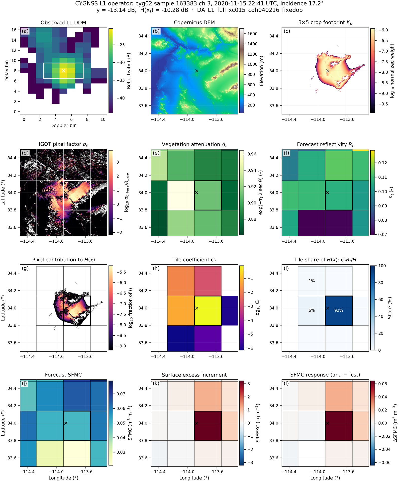
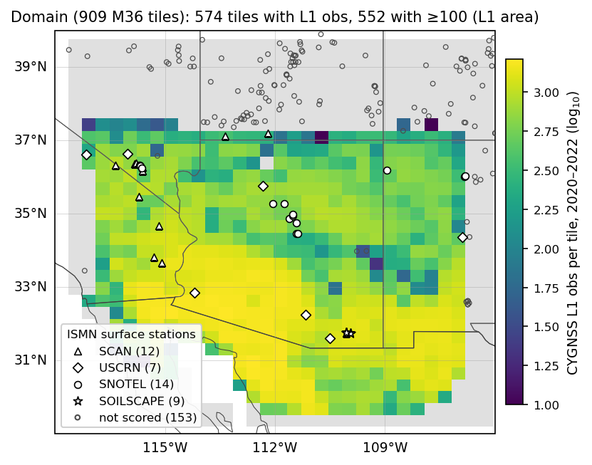
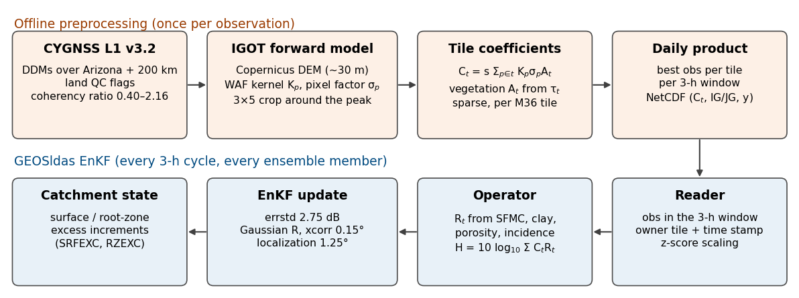
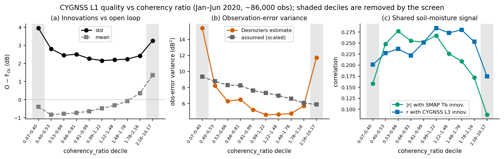
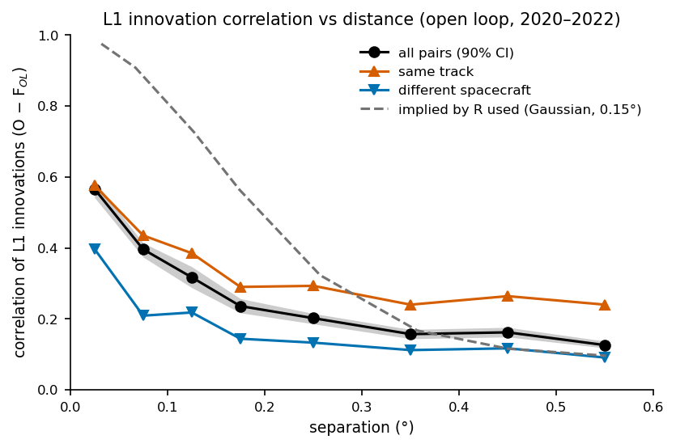
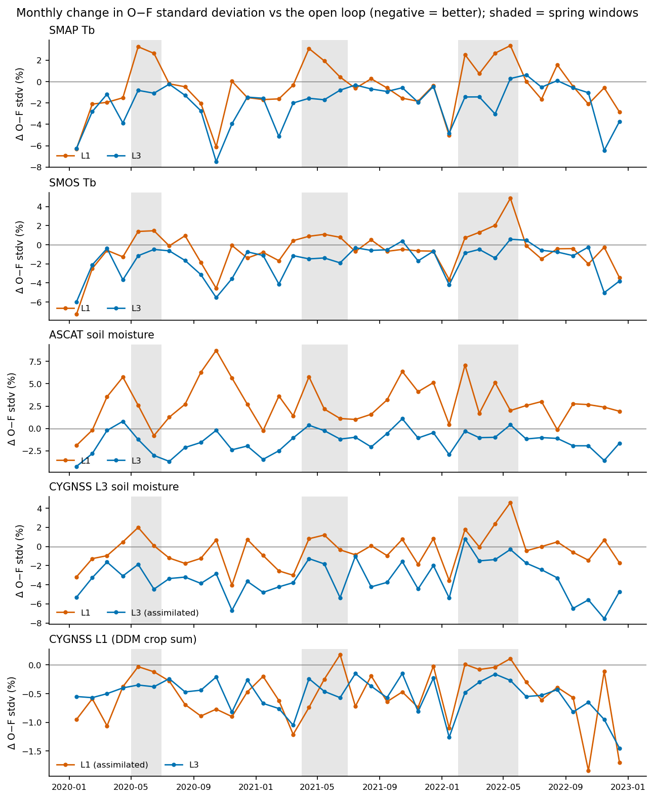
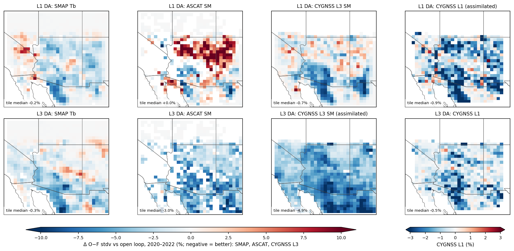
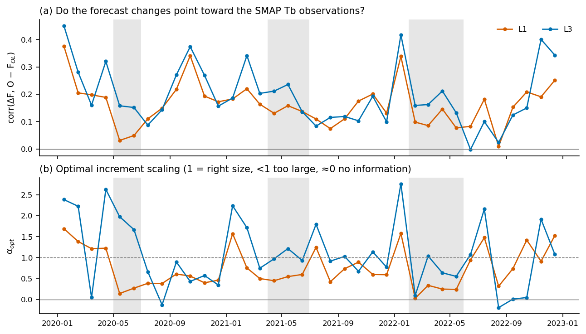
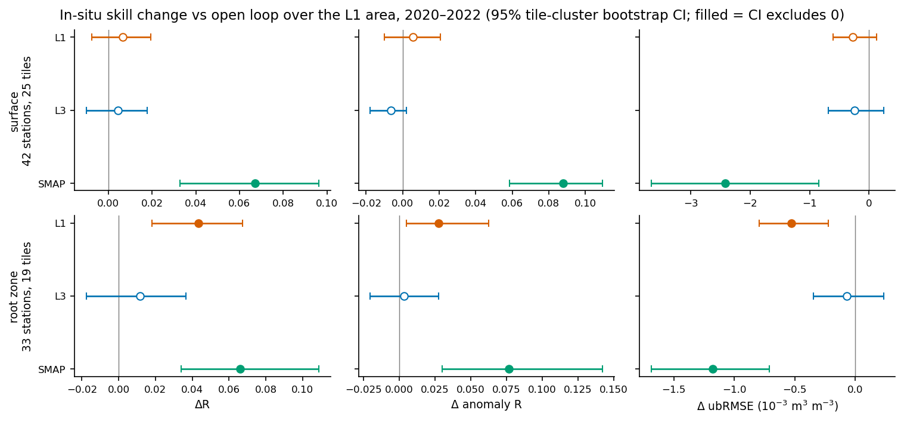

# Paper outline: assimilating CYGNSS L1 DDM observations in GEOSldas

*Draft outline with figures, revised 2026-09-29. Outstanding analyses and decisions: [TODO.md](TODO.md). Reported numerical results are retained; proposed checks are not completed results.*
- The primary L1 experiment is `DA_L1_full_xc015_coh040216_fixedop`: L1 stream after tile/window selection, coherency screen 0.40–2.16, errstd 2.75 dB, xcorr 0.15°. It is called **L1** below.
- The figures are made by [`make_paper_figures.py`](make_paper_figures.py) (Fig. 2 comes from [`../notebooks/cygl1_operator_story_figure.ipynb`](../notebooks/cygl1_operator_story_figure.ipynb)).
- Sources are listed in [`../docs/paper_source_manifest.md`](../docs/paper_source_manifest.md).

## Working title

*Assimilating CYGNSS Level-1 DDM-derived reflectivity in the GEOS land data assimilation system with a terrain-aware
tile-coefficient operator*

## Key messages

1. **A terrain-aware L1 operator is practical inside an EnKF.** The adopted pixel-factorized IGOT formulation reduces exactly to a sparse weighted sum of tile reflectivities, conditional on tile-uniform soil state and fixed pixel factors. The dB operator is nonlinear: `H(x) = 10 log10[Σ_t C_t R_t(x)]`. Production evaluation costs 0.035 ms per observation per member; offline construction costs 12.4 s per observation.
2. **Coherency is a useful quality discriminator in this domain.** Several diagnostics support a two-sided screen retaining 80% of observations. Innovation correlation must be distinguished from inferred observation-error correlation; the influence of the assumed spatial correlation after selection remains to be quantified.
3. **Comparable surface skill to L3, with greater root-zone gains for L1 in this evaluation.** L1 improves root-zone R by +0.044 and ubRMSE by −0.53 × 10⁻³ m³ m⁻³ versus OL. Direct L1–L3 differences in root-zone R and ubRMSE also have CIs excluding zero. Tb changes are close to L3 within the L1 area. The absolute ubRMSE benefit is small; mechanism and spatial robustness need diagnosis.
4. **Benefits are modest and mixed.** Spring Tb degradation and the ASCAT penalty remain material findings. Coverage is limited to Arizona + 200 km; SMAP assimilation gives stronger in-situ improvements.

## 1. Introduction

- CYGNSS GNSS-R over land: frequent revisits and sensitivity to near-surface soil moisture through coherent reflection. Land DA with
  CYGNSS has so far assimilated soil-moisture retrievals, including our CYGNSS L3 DA study (Fox, Reichle & Liu 2026, JHM, submitted).
- The case for L1:
  - it places the mapping from soil moisture to the measured signal inside DA, replacing retrieval assumptions with forward-model assumptions; it does not eliminate correlated errors;
  - terrain and vegetation are modelled explicitly;
  - it is the same approach GEOSldas uses for SMAP brightness temperature, which is assimilated through a forward model.
- Root-zone moisture matters for plant water availability and hydrological persistence.
- Z-score scaling adjusts mean and variance but retains temporal ordering and state-dependent response. The physical operator can therefore contribute terrain-, geometry- and vegetation-dependent footprint structure beyond its absolute level. A simpler-operator comparison would test that added value.
- The obstacle is cost: a per-pixel DDM model is too slow to run inside the ensemble.
- Contributions:
  - an exact tile-coefficient operator and processing chain;
  - a characterization of L1 observation quality and error correlation;
  - 3-year DA experiments over the US Southwest, evaluated against satellite O−F and in-situ data.

## 2. Observation operator

- **Forward model.** IGOT (Melebari et al. 2023) models DDM formation from the GPS geometry, the delay-Doppler ambiguity function
  (WAF) and per-pixel scattering over terrain (Copernicus DEM, ~30 m). Equations only: the IGOT code is private collaborator code.
- **Observable.** One scalar per observation: sum the 3×5 bins around the reference peak in linear reflectivity space, then express it in dB. Full DDM shape is not assimilated. The operator integrates the corresponding terrain- and geometry-dependent footprint across tiles rather than using specular-point reflectivity alone.
- **Tile-coefficient reduction.**
  - Formula: `C_t = s Σ_{p∈t} K_p σ_p A_t`, where
    - `K_p` is the WAF/area kernel,
    - `σ_p = σ₀,base / R_base` is the fixed IGOT pixel factor (terrain, roughness, geometry),
    - `A_t = exp(−τ_t · 2 sec θ)` is the vegetation attenuation from the GEOSldas tile opacity,
    - `s` is the reflectivity-domain scale.
  - `R_t(x)` is the tile LR reflectivity from SFMC, clay, porosity and incidence angle.
  - Linear aggregation is `S(x) = Σ_t C_t R_t(x)`; the assimilated operator is `H(x) = 10 log10 S(x)`. It is linear in reflectivity, not in land state or the dB observable.
  - Exactness is conditional on the adopted pixel factorization, tile-uniform soil state and fixed σ_p and other factors during ensemble evaluation. This preserves the formulation; it does not establish physical accuracy.
  - Specular-point geometry for vegetation attenuation is a separate approximation. Table 2 discrepancies describe tested cases, not bounds on structural physical error.
- **Worked example (Fig. 2).**
  - The pixel contribution to H(x) (panel g) is concentrated on a smooth, coherent patch.
  - That patch lies mostly in one M36 tile, which carries 92% of H(x) and receives the increment (panels k and l).
  - The coefficients recomputed from the pixels match the production product (weight-weighted difference 5 × 10⁻⁴).
- **Accuracy and cost (Table 2).**

**Fig. 2.** One assimilated observation traced from native pixels to the analysis increment: cyg02, 2020-11-15 22:41 UTC, SW Arizona.
- Rows: (a–c) the observation and its footprint; (d–f) pixel and tile factors of the operator; (g–i) aggregation from pixels to tiles;
  (j–l) the forecast state and the increment in the L1 experiment.
- Thin lines are M36 tile boundaries, and the heavy box is the tile carrying most of the weight.

**Table 2.** Operator accuracy and cost. Sources: [OP] `CYGNSS_IGOT_GEOSldas_Report.md`,
`docs/cygnss_preprocessed_operator_validation_20191101.md`.

| Check | Result |
|---|---|
| Coefficient operator vs full-pixel IGOT, 20 obs (M09 and M36) | max difference ≤ 1.0 × 10⁻¹² dB |
| Python comparison: full-pixel vs coefficient evaluation | ~3.5 s vs ~0.3 ms per obs |
| M36 production mode: coefficient build / ensemble evaluation | 12.4 s per obs / 0.035 ms per obs per member |
| Vegetation, tile opacity with specular-point geometry vs per-pixel IGOT geometry | 0.0007 dB mean difference |
| GEOSldas Fortran operator vs Python simulator (3 cycles, 23 obs) | 0.017–0.052 dB mean absolute difference |

Fortran–Python mean absolute differences are approximately 0.6–1.9% of 2.75 dB in the tested cases. Document total preprocessing core-hours, throughput and hardware before claiming scalability.

## 3. Observations and processing

- **Data.** CYGNSS L1 v3.2 land DDMs, 2020–2022.
- **Base QC:** `quality_flags_2`, `sp_land_valid`, `sp_land_confidence ≥ 2`, and the water and terrain masks.
- **Preprocessing (Fig. 3):**
  - done offline, over Arizona + 200 km;
  - one coefficient set per observation;
  - selection per M36 owner tile and 3-h window (reader selection is nearest to the owner tile centre; verify agreement with preprocessing);
  - one NetCDF product per day.
- **Coverage (Fig. 1).**
  - 574 of the 909 domain tiles have L1 obs. The "L1 area" is the 552 tiles with ≥ 100 obs.
  - The limits are the preprocessing region (it ends at ~106.8° W) and the CYGNSS orbit (south of ~37.9° N).
- **Coherency screen (Fig. 4).**
  - Both tails of the coherency ratio (< 0.40 and > 2.16) have 2–3× the error variance and the weakest shared soil-moisture signal.
  - The high tail has positive observation-space innovation bias (+1.35 dB), and z-score scaling gives it the smallest assumed error. A wet soil-moisture interpretation requires further evidence.
  - Keeping 0.40–2.16 retains 80% of the obs and lowers the Desroziers error variance from 7.3 to 5.7 dB².
  - The z-score climatology is rebuilt on the screened obs.
  - Screen development uses Jan–Jun 2020 and scaling uses 2020–2022, overlapping evaluation. Disclose this and test the frozen screen on 2021–2022; this alone does not make the scaling climatology independent.
  - Desroziers absolute variances depend on gain and covariance assumptions. Physical interpretations of coherency tails require checking the metric definition and ancillary evidence.

**Fig. 1.** Experiment domain and CYGNSS L1 coverage.
- Tiles are coloured by the number of L1 obs over 2020–2022. Grey tiles have none.
- Large markers are the ISMN surface stations scored in §5.3 (on tiles with ≥ 100 L1 obs). Small circles are stations outside the L1
  area.

**Fig. 3.** Processing chain: offline coefficient preprocessing (top) and the GEOSldas EnKF (bottom).

**Fig. 4.** L1 observation quality by coherency-ratio decile (Jan–Jun 2020):
- (a) innovation mean and standard deviation against the open loop;
- (b) Desroziers and assumed observation-error variance;
- (c) correlation with collocated SMAP Tb and CYGNSS L3 innovations.

Shaded deciles are removed by the screen. *Drawn from the tables in `docs/cygl1_obs_quality_vs_qc_report.md`; to be regenerated from
the per-obs data.*

## 4. Data assimilation system and experiments

- **System.**
  - GEOSldas with the Catchment land model and the EnKF, on EASEv2 M36 (909 tiles, 118–106° W, 29–40° N), 2020–2022.
  - L1 is species `CYGNSS_L1_DDM3X5_CROP_SCALAR`. The reader takes the observation nearest each owner tile in the 3-h window, and the
    operator uses exactly that observation's coefficients.
  - All species use z-score scaling.
- **Observation errors (Fig. 5).**
  - errstd 2.75 dB, isotropic Gaussian correlation with xcorr 0.15°, localization 1.25°.
  - L1 innovations are correlated ~0.57 at 3–5 km, falling to ~0.2 at 0.2°.
  - Same-track pairs are about twice as correlated as pairs from different spacecraft.
  - Innovation correlations include forecast- and observation-error covariance. State assumptions for their separation.
  - Identify whether pair diagnostics use raw, screened or reader-selected observations. One observation per tile does not guarantee 36 km separation when actual observation coordinates are retained.
  - Quantify retained-pair distances and off-diagonal R using the coordinates used by GEOSldas before judging xcorr's practical influence.
  - Document the actual rationale for 2.75 dB versus √5.7 ≈ 2.4 dB; do not invent a retrospective inflation rationale.
- **Experiments (Table 1).**
  - One open loop (OL) that monitors all 13 observation types.
  - Three DA experiments that assimilate one type each and monitor the rest.
- **Evaluation.**
  1. O−F standard deviation of the independent monitors (SMAP Tb, SMOS Tb, ASCAT, CYGNSS L3), as a % change vs the OL. The OL is
     cross-masked to each experiment's scaled observations.
  2. Assimilation-induced forecast-change diagnostics: corr(ΔF, O−F_OL) and retrospective optimal scale α_opt, with ΔF = F_DA − F_OL in monitor observation space. This includes accumulated updates and model propagation, not just instantaneous analysis increments.
  3. ISMN in situ (R, anomaly R, ubRMSE) over the L1 area, with 95% CIs from a tile-cluster bootstrap.

**Table 1.** Experiments (all 2020-01-01 to 2022-12-31).

| Name | EXP_ID | Assimilated | Notes |
|---|---|---|---|
| OL | `OLv8_M36_AZ_fixedop` | none | all 13 types monitored, unscaled |
| **L1** | `DA_L1_full_xc015_coh040216_fixedop` | CYGNSS L1 | coherency 0.40–2.16, errstd 2.75 dB, xcorr 0.15° |
| L3 | `DA_L3_fixedop` | CYGNSS L3 soil moisture | L1 monitored |
| SMAP | `DA_SMAP_fixedop` | SMAP L1C Tb | L1 monitored |

**Fig. 5.** Correlation of L1 innovations against the open loop as a function of distance. The dashed line is the innovation correlation
predicted under the assumed forecast/observation-error decomposition (verify the plotted definition). Observation-error correlation alone is not innovation correlation. *Drawn from the tables in `docs/cygl1_obs_error_correlation_report.md`; to be regenerated
from the pair data.*

## 5. Results

### 5.1 Independent satellite O−F

- **Primary comparison:** use the L1-area rows; complete the missing SMAP row from source data and add uncertainty. Domain-wide effects include tiles without L1 coverage.
- **Domain-wide:** L1 reduces SMAP and SMOS Tb O−F by about 1–1.3% and CYGNSS L3 O−F by 1.9%, but increases ASCAT O−F by 2.2%
  (Table 3).
- **Within the L1 area,** the Tb gains grow to about 1.35–1.66%, **essentially tied with L3**.
- **ASCAT:** the penalty is concentrated in the Four Corners area (Fig. 7).
- **By season (Fig. 6):** Oct–Jan is consistently the best period for L1. Spring is consistently the worst: SMAP Tb O−F is worse than
  the OL in May–Jun 2020, Apr–Jun 2021 and Feb–May 2022.
- **SMAP assimilation** is in a different class for Tb (−11 to −14%), but degrades ASCAT by +12.6%.

- **L1 own fit:** O−F decreases only 0.76%; L3 assimilation decreases the L1 monitor by 0.54%. Assess forecast variance, normalized innovations, gains and increments before attributing this to low signal-to-noise. Own-fit percentages across species are not directly comparable information measures or independent validation.
- SMAP's ASCAT penalty shows disagreement between monitors and in-situ evaluation, not proof ASCAT is biased or invalid. Spatially matched coverage and seasonal/QC checks are needed.

**Table 3.** O−F standard deviation, % change vs the OL, pooled over 2020–2022 (negative = better). *Own fit* marks the assimilated
type. Sources: the O-F report §3, and "O-F over the same L1 area" in the ISMN report.

| Tiles | Experiment | SMOS Tb | SMAP Tb | ASCAT | CYGNSS L3 | CYGNSS L1 |
|---|---|---:|---:|---:|---:|---:|
| all 909 | **L1** | −1.02 | −1.29 | +2.18 | −1.86 | −0.76 *(own fit)* |
| | L3 | −1.14 | −1.48 | −3.61 | −6.01 *(own fit)* | −0.54 |
| | SMAP | −14.12 | −11.48 *(own fit)* | +12.59 | +2.94 | −0.67 |
| L1 area (552) | **L1** | −1.35 | −1.66 | +3.21 | −2.21 | −0.76 *(own fit)* |
| | L3 | −1.36 | −1.76 | −4.24 | −6.00 *(own fit)* | −0.54 |

**Fig. 6.** Monthly change in O−F standard deviation vs the open loop, for L1 and L3 assimilation. Shaded: the spring windows in which L1
degrades Tb.

**Fig. 7.** Change in O−F standard deviation per tile vs the open loop, pooled over 2020–2022, for L1 (top) and L3 (bottom)
assimilation.

### 5.2 Seasonal variation in assimilation-induced forecast changes

- Fig. 8 measures alignment and amplitude of ΔF = F_DA − F_OL against independent SMAP Tb innovations.
- Oct–Jan: correlation reaches 0.3–0.4; January α_opt ≈ 1.6–1.7 suggests a larger retrospective forecast difference would improve diagnostic fit.
- Spring 2020 and 2022: corr ≈ 0.03–0.10 and α_opt ≈ 0.2 indicate weak alignment.
- Spring 2021: corr = 0.13–0.16 and α_opt ≈ 0.5 indicate halving the accumulated forecast difference would improve diagnostic fit.
- These diagnose alignment and amplitude, not physical causes or the size of individual EnKF increments. They do not directly estimate observation error or prescribe seasonal R.
- Shifting degradation windows complicate a fixed calendar intervention.
- Candidate explanations: vegetation green-up, roughness, fixed σ_p, seasonal coherency shifts, snow/frozen soils and uncertainty in the three-year scaling climatology. Compare spring in-situ skill and monitor QC before attributing discrepancies to L1 alone.

**Fig. 8.** Monthly diagnostics of assimilation-induced forecast changes, measured against independent SMAP Tb innovations:
- (a) correlation between the forecast change and the OL innovation;
- (b) the retrospective forecast-change scale factor that would minimize the O−F error.

### 5.3 In-situ validation

- 42 surface stations on 25 tiles, and 33 root-zone stations on 19 tiles, all in the L1 area (Fig. 1).
- **Root zone:** L1 improves R by +0.044, anomaly R by +0.027 and ubRMSE by −0.53 × 10⁻³ m³ m⁻³. All three are significant, and 70–90%
  of stations improve. L3 changes nothing significantly.
- **L1 vs L3 directly:** L1 is better in root-zone R (+0.032), root-zone ubRMSE and surface anomaly R (+0.012), all significant.
- **Surface:** L1–OL CIs include zero. The marginal surface anomR L1–L3 result is secondary given 24 comparisons; CIs are nominal unless multiplicity is addressed.
- Add OL baselines and percentage ubRMSE changes. Test equal tile weighting and leave-one-tile-out sensitivity before claiming spatial robustness.
- **Mechanism to diagnose:** ensemble cross-covariances can directly update root-zone-related Catchment states, while subsequent model propagation also contributes. Inspect srfexc, rzexc and catdef analysis increments, diagnosed SFMC/RZMC changes, sampling, wetting events and dry-down persistence. Sub-daily sampling is a hypothesis, not an established explanation.
- **SMAP** is the strongest at both depths.
- Because the obs are rescaled to the model climatology, the model's dry bias (−0.02 to −0.03 m³ m⁻³) is essentially unchanged.

**Fig. 9.** Change in in-situ skill vs the open loop over the L1 area, 2020–2022, with 95% tile-cluster bootstrap CIs. Filled markers:
the CI excludes zero.

**Table 4.** In-situ skill differences over the L1 area: mean over stations, 95% tile-cluster bootstrap CI; \* = CI excludes 0. ubRMSE is
in 10⁻³ m³ m⁻³ (negative = better). Computed by `make_paper_figures.py`; it reproduces the ISMN report.

| Depth | Metric | L1 − OL | L3 − OL | SMAP − OL | L1 − L3 |
|---|---|---|---|---|---|
| surface | R | +0.007 [−0.008, +0.019] | +0.004 [−0.010, +0.018] | +0.067 [+0.033, +0.096]\* | +0.002 [−0.009, +0.020] |
| surface | anomR | +0.006 [−0.010, +0.021] | −0.007 [−0.018, +0.002] | +0.088 [+0.059, +0.109]\* | +0.012 [+0.001, +0.027]\* |
| surface | ubRMSE | −0.27 [−0.60, +0.13] | −0.25 [−0.68, +0.25] | −2.42 [−3.67, −0.84]\* | −0.03 [−0.53, +0.35] |
| root zone | R | +0.044 [+0.018, +0.067]\* | +0.012 [−0.018, +0.037] | +0.066 [+0.034, +0.109]\* | +0.032 [+0.010, +0.062]\* |
| root zone | anomR | +0.027 [+0.005, +0.063]\* | +0.003 [−0.020, +0.027] | +0.077 [+0.030, +0.142]\* | +0.024 [−0.005, +0.069] |
| root zone | ubRMSE | −0.53 [−0.79, −0.23]\* | −0.07 [−0.35, +0.24] | −1.18 [−1.69, −0.71]\* | −0.46 [−0.73, −0.26]\* |

## 6. Discussion

- **Why O−F and in situ rank L1 and L3 differently.**
  - Every O−F monitor senses the top few centimetres, and there L1 and L3 are close (a Tb tie; surface in-situ ΔR +0.002).
  - The L1 advantage is in the root zone, which no satellite monitor sees.
  - Match station coverage to the ASCAT penalty region before using in-situ results to assess it. Shared retrieval errors remain an untested hypothesis.
  - L1–L3 contrasts compare complete DA configurations with different sampling, QC, scaling and errors; they do not isolate an intrinsic Level-1 advantage.
- **Spring.** The case for seasonal or adaptive observation errors, and the physical candidates listed in §5.2.
- **ASCAT penalty.**
  - It is concentrated in the Four Corners area (Fig. 7).
  - It needs a regional diagnosis: land cover, terrain, and the ASCAT retrieval there.
  - Check regional station coverage, terrain/land-cover and seasonal breakdowns, and distance from the preprocessing boundary. In-situ scores cannot resolve penalties in unsampled regions.
- **Error model.** Isotropic correlation is an approximation. Along-track structure (Fig. 5) suggests along-track superobbing or a
  track-aware R as a next step.
- **Transferability.** The structure may be reusable for other GNSS-R missions; mission-specific scattering, calibration, sampling and preprocessing costs require assessment.
- **Limitations:**
  - one semi-arid domain;
  - coverage limited to Arizona + 200 km;
  - 19–25 independent in-situ tiles;
  - point-to-tile representativeness;
  - the pixel factor σ_p is held fixed.

## 7. Conclusions

The four key messages, plus next steps: seasonal R, a larger preprocessing region, along-track error modelling, and other GNSS-R
missions.

## Supplement (planned)

- Sensitivity to errstd: 3.9 dB. It gives a smaller ASCAT penalty (+0.55%) but a weaker root-zone gain (R +0.030).
- Run configurations (`runs/configs/`).
- SOILSCAPE per-tile comparison.
- All-station ISMN scores.

## Figure status

| Figure | Status |
|---|---|
| 1, 3, 6, 7, 8, 9 | draft from local post-fix data; regenerate with `make_paper_figures.py` |
| 2 | draft from the notebook (fixed-operator run); final layout still open |
| 4, 5 | draft drawn from report tables; regenerate from the per-obs and pair data on Discover |

## Open decisions

- **Target journal:** HESS, JHM, RSE, WRR or TGRS. This sets how much operator detail goes in the main text.
- **IGOT collaborators (USC/MiXIL):** co-authorship or acknowledgment, and how much of the formulation to show.
- **Coverage:** accept Arizona + 200 km, or re-preprocess a larger region.
- **Seasonal-R experiment:** decide scope before seeing results, freeze choices before evaluation where feasible, and report partial or negative outcomes if undertaken.
