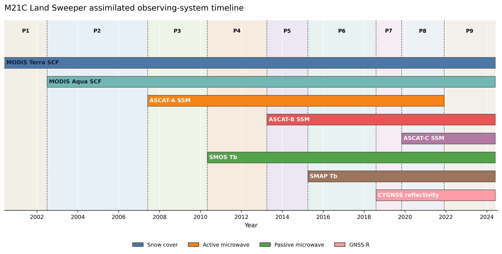
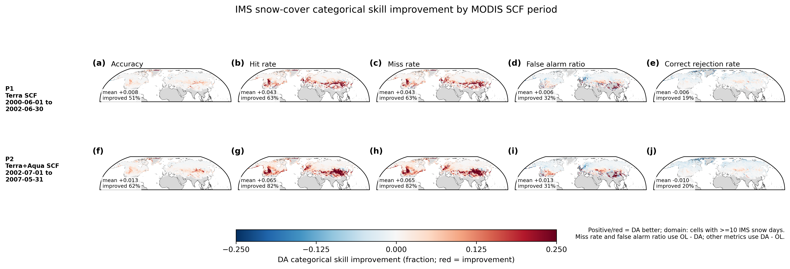
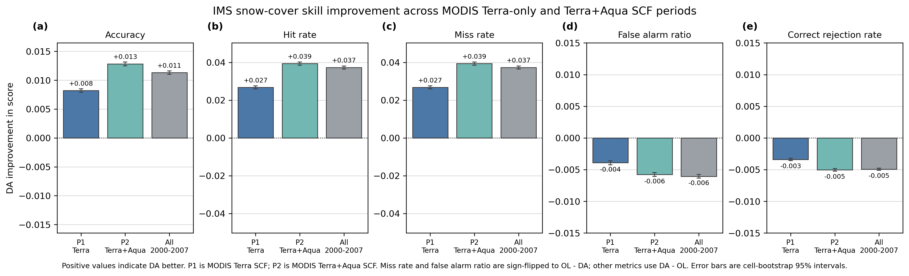
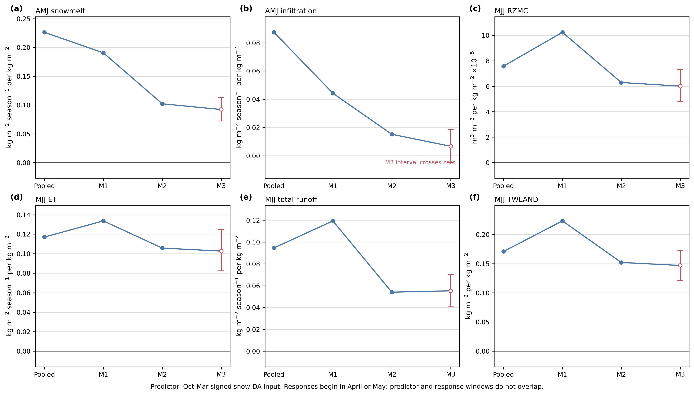
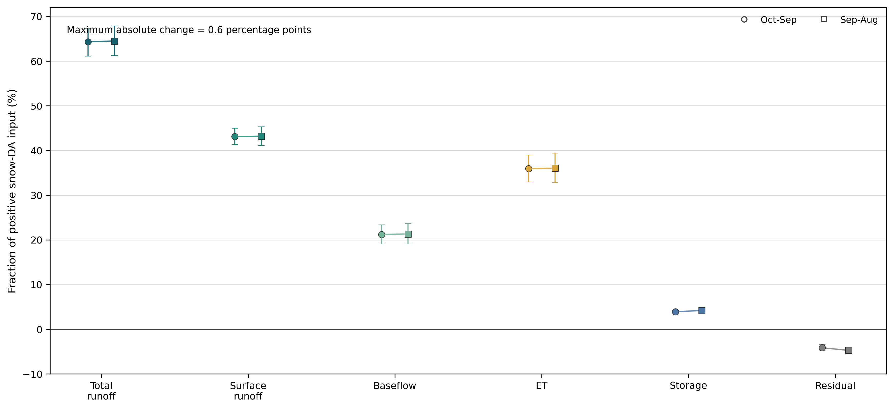
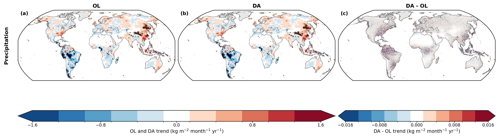
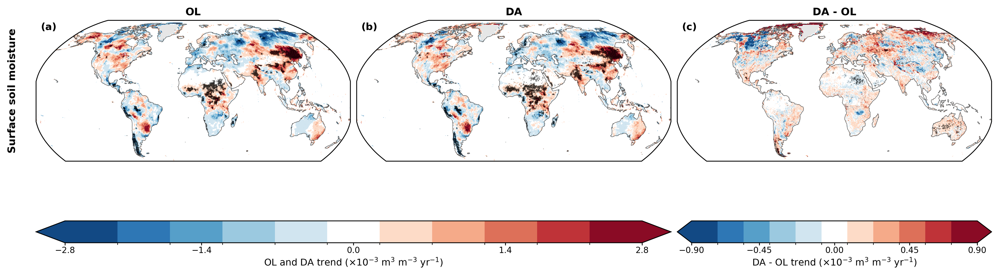
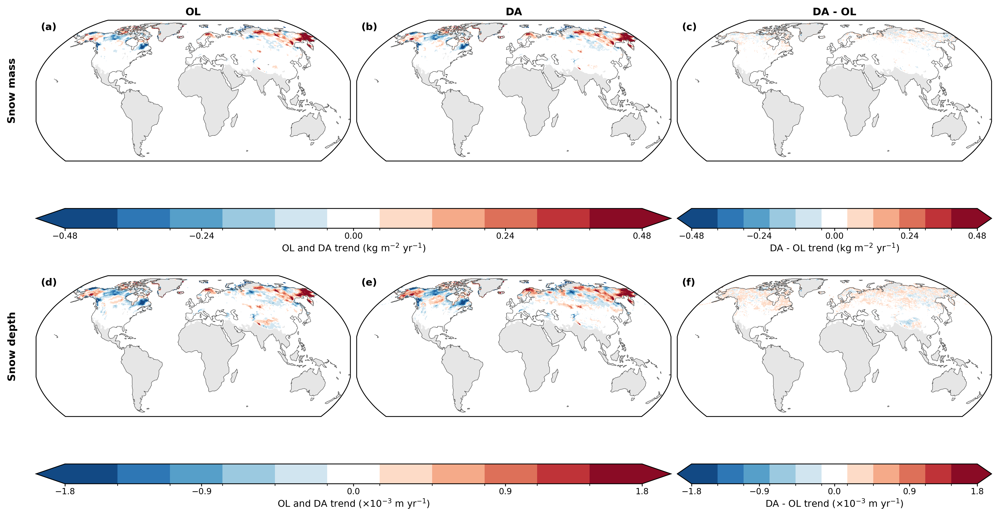

# M21C Land-Sweeper Paper Figures

This page collects the revised manuscript figures produced in response to the
co-author feedback round. The figures were generated by
[`paper_figures_unified.ipynb`](../notebooks/paper_figures_unified.ipynb) from
the shared P1-P9 observing-system registry and the current validation products.

Unless stated otherwise, improvement panels use **positive/red = DA better**.
The publication-quality PDF versions and machine-readable summary tables are
generated locally under `projects/M21C_ls/output/paper_figures/`.

## Figure 1: Observing-System Timeline

The P1-P9 land observing-system periods, including the MODIS Terra-only to
Terra+Aqua transition and subsequent microwave sensor additions.

## Figure 2: Mean Assimilated Observations Per Day

Spatial sampling density for observations entering the land analysis after
quality control and aggregation.

## Figure 3: Monthly Assimilated Observation Counts

Temporal evolution of assimilated observation counts, shown against the
P1-P9 observing-system periods.

## Figure 4: Full-Period O-F Standard-Deviation Improvement

Full-period observation-minus-forecast standard-deviation changes by sensor.
The plotted quantity is `(OL - DA) / OL`, so positive/red indicates lower O-F
variability in DA.

## Figure 5: Monthly O-F Standard-Deviation Evolution

Monthly evolution of O-F standard-deviation improvement, with a centered
five-month running mean and the P1-P9 observing-system periods.

## Figure 6: Period-by-Sensor O-F Improvement Maps

Spatial O-F standard-deviation improvement for each available sensor and
observing-system period. Positive/red indicates improvement.

## Figure 7: ISMN Soil-Moisture Skill

Paired DA-minus-OL surface and root-zone soil-moisture skill across the broad
V1-V3 validation periods. For correlation metrics, improvement is `DA - OL`;
for ubRMSE, improvement is `OL - DA`.

## Figure 8: IMS Snow-Cover Skill

Full-period categorical snow-cover skill changes against IMS over the Northern
Hemisphere snow-evaluation domain. Metric signs are oriented so positive/red
means DA performs better.

### Supplemental Figure S1: Terra and Terra+Aqua Maps

IMS snow-cover skill for P1 MODIS Terra-only SCF and P2 MODIS Terra+Aqua SCF.

### Supplemental Figure S2: Terra and Terra+Aqua Summary

Summary comparison of the P1, P2, and combined 2000-2007 IMS skill results.

## Figure 9: SNOTEL SWE Skill

Seasonal SNOTEL snow-water-equivalent statistics and full-period station maps.
Map values use `OL - DA`, so positive/red indicates lower DA error.

## Figure 10: GHCN Snow-Depth Skill

Seasonal GHCN snow-depth statistics and full-period station maps. Positive/red
map values indicate lower DA error.

## Figure 11: ERA5-Land Soil-Moisture Skill

Surface and root-zone soil-moisture comparison against ERA5-Land for the V1-V3
validation periods, using the common warm, snow-free evaluation mask.

## Figure 12: ERA5-Land Soil-Moisture Improvement Maps

Surface and root-zone correlation, anomaly-correlation, and ubRMSE improvement
against ERA5-Land. All signs are oriented so positive/red means DA is better.

## Figure 13: ERA5-Land Snow Comparison

Full-period OL and DA snow-cover fraction, snow depth, and SWE comparison
against ERA5-Land over the snow-possible domain.

## Figure 14: Snow-DA Water Budget

Six annual all-tile budgets and the positive-input partition of snow-DA water
among runoff, evapotranspiration, storage, and the closing residual.

## Figure 15: Monthly Snow-DA Hydrologic Pathway

October-September evolution of snow-DA input, snowmelt, surface and root-zone
soil moisture, runoff, and evapotranspiration for snow-addition tile-years.

### Supplemental Figure S3: Oct-Mar Snow Attribution

Non-overlapping October-March snow-input controls for the accepted spring and
summer hydrologic responses.

### Supplemental Figure S4: Water-Budget Boundary Sensitivity

Comparison of the accepted October-September budget with the shifted
September-August accounting boundary.

## Figure 16: Long-Term RZMC And SCF Trends

Production Theil-Sen trends for OL, DA, and paired DA-minus-OL root-zone soil
moisture and snow-cover fraction, with black stippling for spatial FDR
significance.

## Figure 17: Regional RZMC Period Means

Area-weighted RZMC DA-OL for global valid land and five fixed regions, in
native units, with the mean within each P1-P9 observing-system period.
Generated by `scripts/plot_regional_rzmc_periods.py --paper`.

### Supplemental Figure S5: Precipitation Trends

The OL/DA common-forcing trend check and paired DA-minus-OL result.

### Supplemental Figure S6: Surface Soil-Moisture Trends

OL, DA, and paired DA-minus-OL SFMC trends on valid land.

### Supplemental Figure S7: Snow-Mass And Snow-Depth Trends

OL, DA, and paired DA-minus-OL snow-mass and snow-depth trends on the Northern
Hemisphere seasonal-snow mask.

## Provenance

The generating notebook writes a detailed manifest containing each figure's
source products, metric definitions, masks, period mappings, and output
settings to `output/paper_figures/paper_figures_manifest.csv`. The shared
period definitions are documented in
[`observing_system_period_registry.md`](observing_system_period_registry.md).
