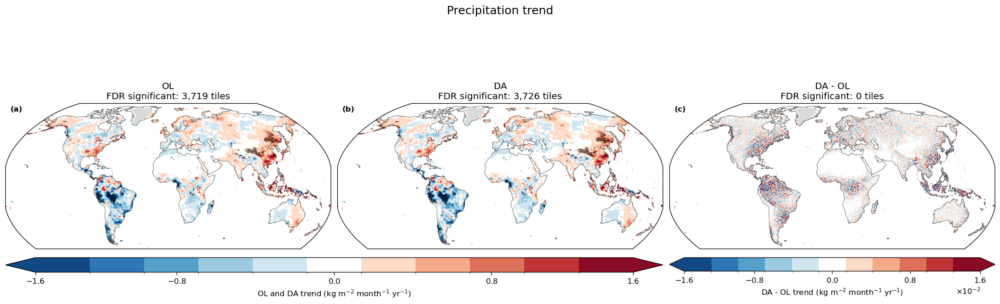
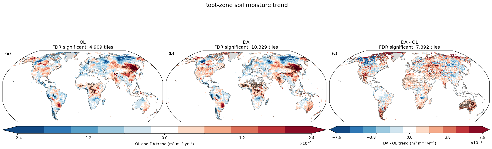
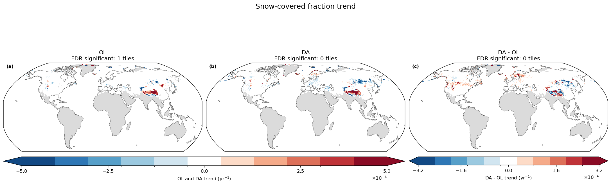
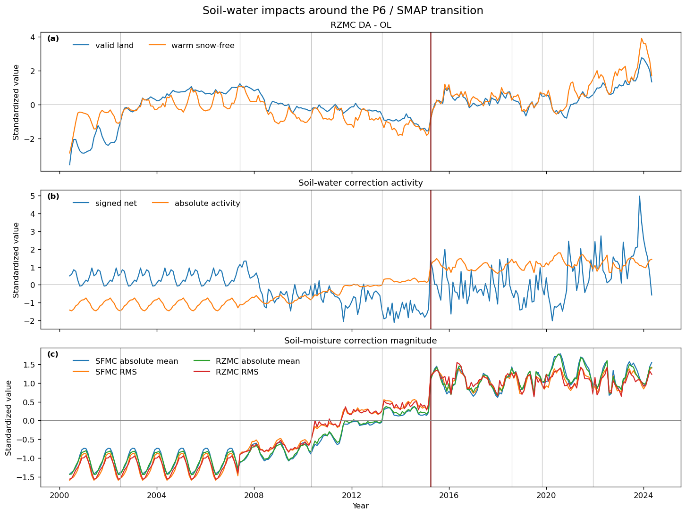
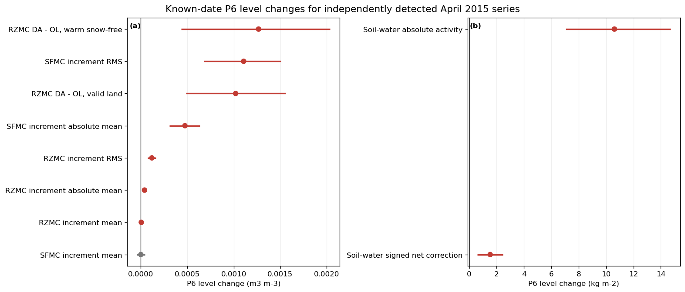
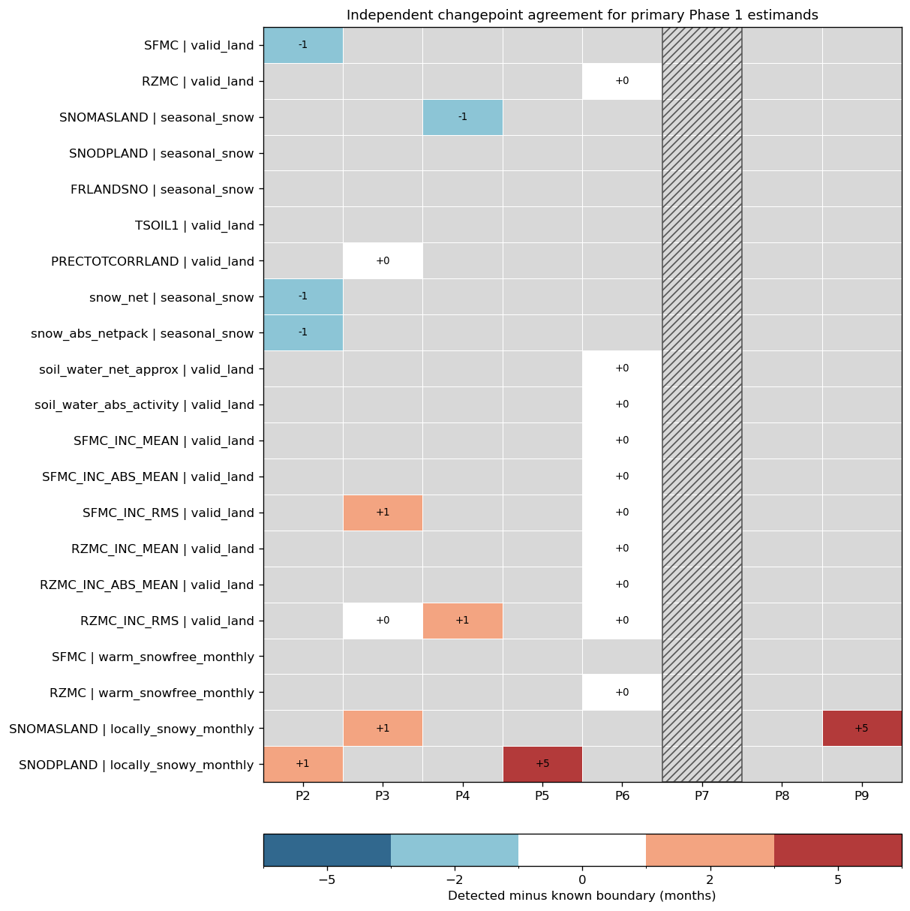

# Executive Summary

This report examines whether the evolving GEOS LDAS data-assimilation (DA)
system introduced long-term trends or abrupt discontinuities into precipitation,
snow, and soil-moisture states during June 2000-May 2024. It compares the
matched open-loop (OL v2) and DA (DA v3) simulations, tests the trend in the
strictly paired `DA - OL` series, evaluates changes at known observing-system
transitions (P1-P9), and independently searches for changepoints.

The main conclusion is reassuring: **DA generally preserves the long-term state
behavior of OL rather than imposing a new global drift.** Precipitation trends
are nearly identical in OL and DA. Snow mass and snow depth show effectively no
long-term trend in either experiment. Snow-covered fraction declines in the
area-weighted seasonal-snow-domain mean, but it declines at almost exactly the
same rate in OL and DA, while `DA - OL` has no trend. Surface soil-moisture
effects are limited.

Root-zone soil moisture (RZMC) is the qualified exception. DA expands the area
with significant regional trends, and significant `DA - OL` trends are mostly
positive, particularly in dry and transitional regions. However, OL, DA, and
`DA - OL` still have no significant global land-mean RZMC trend. DA therefore
modifies the **regional pattern** of root-zone trends without creating a
resolved global secular trend.

The clearest observing-system discontinuity occurs in **April 2015**, when SMAP
brightness-temperature assimilation begins. Known-date inference and
independent changepoint detection converge exactly on this date across RZMC
`DA - OL`, surface and root-zone correction diagnostics, and total soil-water
correction activity. This is strong controlled evidence for a system transition,
although it is not proof that SMAP alone caused every contemporaneous change.

# Questions and Scope

The analysis addresses four questions:

1. Does the OL simulation contain long-term precipitation, snow, or
   soil-moisture trends?
2. Does DA preserve, amplify, or oppose those background trends?
3. Do known observing-system transitions produce detectable level or slope
   changes?
4. Do independently detected changepoints agree with those known dates?

The record contains 288 monthly values from June 2000 through May 2024 on the
112,573-tile M36 land grid. Snow-state analyses use a Northern Hemisphere
seasonal-snow mask containing 48,067 tiles. Maps extend to 60 degrees S and use
the Robinson projection. All reported domain means are weighted by M36 tile
area.

Two spatial scales must be kept separate:

- **Whole-record trend maps** are calculated independently at each tile.
- **Known-transition and independent-changepoint analyses** use one
  area-weighted monthly domain-mean series for each variable and mask.

# Data and Statistical Design

OL and DA values are restricted to the same finite monthly samples before any
trend or difference is calculated. The primary DA-impact estimand is the trend
of the paired monthly `DA - OL` series, not the difference between two
independently estimated slopes.

Tile trends use an exact Theil-Sen slope after a trend-preserving
calendar-month adjustment. Significance uses a modified Mann-Kendall test with
an autocorrelation variance correction, followed by Benjamini-Hochberg false
discovery rate (BH-FDR) control at 0.05 across every complete spatial field.
OL, DA, and `DA - OL` each retain their own full-field FDR family.

Area-weighted OL, DA, and `DA - OL` domain trends for six state variables form
one additional 18-test BH-FDR family. Known-date transition inference uses a
P1-P9 segmented interrupted time-series model with Prais-Winsten AR(1)
correction and fitted-AR(1) bootstrap intervals. P7 is treated as level-only
because its 15-month duration cannot support an independent slope estimate.

Independent changepoints use two PELT formulations across a penalty grid. A
break is accepted only when it is present under the primary AR(1)+linear model,
stable across penalties, and reproduced by an independently prewhitened linear
method. This conservative consensus is designed to resolve abrupt structural
changes; validation shows that it has little power to localize gradual slope
hinges.

# Whole-Record Trends

## Precipitation: a common-forcing control

OL precipitation has significant trends at 3,719 tiles (3.30%), and DA at
3,726 tiles (3.31%). Of these, 3,603 tiles overlap, every overlapping trend has
the same sign, and the complete OL/DA slope correlation is 0.9998. No
`DA - OL` precipitation tile survives FDR, and none of the area-weighted OL,
DA, or `DA - OL` precipitation trends is significant.

**Interpretation:** regional precipitation trends exist in the forcing, but DA
does not measurably alter them.

## Soil moisture: limited surface effects, clearer regional root-zone effects

Surface soil moisture (SFMC) contains a modest background trend pattern: 6,992
OL tiles (6.21%) and 8,966 DA tiles (7.96%) are significant. Only 1,412 tiles
(1.25%) have a significant `DA - OL` trend, and the area-weighted SFMC trends
are not significant. DA modifies SFMC trends locally but does not create a
global mean drift.

RZMC is more responsive. Significant coverage increases from 4,909 OL tiles
(4.36%) to 10,329 DA tiles (9.18%). The `DA - OL` trend is significant at 7,892
tiles (7.01%); 7,267 of these are positive and 625 negative. Positive effects
are especially extensive in Australia, North Africa and the Middle East,
southern Africa, and parts of the Americas and northern Eurasia. Nevertheless,
the area-weighted OL, DA, and `DA - OL` RZMC trends are all nonsignificant.

**Interpretation:** DA increasingly shifts the root zone wetter relative to OL
in particular regions, but it does not introduce a significant global
land-mean RZMC trend.

## Snow: no DA-induced trend

Snow mass and snow depth are effectively null at the tile scale. Snow mass has
12 significant OL tiles and 5 DA tiles out of 48,067; snow depth has 7 and 6,
respectively. No `DA - OL` tile survives FDR for either variable, and their
area-weighted domain trends are nonsignificant.

Snow-covered fraction provides a more subtle result. Its area-weighted
seasonal-snow-domain mean declines significantly in both experiments:

| Series | Sen slope (yr-1) | Autocorrelation-adjusted 95% interval | BH q |
|---|---:|---:|---:|
| OL | -0.000554 | -0.000911 to -0.000198 | 0.0061 |
| DA | -0.000549 | -0.000856 to -0.000233 | 0.0016 |
| DA - OL | -0.000006 | -0.000073 to +0.000065 | 0.9934 |

The OL and DA slopes imply an approximately 0.013 reduction in domain-mean
snow-covered fraction over 24 years. Their near equality, together with the
null `DA - OL` trend, shows that DA preserves rather than creates the decline.
The domain mean can resolve a small coherent change even though individual
tile effects are too weak to survive correction across 48,067 spatial tests.

# Observing-System Transitions

## April 2015 / SMAP is the clearest transition

P6 begins in April 2015, when SMAP brightness-temperature assimilation enters
the observing system. Nine primary series have FDR-significant known-date level
changes at P6, including:

| Primary estimand | P6 level change | 95% bootstrap interval |
|---|---:|---:|
| RZMC `DA - OL`, valid land | +0.001021 m3 m-3 | +0.000488 to +0.001558 |
| RZMC `DA - OL`, warm snow-free | +0.001267 m3 m-3 | +0.000436 to +0.002037 |
| Soil-water absolute activity | +10.612 kg m-2 | +7.056 to +14.715 |
| Soil-water signed net correction | +1.530 kg m-2 | +0.589 to +2.467 |
| SFMC increment RMS | +0.001107 m3 m-3 | +0.000677 to +0.001505 |
| RZMC increment RMS | +0.000120 m3 m-3 | +0.000077 to +0.000162 |

The independent method finds ten primary series breaking exactly in April
2015. Nine are also significant in the known-date analysis; the additional
series is signed SFMC increment mean. No paired OL or DA control series has an
accepted independent break. The result is best stated as follows:

> The introduction of SMAP coincides with an abrupt increase in soil-moisture
> correction activity and a small positive shift in the DA impact on
> root-zone soil moisture.

This is a controlled attribution result, not proof that every April 2015
change is caused only by SMAP. The transition date may also coincide with
other system or data changes.

## Other observing-system boundaries

- **P2, July 2002 (MODIS Aqua snow cover begins):** signed snow-water
  correction increases by 2.594 kg m-2 and absolute snow-correction activity
  by 4.413 kg m-2. Both known-date changes survive FDR. Four independent breaks
  occur within one month of P2.
- **P3, June 2007 (ASCAT-A begins):** SFMC increment RMS has a positive level
  change. The known-date SFMC `DA - OL` slope changes from positive in P2 to
  negative in P3. Four independent breaks occur within one month, although the
  independent detector is not reliable for gradual slope hinges.
- **P4, May 2010 (SMOS begins):** two independent snow/root-zone diagnostic
  breaks occur nearby, but the corresponding known-date coefficients do not
  survive FDR. These are candidates rather than firm transition findings.
- **P5, P7, P8, and P9:** no primary known-date level or slope change survives
  FDR. P5 and P9 each have one independent match only under the wider
  +/-6-month sensitivity. No accepted break matches P7 or P8. Failure to detect
  a change is not evidence that a sensor had no effect.

# Independent Breakpoint Inventory

Across 43 area-weighted monthly series, the conservative consensus accepts 37
breaks: 20 in paired `DA - OL` series and 17 in DA correction diagnostics.
None occurs in the paired OL or DA control series. Twenty accepted breaks match
a scored P2-P9 boundary within +/-3 months, and two more match only within
+/-6 months. Fifteen are farther than six months from any scored boundary.

Those 15 unmatched breaks are retained as real statistical candidates, but
they should not be assigned to the nearest observing-system event without
additional metadata or physical evidence. They may reflect climate variability,
forcing changes, model behavior, or undocumented system changes.

# Interpretation and Limitations

The most scientifically useful result is not that correction activity rises as
more observations become available. That behavior is expected. The useful
result is that increasing activity generally does **not** produce a widespread
long-term drift in the analyzed snow or soil-moisture states.

The conclusions should retain the following limits:

- These are model-internal OL/DA comparisons, not independent validation.
- A whole-record Sen slope can summarize several discrete observing-system
  steps; the interrupted-series analysis is required for attribution.
- Tile maps establish spatial heterogeneity, while breakpoint results are
  area-weighted domain means and do not prove spatial uniformity.
- Dynamic warm/snow-free and locally snowy masks change monthly support.
- P7 is only 15 months and cannot support a separate slope claim under the
  predeclared minimum-segment rule.
- Independent PELT validation is strong for abrupt level shifts but weak for
  gradual slope changes. A missing independent break does not refute a
  known-date slope change.
- Spatial significance must be read from `significant_fdr`; approximate Sen
  confidence intervals are not used to define mapped significance.

# Overall Conclusion

Over 2000-2024, OL contains regional precipitation and soil-moisture trend
structure and a coherent decline in seasonal-snow-domain snow-covered fraction.
DA preserves the precipitation and snow trends, introduces only limited SFMC
trend changes, and modifies RZMC trends regionally without creating a
significant global land-mean drift. The strongest observing-system event is the
April 2015 SMAP transition, which produces an abrupt increase in correction
activity and a small positive shift in root-zone `DA - OL`.

In short:

> The evolving observing system changes when and how strongly GEOS LDAS
> corrects the land state, but it does not impose a widespread artificial
> long-term trend on snow or soil moisture. Its clearest persistent state
> effect is regional, positive modification of root-zone soil-moisture trends,
> with an abrupt system-level shift at SMAP entry.

# Reproducibility and Detailed Results

The full contract is in `trends_breakpoints_methods.md`; focused results are in
`phase1_trend_results.md`, `phase1_state_trend_results.md`,
`phase1_interrupted_series_results.md`, and
`phase1_changepoint_results.md`. Figures are generated by
`../notebooks/phase1_state_trend_maps.ipynb` and
`../notebooks/phase1_trends_breakpoints_summary.ipynb`.

Machine-readable configurations are under `projects/M21C_ls/config/`.
Derived NetCDF and CSV products are generated under
`projects/M21C_ls/output/trends_breakpoints/` and excluded from version control.
