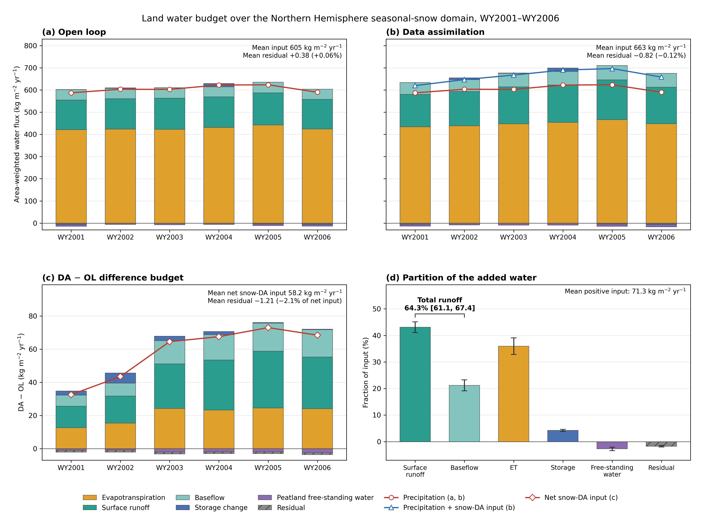
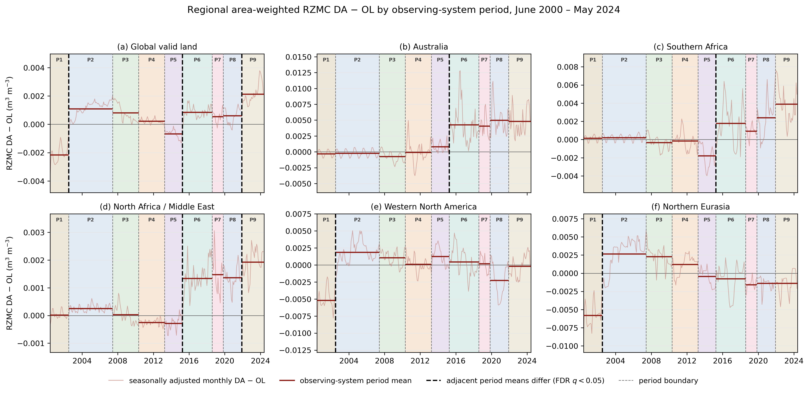

# Evolving Observational Influence and Temporal Consistency in a Multi-Sensor Land Reanalysis, 2000–2024

## Abstract

## 1. Introduction

## 2. Methods and Data

### 2.1 GEOS LDAS and Catchment model

The experiments were performed with the NASA Goddard Earth Observing System (GEOS) Land Data Assimilation System (GEOS LDAS; Reichle et al., 2002, 2008), which couples the Catchment Land Surface Model (CLSM; Koster et al., 2000; Ducharne et al., 2000) to a spatially distributed ensemble Kalman filter. GEOS LDAS was run in its offline, land-only configuration, so the land analysis is driven by prescribed meteorological forcing and does not feed back to the atmosphere. The system and its multi-sensor soil-moisture assimilation configuration are described in detail by Fox et al. (2025, 2026). This section summarizes the model elements needed to interpret the present 2000–2024 experiment; Sections 2.2 and 2.3 describe the aspects specific to the evolving observing system and to MODIS snow-cover assimilation.

CLSM represents subgrid-scale soil-moisture variability by linking the vertical soil-moisture profile to a topography-based distribution of the water table, partitioning each computational element into saturated, transitional, and wilting regimes with distinct treatments of evapotranspiration and runoff. The soil-moisture profile is described by an equilibrium profile balancing gravitational and capillary forces, together with transient deviations from that equilibrium within the 0–100 cm root-zone layer and the 0–5 cm surface layer. The corresponding prognostic variables are the catchment deficit (`catdef`), root-zone excess (`rzexc`), and surface excess (`srfexc`), from which volumetric root-zone (0–100 cm) and surface (0–5 cm) soil moisture contents are diagnosed. Under snow-free conditions the surface temperature is the area-weighted combination of the temperatures of the saturated (`tc1`), unsaturated (`tc2`), and wilting (`tc4`) fractions, and soil temperature is simulated with a six-layer heat-diffusion module whose uppermost layer temperature is diagnosed from the prognostic ground heat content (`ght1`). The runoff, evapotranspiration, and total land-water storage diagnostics used in Sections 3.6 and 3.7 follow from this modeled water and energy state.

Snow is represented by a three-layer snow model (Stieglitz et al., 2001) with prognostic snow water mass, snow depth, and snow heat content, and with parameterized snowfall accumulation, densification, melt, meltwater retention, refreezing, sublimation, and compaction under overlying snow mass. Snow-cover fraction is not itself prognostic but is diagnosed from snow water equivalent (SWE) through the model snow-depletion relationship,

\[
\mathrm{SCF} = \min\left(1, \frac{\mathrm{SWE}}{\mathrm{SWE}_{\min}}\right),
\]

where $\mathrm{SWE}_{\min}$, the minimum SWE required for complete snow cover, is 13 mm water equivalent in the present configuration. This diagnostic relationship between SWE and snow-cover fraction is what allows an observed snow-cover fraction to be converted into a snow-water increment by the assimilation described in Section 2.3. Surface albedo is obtained from the fractional combination of snow-covered and snow-free surfaces, with snow albedo for fully snow-covered conditions prescribed from a climatology [CHECK: precise definition of the prescribed snow-albedo climatology, with Lauren and the source code].

Both experiments were run globally on the 36-km Equal-Area Scalable Earth version 2 (EASEv2) grid (Brodzik et al., 2012), corresponding to the GEOS LDAS `SMAP_EASEv2_M36_GLOBAL` configuration. Land-surface calculations are carried out in the native GEOS LDAS tile space, in which each grid cell is represented by one or more hydrologic catchment elements; all quantities described in this paper as tile-scale refer to that representation.

Atmospheric forcing was taken from the GEOS-IT reanalysis (Lucchesi, 2015). The precipitation forcing was corrected against observation-based precipitation estimates before entering CLSM, following the forcing-correction approach used in earlier GEOS land reanalyses [CHECK: exact precipitation-correction products and procedure used for this experiment, with Qing]. OL and DA were driven by identical meteorological and precipitation forcing throughout, so precipitation differences do not contribute to the differences between them; for the six-year water-budget analysis in Section 3.6, the negligible numerical DA−OL precipitation discrepancy was additionally verified from the archived fields. The corrected precipitation used here should not be assumed identical to the forcing of the eventual MERRA-21C-Land product.

### 2.2 Assimilated observing system

The land observations assimilated over the 24-year record comprise one snow-cover product and four soil-moisture-sensitive microwave or GNSS-reflectometry observing systems. This section describes the observations themselves; their treatment within the assimilation is described in Section 2.3.

Snow-cover fraction observations from the MODIS instruments on Terra and Aqua (Hall et al., 2002) were assimilated throughout the record. The assimilation used the Collection 6.1 daily Climate Modeling Grid (CMG) products MOD10C1 and MYD10C1 (Hall and Riggs, 2021a, 2021b), which provide fractional snow-covered area at 0.05° resolution together with the cloud-obscured fraction and quality-assurance diagnostics for each cell. Terra, with a descending overpass near 1030 local solar time, is available from the start of the experiment; Aqua, with an ascending overpass near 1330 local solar time, begins in July 2002 and defines the P1–P2 boundary. The daily CMG products were assigned to the 3-h analysis windows containing the nominal Terra and Aqua overpass times and screened using the product land-cover, cloud-obscuration, and quality-assurance fields [CHECK: exact MODIS cycle assignment, screening thresholds, and the surface-temperature screening step; local test code applies `Snow_Spatial_QA` ≤ 2 with a minimum clear index of 20, which is not equivalent to a maximum cloud-obscured fraction of 20%]. Retained observations were converted to fractional snow cover, corrected using the MODIS clear index, and aggregated from the CMG grid to GEOS LDAS tile space by area-weighted averaging. The MODIS observation counts shown in Figs. 2–3 refer to this tile-space record rather than to raw 0.05° CMG pixels [CHECK: exact quantity counted for MODIS in Figs. 2–3].

Surface soil-wetness retrievals derived from C-band (5.3 GHz) radar backscatter were assimilated from the ASCAT instruments aboard the MetOp series (Bartalis et al., 2007; Wagner et al., 2013). The retrievals express relative wetness, or degree of saturation, in the upper 0–2 cm soil layer and are provided on a 25-km swath grid in near-real-time BUFR format by EUMETSAT. Observations were screened for adverse retrieval quality, insufficient land fraction, high topographic complexity or inundation, and locations affected by subsurface scattering (Wagner et al., 2024), and were discarded where CLSM indicated frozen or snow-covered ground. Retained observations were rescaled into the climatological space of CLSM surface soil moisture before assimilation (Section 2.3), which also converts their native relative-wetness units to volumetric soil moisture. Full retrieval and quality-control details are given by Fox et al. (2025, 2026). ASCAT-A enters the observing system at P3, ASCAT-B at P5, and ASCAT-C at P8; the ASCAT-A contribution ends at P9.

L-band (1.4 GHz) brightness temperatures from the SMOS MIRAS interferometric radiometer (Kerr et al., 2010) were assimilated from P4 onward. SMOS provides multi-angular observations at horizontal and vertical polarization across a range of incidence angles. Ascending and descending observations from the multi-angular Level-1 SCLF1C product were filtered and interpolated to a common 40° incidence angle following De Lannoy et al. (2015) and gridded to the 36-km EASEv2 grid. Observations falling outside the alias-free zone of the swath were excluded (De Lannoy and Reichle, 2016a), as were observations potentially affected by radio-frequency interference or by open-water emission, and observations for which CLSM indicated snow-covered or frozen conditions. Because SMOS is assimilated as brightness temperature rather than as a soil-moisture retrieval, these are observation-space screening criteria rather than retrieval quality control.

L-band brightness temperatures from the SMAP radiometer (Entekhabi et al., 2010) were assimilated from P6 onward. Forward- and aft-looking Level-1C observations (Chan et al., 2023) were assimilated in both horizontal and vertical polarization and from both the morning and afternoon overpasses, on the 36-km EASEv2 grid. An observation was assimilated only when its overall quality flag was unset, and, as for SMOS, observations were excluded where CLSM indicated snow-covered or frozen surfaces [CHECK: whether the SMAP and SMOS counts in Figs. 2–3 represent individual horizontal and vertical records, view or overpass combinations, or assimilation windows].

Surface soil-moisture retrievals derived from GNSS reflectometry were assimilated from P7 onward. The CYGNSS constellation of eight microsatellites (Ruf et al., 2016) records forward-scattered L-band (1.575 GHz) GPS signals whose surface reflectivity is sensitive to near-surface soil dielectric properties and to vegetation attenuation. We assimilated the UCAR/CU CYGNSS Level-3 soil moisture product (Chew and Small, 2018, 2020), which provides volumetric soil moisture on the 36-km EASEv2 grid as 6-hourly means across the approximately ±38° latitude band sampled by the constellation. The product applies instrument and geophysical quality control before gridding and derives volumetric soil moisture through a per-cell calibration of CYGNSS reflectivity against SMAP Level-3 soil-moisture retrievals; the CYGNSS retrievals are therefore not fully independent of SMAP. As for ASCAT, the retrievals were rescaled to the CLSM soil-moisture climatology before assimilation and were excluded where CLSM indicated frozen or snow-covered ground.

The observing system therefore changes substantially through the experiment, both in the number of observations available and in their type, sampling characteristics, and geographic coverage: from a snow-cover record based on visible and near-infrared imagery, through the successive addition of active and passive microwave soil-moisture constraints, to a multi-sensor system that additionally includes GNSS-reflectometry retrievals over the tropics and subtropics. The resulting chronology is summarized in Fig. 1 and defined as the P1–P9 periods in Section 2.4.

### 2.3 Land data assimilation

Two distinct assimilation methods were used. Microwave soil-moisture and brightness-temperature observations were assimilated with the spatially distributed GEOS LDAS ensemble Kalman filter (EnKF) described by Fox et al. (2025, 2026), whereas MODIS snow-cover fraction was assimilated with the rules-based snow-cover update described below. The two act on different prognostic states and are not combined within a single filter update.

The EnKF uses a 24-member ensemble to represent model forecast uncertainty. Ensemble spread is maintained by perturbing selected CLSM prognostic states together with the precipitation and downward shortwave and longwave radiation forcing, following the configuration described by Fox et al. (2025, 2026) [CHECK: production perturbation state list for this experiment; published configurations differ on whether `rzexc` is included alongside `srfexc` and `catdef`]. The analysis is performed every 3 h, at 0000, 0300, …, and 2100 UTC, and all observations falling within the 3-h window centered on the analysis time are assimilated simultaneously. The EnKF state vector comprises the prognostic variables associated with surface and root-zone soil moisture and with surface and near-surface soil temperature — `srfexc`, `rzexc`, `tc1`, `tc2`, `tc4`, and `ght1` — plus `catdef` for grid cells modeled as peatlands. Ensemble-estimated cross-covariances between the observation-space diagnostics and these prognostic variables allow observations sensitive only to the near-surface state to update the deeper soil column. The update is spatially distributed, with a compact-support localization radius of 1.25° (Gaspari and Cohn, 1999; De Lannoy and Reichle, 2016a) setting the maximum distance over which an observation can influence the analysis.

SMAP and SMOS brightness temperatures are assimilated in observation space through the GEOS L-band microwave radiative transfer model, which simulates brightness temperature from the modeled surface soil moisture and soil temperature; ASCAT and CYGNSS are assimilated as surface soil-moisture observations after rescaling. Observation-error standard deviations were held constant at 4 K for SMAP and SMOS brightness temperature, 9% relative saturation for ASCAT prior to conversion into volumetric units, and 0.05 m³ m⁻³ for CYGNSS. CYGNSS soil moisture, supplied as 6-hourly means, is assimilated four times daily, at 0300, 0900, 1500, and 2100 UTC. The radiative transfer formulation and the derivation of these error estimates are given by Fox et al. (2025, 2026).

Because the EnKF assumes approximately unbiased model and observation errors, systematic climatological differences between the observations and their model-space equivalents are removed before assimilation rather than corrected by the filter. SMAP and SMOS brightness temperatures are adjusted by removing the observed seasonal mean cycle and adding the simulated one, so that only observed anomalies are assimilated. ASCAT and CYGNSS soil moisture are rescaled by a seasonal Z-score transform that normalizes the observed anomalies by the observed seasonal standard deviation, rescales them to the modeled seasonal standard deviation, and adds the modeled seasonal mean; for ASCAT this also converts relative wetness into volumetric units. All rescaling statistics are computed separately for each sensor and location, with the model estimates masked to the times and locations of good-quality observations so that both climatologies are sampled consistently [CHECK: the period over which the scaling climatologies were computed for each observation type in this 2000–2024 experiment]. The transformation equations are given by Fox et al. (2026).

MODIS snow-cover fraction is assimilated by a rules-based snow analysis rather than by the EnKF, because it constrains snow extent rather than snow mass and is related to SWE through the strongly nonlinear depletion relationship of Section 2.1. During each 3-h cycle, the tile-space observed snow-cover fraction (Section 2.2) is compared with the modeled value for each land element, and the mismatch is converted into a signed SWE increment through an empirical gain function. Snow water is added where the modeled snow-cover fraction falls sufficiently below the observed value and removed where it is sufficiently high relative to the observation, with the adjustment limited by a maximum allowed increment. The update therefore acts most strongly near the snow/no-snow transition, where snow-cover fraction is most sensitive to SWE [CHECK: production maximum SWE increment and snow-addition/removal threshold parameters].

Each SWE increment is accompanied by consistent adjustments to snow depth and snow heat content. Where snow is already present in the forecast, the mass change is distributed across the existing snow layers while preserving the modeled snow density and temperature structure. Where snow must be created in a previously snow-free state, the added snow is initialized using the snow-analysis fresh-snow assumptions, after which the model redistributes the updated snow states according to its usual layer constraints [CHECK: production fresh-snow density and heat-content initialization]. Because these increments are applied directly to the prognostic snow mass, they represent a physical addition or removal of water from the land column and are treated as such in the water-budget analysis of Section 3.6.

The assimilation also produces an observation-minus-forecast (OmF) residual for each accepted observation, defined as the observation minus the corresponding pre-analysis background forecast in the assimilated, rescaled observation space. Each residual is computed before the observation is used, so OmF statistics measure the agreement between the model background and the observations. Observational influence in Section 3.2 is quantified as the relative reduction in the time-series standard deviation of the OmF residuals, $(\sigma_{\mathrm{OL}}-\sigma_{\mathrm{DA}})/\sigma_{\mathrm{OL}}\times100\%$, so that positive values indicate smaller OmF variability in DA than in OL. This is an internal diagnostic of observational influence and is not treated as independent validation of analysis skill.

### 2.4 Experiments and observing-system periods

Two GEOS LDAS experiments were integrated globally from 1 June 2000 to 1 June 2024, spanning the 24 years from June 2000 through May 2024. The open-loop experiment (OL) assimilates no land observations and evolves under the prescribed meteorological and corrected precipitation forcing alone. In OL, the configured observations were processed passively to generate OmF diagnostics but were not used to update the model state. OL is nevertheless an ensemble simulation: its 24 members are forced and perturbed exactly as in DA, so that the two experiments differ only in whether the analysis increments are applied. The data-assimilation experiment (DA) assimilates all configured land observations as they become available through the record: MODIS snow-cover fraction throughout, together with ASCAT soil moisture, SMOS and SMAP brightness temperature, and CYGNSS soil moisture from their respective start dates.

OL and DA share the same meteorological forcing, precipitation correction, land-model physics and parameters, grid, and ensemble and perturbation framework, and differ in the application of the land analysis. The localization radius, observation-error assumptions, and observation rescaling described in Section 2.3 are properties of the DA configuration and do not apply to OL.

Both experiments were integrated continuously through the full record, without reset or reinitialization at any observing-system boundary, and with the land-model configuration held fixed [CHECK: length and forcing source of the spin-up integration used to initialize the experiments]. Differences between DA and OL therefore quantify the effect of land-observation assimilation under a common model and forcing configuration. Because the assimilation was not re-optimized for each observing era, temporal changes in the DA−OL difference reflect the combined effect of the evolving observing system and of a fixed assimilation configuration applied to it, rather than the intrinsic information content of individual sensors.

The observing-system chronology is defined by nine periods, P1–P9, whose boundaries mark changes in the set of assimilated observations (Fig. 1). P1 (June 2000–June 2002) has MODIS Terra snow-cover fraction only. P2 (July 2002–May 2007) adds MODIS Aqua. P3 (June 2007–April 2010) adds ASCAT-A soil moisture, the first microwave constraint on soil moisture. P4 (May 2010–March 2013) adds SMOS brightness temperature and P5 (April 2013–March 2015) adds ASCAT-B. P6 (April 2015–July 2018) adds SMAP brightness temperature. P7 (August 2018–October 2019) adds CYGNSS soil moisture and, at 15 months, is the shortest period. P8 (November 2019–November 2021) adds ASCAT-C, and P9 (December 2021–May 2024) follows the end of the ASCAT-A contribution. Figure 1 is the authoritative observing-system chronology for this paper.

Some evaluations require longer samples than the shorter individual periods can support. Three broader aggregations are used where that is the case: the SCF-only period (P1–P2, June 2000–May 2007), during which no soil-moisture observations are assimilated; the pre-SMAP microwave period (P3–P5, June 2007–March 2015); and the SMAP-era microwave period (P6–P9, April 2015–May 2024). These aggregations are used only where sample size requires them; the P1–P9 chronology remains the primary description of the observing system.

### 2.5 Evaluation datasets and metrics

### 2.6 Snow-DA hydrologic pathway and differential water-budget analysis

The hydrologic consequences of snow-cover assimilation were examined during the six complete MODIS-only water years, WY2001–WY2006, where each water year extends from October through September. This period predates the introduction of microwave soil-moisture assimilation in June 2007 and therefore provides the cleanest interval in which to attribute differences between DA and OL to snow-cover assimilation. The analysis was restricted to the Northern Hemisphere seasonal-snow domain used throughout the snow-process analysis. All quantities were evaluated in native M36 tile space, and fluxes were converted to monthly water-equivalent totals before aggregation over the water year.

The primary analysis was a differential water budget constructed from the signed snow-water analysis increments and the corresponding DA−OL hydrologic responses over a common October–September window. The snow-DA input, $I_{\mathrm{snow}}$, was calculated as the water-year sum of the native prognostic `snow_net` increments, with positive values denoting addition of snow water and negative values denoting removal. The closing terms were the DA−OL changes in total runoff, evapotranspiration, total land-water storage, and peatland free-standing surface water,

\[
I_{\mathrm{snow}} =
\Delta R_{\mathrm{surf}} +
\Delta R_{\mathrm{base}} +
\Delta ET +
\Delta S +
\Delta W_{\mathrm{peat}} +
\epsilon,
\]

where total runoff is the sum of surface runoff and baseflow and $\epsilon$ is the residual. Because OL and DA use the same precipitation forcing, precipitation does not enter the differential budget; a separate numerical check was used to verify that the annual DA−OL precipitation difference remained negligible. Snowmelt and infiltration were retained as pathway diagnostics but were not included as terminal budget terms because they redistribute water within the land column rather than remove it from the budget.

The storage term required particular care because the standard land-water tendency diagnostic does not include the discontinuous mass introduced by the analysis update. We therefore calculated $\Delta S$ from the change in DA−OL total land-water storage (`TWLAND`) between the instantaneous states at the start and end of each water year. These endpoint states were reconstructed at 00Z on 1 October from the model restart files as the ensemble mean of the prognostic storage components, avoiding the temporal approximation that monthly-mean endpoints would introduce. The integrated DA−OL `WCHANGELAND` tendency was retained only as a diagnostic and was not used to close the budget. Surface and root-zone soil moisture were likewise treated as diagnostic state responses rather than independent storage terms because their water is already contained within total land-water storage.

A second term is required for peatlands. The model's total land-water storage diagnostic is assembled from the soil, canopy-interception, and snow stores, and by construction excludes the free-standing surface water carried on peat tiles by the PEATCLSM module. Water entering or leaving that store therefore lies outside `TWLAND` and would otherwise be misattributed to the residual. We included it explicitly as $\Delta W_{\mathrm{peat}}$, evaluated from the model's own free-standing water tendency and identically zero on non-peat tiles. Although peatlands occupy a small fraction of the seasonal-snow domain, this term is not negligible relative to the differential budget because assimilation systematically alters the snowmelt water reaching these persistently wet tiles.

Water-budget partitions were evaluated both for the full sample and separately for tile-years in which snow assimilation added ($I_{\mathrm{snow}}>0$) or removed ($I_{\mathrm{snow}}<0$) water. The main analysis emphasizes the snow-addition sample. Area-weighted partition fractions were calculated for surface runoff, baseflow, evapotranspiration, storage change, peatland free-standing water, and the residual. Uncertainty in these fractions was estimated with 1,000 spatial-block bootstrap realizations using approximately $5^\circ \times 5^\circ$ blocks, thereby accounting for spatial dependence among neighboring tiles. Annual domain budgets were also retained to assess the consistency of the partitioning across the six individual water years. All reported partition fractions used the same accepted positive-input sample and spatial-block uncertainty calculation.

The direct accounting was complemented by a controlled regression analysis using signed within-tile anomalies of snow-water input and the terminal budget responses, with common year effects and the within-tile anomaly of OL March–May snow mass as controls. Spatial-block resampling was used for coefficient uncertainty. These regressions provide an independent test of the runoff, evapotranspiration, storage, peatland free-standing water, and residual response per unit snow-water input and are used as corroboration of the direct mass accounting rather than as the primary partition estimate. The regression specification and sensitivity tests are given in the Supporting Information.

Finally, the timing of the hydrologic response was examined from monthly DA−OL fields across the same October–September water-year cycle. Monthly snow-water input was related to subsequent snowmelt, root-zone soil moisture, runoff, and evapotranspiration for snow-addition tile-years. Snowmelt is interpreted as a transit term marking the release of assimilation-added water from the snowpack rather than as a terminal sink. A stricter sensitivity analysis used only October–March snow input and non-overlapping subsequent response windows; detailed regression variants, alternative bootstrap configurations, the snow-removal partition, storage diagnostics, and soil-moisture persistence analyses are reported in the Supplement.

### 2.7 Long-term trends and observing-system transitions

Whole-record changes were evaluated separately from changes associated with individual stages of the evolving observing system. The analysis used the 288 monthly values from June 2000 through May 2024. For variables available in both experiments, OL and DA were restricted to identical finite samples, and the primary measure of assimilation-induced long-term change was the trend of the paired DA−OL series. The state analysis included precipitation, surface and root-zone soil moisture, snow-cover fraction, snow mass, and snow depth. A focused extension applied the same framework to evapotranspiration (ET), total runoff, and total land-water storage. Soil-moisture, precipitation, ET, runoff, and storage analyses used the valid-land domain, whereas snow-state analyses used the Northern Hemisphere seasonal-snow domain. Fluxes were converted to monthly water-equivalent totals where required, and spatial aggregates were weighted by M36 tile area.

At each tile, seasonality was removed using a trend-preserving calendar-month adjustment, and long-term change was estimated with the Theil–Sen median slope (Helsel et al., 2020). Trend significance was assessed with a Mann–Kendall test using a conservative Hamed–Rao autocorrelation adjustment (Hamed and Rao, 1998), followed by Benjamini–Hochberg false-discovery-rate control at 0.05 across each spatial field (Benjamini and Hochberg, 1995; Wilks, 2016). Area-weighted domain-mean trends were evaluated separately from the tile-scale fields.

To determine when the regional RZMC differences identified by the whole-record trend analysis emerged, we used the same seasonally adjusted tile-level paired DA−OL series to calculate area-weighted monthly RZMC DA−OL for six fixed geographic domains: global valid land, Australia, southern Africa, North Africa/Middle East, western North America, and northern Eurasia. The five regional boxes were selected from broad coherent structures in the whole-record RZMC DA−OL trend field and therefore constitute an exploratory timing decomposition rather than an independent test of regional significance. Region membership and the OL/DA spatial support were fixed throughout the record.

The adjusted tile series were area-weighted within each region, and the mean RZMC DA−OL was then calculated separately for each of P1–P9. The whole-record trend and regional period analyses therefore share the same tile-level seasonal preprocessing but summarize it differently: the former estimates tile slopes across the complete record, whereas the latter compares regional period means. Changes associated with observing-system evolution were quantified as differences between adjacent period means, for example $\overline{\Delta \mathrm{RZMC}}_{P6} - \overline{\Delta \mathrm{RZMC}}_{P5}$. These quantities describe differences in average assimilation influence between periods and are not instantaneous discontinuities at the period boundary.

Serial dependence was represented with an AR(1) effective sample size, from which 95% intervals were calculated for each adjacent-period difference. Benjamini–Hochberg false-discovery-rate control at 0.05 was applied separately at each P2–P9 transition across the six regional tests. A parallel calculation for surface soil moisture, using identical regions and statistical treatment, was retained as a depth-sensitivity analysis. Full specifications are given in the Supporting Information.

## 3. Results

### 3.1 Evolution of the assimilated observing system

The observing-system chronology introduced in Fig. 1 produces large changes in both the spatial sampling and temporal density of observations entering the land analysis. The early record is dominated by seasonally available MODIS snow-cover observations, whereas successive microwave missions progressively expand the year-round observational constraint on soil moisture (Figs. 2–3).

The spatial distribution of accepted observations differs markedly among sensors (Fig. 2). MODIS observations are concentrated in regions with seasonal snow and are consequently most frequent across northern North America and Eurasia. ASCAT provides much broader year-round coverage across the midlatitudes, with reduced availability in densely vegetated, frozen, and other screened environments. SMOS sampling is more spatially heterogeneous, whereas SMAP provides dense and spatially continuous microwave sampling over much of low- and midlatitude land. CYGNSS has a distinct footprint restricted to approximately ±38° latitude and adds comparatively dense sampling within the tropics and subtropics. Thus, the evolving observing system changes not only the number of observations available to the analysis but also their geographic distribution.

**Figure 2.** Mean number of assimilated observation records per active observing-system day for (a) MODIS SCF, (b) ASCAT soil moisture, (c) SMOS brightness temperature, (d) SMAP brightness temperature, and (e) CYGNSS soil moisture, aggregated over the period in which each observing system is available. Values are shown on the M36 grid, and the spatial mean and standard deviation are given in each panel. Counts represent accepted observation records entering the assimilation system and therefore reflect sensor sampling together with the applicable quality-control and environmental screening.

The temporal evolution makes the changing observational constraint still clearer (Fig. 3). During P1–P2, monthly counts are dominated by MODIS and exhibit a pronounced seasonal cycle associated with Northern Hemisphere snow cover. ASCAT introduces a persistent soil-moisture constraint in P3, and SMOS increases the diversity of the microwave observing system beginning in P4. The largest increase in observation volume occurs with SMAP in P6, after which the combined system maintains substantially greater year-round observational coverage than during the first half of the record. CYGNSS and changes in the ASCAT constellation further alter the composition of the observing system during P7–P9. The land analysis is therefore subject to distinctly different observational regimes through time rather than to a stationary set of constraints.

**Figure 3.** Temporal evolution of assimilated observations from June 2000 through May 2024. (a) Total number of accepted observations assimilated each month and (b) monthly counts separated into MODIS, ASCAT, SMOS, SMAP, and CYGNSS observation groups. Background shading denotes the P1–P9 periods defined in Fig. 1. Changes in both the total count and its sensor composition reflect mission availability together with quality-control and environmental screening.

### 3.2 Evolution of observational influence

The changing observing system is accompanied by corresponding changes in the agreement between the land-model background and the assimilated observations. Figure 4 shows the full-record relative reduction in the time-series standard deviation of the observation-minus-forecast (OmF) residuals, expressed as \((\sigma_{\mathrm{OL}}-\sigma_{\mathrm{DA}})/\sigma_{\mathrm{OL}}\), so that positive values indicate smaller residual variability in DA. OmF variability is reduced for each observation group over substantial portions of its sampling domain, but the magnitude and spatial coherence of the response differ among sensors. The later L-band observations, particularly SMAP, show the broadest and most coherent reductions, whereas ASCAT and CYGNSS responses are more spatially heterogeneous. These differences characterize how strongly the common DA system constrains the model background; they are not an independent assessment of observation quality or sensor skill.

MODIS exhibits a different response because SCF is highly seasonal and directly constrained by its assimilation. Large reductions in SCF OmF variability occur across much of the seasonal-snow domain. The normalized magnitude can become large where OL SCF residual variability is small or intermittent, however, and is not directly comparable with the microwave percentages. The MODIS result is therefore interpreted primarily as evidence of strong direct constraint on modeled snow occurrence.

**Figure 4.** Full-period relative reduction in the time-series standard deviation of observation-minus-forecast (OmF) residuals for (a) MODIS SCF, (b) ASCAT soil moisture, (c) SMOS brightness temperature, (d) SMAP brightness temperature, and (e) CYGNSS soil moisture. Improvement is calculated as \((\sigma_{\mathrm{OL}}-\sigma_{\mathrm{DA}})/\sigma_{\mathrm{OL}}\times100\%\); positive values indicate that the DA background has lower OmF variability than OL. Values in each panel give the spatial mean and standard deviation over locations with sufficient observations.

More important for the present study is how this influence evolves through time (Fig. 5). The transition to the SMAP era does not produce a uniform increase in OmF improvement across the existing microwave observation streams. Between P5 and P6, mean SMOS improvement increases from 6.3% to 15.4%, whereas ASCAT decreases from 13.8% to 6.4%; SMAP enters the observing system with a mean improvement of 15.3%. The response to the P5–P6 transition is therefore better characterized as a reorganization of observational influence within the multi-sensor analysis than as a simple increase in constraint across all sensors. This changing response demonstrates that the effect of adding an observing system depends on its interaction with the observations already being assimilated.

**Figure 5.** Evolution of the relative reduction in OmF standard deviation through the observing-system record. (a) Monthly improvement for MODIS, ASCAT, SMOS, SMAP, and CYGNSS, calculated as \((\sigma_{\mathrm{OL}}-\sigma_{\mathrm{DA}})/\sigma_{\mathrm{OL}}\times100\%\). Thin lines show monthly values and thick lines the centered five-month running means. Background shading denotes P1–P9. (b) Mean improvement for each observation group within each P1–P9 period. Positive values indicate smaller OmF variability in DA than in OL.

The period-specific maps show that the temporal evolution is also spatially structured (Fig. 6). Early microwave periods exhibit a comparatively heterogeneous response, whereas the later multi-sensor periods show broader regions in which assimilation reduces OmF variability. Spatial heterogeneity nevertheless remains, indicating that increasing observational density does not make the different observation constraints mutually consistent everywhere. The maps therefore reinforce the principal result from Fig. 5: the strength and spatial organization of observational influence change substantially as the observing system evolves.

**Figure 6.** Spatial distribution of the relative reduction in OmF standard deviation for each observation group and P1–P9 observing-system period in which data are available. Columns show MODIS, ASCAT, SMOS, SMAP, and CYGNSS, and rows correspond to the periods defined in Fig. 1. The metric and sign convention are the same as in Figs. 4–5, with positive values indicating lower OmF variability in DA. Empty or gray regions denote unavailable or insufficient observations.

Together, Figs. 4–6 demonstrate that observational influence is nonstationary across the 24-yr record. As new observing systems are introduced, both the magnitude and spatial organization of the OmF response change, and these changes are not uniform across the observation streams already present. The P5–P6 transition is particularly clear, with strong SMAP and SMOS responses accompanied by a reduction in the ASCAT OmF improvement. Section 3.7 examines whether this evolving observational influence is accompanied by regionally structured changes in the mean assimilation effect on root-zone soil moisture across the P1–P9 periods.

### 3.3 Independent soil-moisture evaluation

Independent evaluation against in situ observations shows a progression consistent with the changing observational influence in Figs. 4–6 (Fig. 7). During the SCF-only period (P1–P2), when no soil-moisture observations are assimilated, changes in surface and root-zone skill are generally small and most uncertainty intervals include zero. Positive soil-moisture responses become more apparent during the Pre-SMAP microwave period (P3–P5) and are generally largest and most consistent at the surface during the SMAP-era microwave period (P6–P9). The response is weaker and more heterogeneous in the root zone throughout the microwave periods.

For surface soil moisture, R increases during the Pre-SMAP microwave period range from 0.016 to 0.046 across SNOTEL, SCAN, USCRN, and ARM. During the SMAP-era microwave period, the median R increase across the six networks is 0.049; increases are 0.044–0.060 for SNOTEL, USCRN, and OzNet, while ARM has a larger but more uncertain increase of 0.157 based on four paired sites. Surface anomR shows a similar progression, reaching 0.074 for SNOTEL and 0.090 for OzNet, with the four-site ARM estimate again larger and less certain. Surface ubRMSE decreases by 0.0022–0.0039 m³ m⁻³ for SNOTEL, SCAN, USCRN, and OzNet during this later period, whereas the SMOSMANIA change is near zero. The variation in both response magnitude and interval width indicates that the period progression is not spatially uniform and should not be interpreted as a common response across all networks.

Root-zone changes are smaller. During the SMAP-era microwave period, network-mean R changes range from 0.010 to 0.045, with a median of 0.019, and anomR changes range from 0.004 to 0.063, with a median of 0.036. Root-zone ubRMSE changes are centered closer to zero, with a median improvement of 0.0011 m³ m⁻³; SMOSMANIA is nearly neutral and OzNet shows a decrease in skill of 0.0047 m³ m⁻³. Many root-zone uncertainty intervals overlap zero, consistent with a weaker and less uniform response than at the surface. The independent measurements therefore show that the evolving observational constraint is accompanied by improved soil-moisture skill, particularly near the surface, rather than only by closer agreement with the assimilated observations.

**Figure 7.** Paired differences in soil-moisture skill between the data-assimilation experiment (DA) and open-loop experiment (OL) against in situ observations from the International Soil Moisture Network. Columns show correlation (R), anomaly correlation (anomR), and unbiased RMSE (ubRMSE) for surface and root-zone soil moisture. Results are aggregated over the SCF-only period (P1–P2), Pre-SMAP microwave period (P3–P5), and SMAP-era microwave period (P6–P9). Differences are DA−OL for R and anomR and OL−DA for ubRMSE, so positive values indicate better DA skill for all metrics. Symbols show network means of paired station-level differences; error bars are 95% Student-t confidence intervals for each network mean, calculated from the across-station standard error of the paired differences. SNOTEL and SCAN contribute surface and root-zone results in all three periods; ARM contributes surface results in all three periods but has no root-zone result; USCRN, SMOSMANIA, and OzNet contribute to the later two periods.

### 3.4 Snow-cover, SWE, and snow-depth evaluation

Independent snow evaluation shows a pronounced contrast between the response of snow occurrence and that of bulk snowpack properties (Figs. 8–10). Relative to IMS, DA improves the representation of snow presence across much of the Northern Hemisphere seasonal-snow domain (Fig. 8). Domain-mean accuracy increases from 0.901 in OL to 0.912 in DA, while hit rate increases from 0.824 to 0.863 and miss rate decreases from 0.176 to 0.137. These gains are accompanied by a much smaller deterioration in snow-free classification: the false alarm ratio increases from 0.116 to 0.118 and the correct rejection rate decreases from 0.942 to 0.938. Spatially, the largest improvements are associated with increased hit rate and reduced misses across major seasonal-snow regions, whereas the false-alarm response is smaller and more heterogeneous. A common-support comparison of the early MODIS periods similarly shows a larger hit-rate improvement during the Terra+Aqua period (P2; +0.0655) than during the Terra-only period (P1; +0.0433), consistent with the stronger snow-cover observational constraint after Aqua observations are added.

**Figure 8.** Differences in categorical snow-cover skill between the data-assimilation experiment (DA) and open-loop experiment (OL) relative to daily IMS observations over the Northern Hemisphere. Panels show changes in accuracy, hit rate, miss rate, false alarm ratio, and correct rejection rate. Differences are expressed as DA−OL for accuracy, hit rate, and correct rejection rate and as OL−DA for miss rate and false alarm ratio, such that positive values indicate better DA performance throughout. Model snow cover is defined using a snow-cover-fraction threshold of 0.5, and the evaluation is restricted to grid cells with at least 10 IMS-observed snow days during the analysis period.

The response of snow water equivalent is much smaller (Fig. 9). Against SNOTEL, the all-season station-mean RMSE decreases only slightly, from approximately 246.8 to 246.0 kg m⁻², while ubRMSE is nearly unchanged at approximately 176.3 and 176.2 kg m⁻² in OL and DA, respectively. Seasonal RMSE changes are similarly modest, including reductions from about 31.2 to 30.3 kg m⁻² in SON and from 215.1 to 213.2 kg m⁻² in DJF. The station-level maps show substantial spatial heterogeneity, with local improvements offset by degradations elsewhere. Thus, the strong improvement in snow occurrence does not translate into a comparable domain-wide improvement in SWE magnitude.

**Figure 9.** Seasonal snow-water-equivalent (SWE) performance against SNOTEL observations for OL and DA. The top row shows station-mean RMSE, unbiased RMSE (ubRMSE), and absolute bias for the all-season snow period (excluding JJA), SON, DJF, and MAM, with 95% confidence intervals estimated by station bootstrap. The bottom row shows station-level OL−DA differences for the corresponding metrics, so positive values indicate lower error in DA. The mapped station sample is additionally restricted to locations for which the absolute difference between station and model-tile elevation is less than 500 m.

Snow-depth evaluation against GHCN shows a similar but somewhat clearer small improvement (Fig. 10). Across the 9,451-station baseline sample, all-season RMSE decreases from 126.3 mm in OL to 124.4 mm in DA, ubRMSE from 100.6 to 99.1 mm, and absolute bias from 66.8 to 65.7 mm. Comparable small reductions occur during DJF and MAM, whereas the SON response is weaker and absolute bias slightly increases. The station maps remain spatially mixed, with improvements across many locations accompanied by regional degradations. The snow-depth response is therefore more consistent with a modest redistribution and reduction of error than with a uniform improvement in snowpack magnitude.

**Figure 10.** Seasonal snow-depth performance against GHCN-Daily observations for OL and DA. The top row shows station-mean RMSE, ubRMSE, and absolute bias for the all-season snow period (excluding JJA), DJF, MAM, and SON, with 95% confidence intervals estimated by station bootstrap. The bottom row shows station-level OL−DA differences for the corresponding metrics, such that positive values indicate lower DA error. Results use the 9,451-station Northern Hemisphere baseline-core sample satisfying the common OL/DA coverage, distance, and elevation-difference requirements.

Taken together, Figs. 8–10 show that MODIS SCF assimilation most clearly improves the occurrence and seasonal extent of modeled snow, whereas changes in SWE and snow depth are smaller and more heterogeneous. This contrast is consistent with the information supplied by the assimilated observations: SCF directly constrains whether and how much of a land element is snow covered, while the associated SWE and depth adjustments do not uniquely determine subsequent snowpack magnitude, which also depends on snowfall, density evolution, thermodynamics, and melt. The comparatively modest SWE and snow-depth validation response should therefore not be interpreted as evidence that snow-cover assimilation has little hydrologic consequence. Section 3.6 shows that the snow-water corrections required to enforce the SCF constraint subsequently propagate strongly through melt-season soil moisture, runoff, evapotranspiration, and land-water storage.

### 3.5 Comparison with ERA5-Land

The ERA5-Land comparison provides a complementary large-scale assessment of how the OL and DA land states evolve relative to another long-term land-reanalysis product (Figs. 11–13). The comparison is interpreted as a measure of consistency rather than as a direct test of correctness because ERA5-Land is itself model based. For soil moisture, differences between OL and DA are small during the SCF-only period (P1–P2), become more apparent during the Pre-SMAP microwave period (P3–P5), and are largest during the SMAP-era microwave period (P6–P9; Fig. 11). The progression is clearest at the surface, where both correlation and anomaly correlation increase and ubRMSE decreases relative to OL during the later periods. During P6–P9, surface R increases by 0.036, surface anomaly R increases by 0.057, and surface ubRMSE decreases by 0.00227 m³ m⁻³. Root-zone responses are smaller and less consistent, in agreement with the surface-to-root-zone contrast found in the in situ evaluation in Section 3.3.

**Figure 11.** Spatially averaged agreement of OL and DA soil moisture with ERA5-Land over the SCF-only period (P1–P2), Pre-SMAP microwave period (P3–P5), and SMAP-era microwave period (P6–P9). Rows show correlation (R), anomaly correlation (anomR), and unbiased RMSE (ubRMSE); each panel compares surface and root-zone OL and DA values. Error bars denote the standard error of the spatial mean over finite M36 grid cells. Statistics use the common warm, snow-free comparison mask and require at least 24 paired monthly values. ERA5-Land is used here as a large-scale reanalysis consistency reference, not as an observational benchmark.

The spatial patterns reinforce this temporal progression (Fig. 12). Surface-soil-moisture changes are weak and spatially mixed during P1–P2, become more broadly positive during P3–P5, and show the greatest spatial coherence during P6–P9. In the later period, the spatial-mean gains in agreement are +0.029 for surface R, +0.057 for surface anomaly R, and +0.0021 m³ m⁻³ for surface ubRMSE. Root-zone responses remain smaller and more heterogeneous, with corresponding P6–P9 spatial-mean values of +0.0067, +0.017, and +0.0005 m³ m⁻³. The increased observational constraint is therefore expressed most consistently in near-surface soil moisture, while propagation into the root zone remains more dependent on regional land-surface dynamics.

**Figure 12.** Spatial distribution of changes in soil-moisture agreement with ERA5-Land for the SCF-only period (P1–P2), Pre-SMAP microwave period (P3–P5), and SMAP-era microwave period (P6–P9). Rows show surface and root-zone correlation, anomaly correlation, and ubRMSE. Correlation differences are DA−OL and ubRMSE differences are OL−DA, so positive values and red shading indicate better DA agreement throughout. Values shown within the panels give the spatial mean improvement over finite grid cells.

The snow comparison shows the same variable dependence identified by the observational evaluations in Section 3.4 (Fig. 13). Over the complete June 2000–May 2024 record, SCF exhibits the clearest improvement in agreement with ERA5-Land: RMSE decreases from 0.1178 in OL to 0.1087 in DA, ubRMSE decreases from 0.0660 to 0.0597, and the absolute bias decreases by 0.0144. Changes in bulk snowpack magnitude are substantially smaller, with RMSE and ubRMSE reductions of 0.00121 and 0.00028 m for SWE and 0.00489 and 0.00115 m for snow depth. Thus, the ERA5-Land comparison shows neither a large systematic improvement nor degradation in bulk snowpack magnitude, but does show substantially greater consistency in snow-cover occurrence after assimilation. This result is consistent with the IMS, SNOTEL, and GHCN evaluations: the strongest direct snow-analysis response occurs in snow-cover extent, whereas the resulting SWE and depth changes are more heterogeneous.

**Figure 13.** Full-period June 2000–May 2024 comparison of OL and DA snow variables with ERA5-Land over the snow-possible domain. Rows show snow-cover fraction (SCF), snow water equivalent (SWE), and snow depth, and columns show RMSE, ubRMSE, and bias. Error bars denote the standard error of the spatial mean over finite grid cells. Panel annotations give DA improvement as OL−DA for RMSE and ubRMSE and as the reduction in absolute bias for the bias panels. Positive improvement therefore denotes closer DA agreement with ERA5-Land.

Overall, Figs. 11–13 show that the changing observational constraint increasingly modifies GEOS LDAS toward the large-scale soil-moisture variability represented by ERA5-Land, with the clearest response at the surface and during the SMAP-era microwave period. Because ERA5-Land is another model-based land reanalysis, these results are interpreted as evidence of increasing cross-reanalysis consistency and are complementary to, rather than a substitute for, the independent observational evaluations in Sections 3.3–3.4.

### 3.6 Hydrologic consequences of snow-cover assimilation

Although the SWE and snow-depth validation response in Section 3.4 is modest, the snow-water corrections required to enforce the SCF constraint are large in mass terms and propagate strongly through the modeled hydrologic cycle. Across the six complete MODIS-only water years WY2001–WY2006, the area-weighted mean signed snow-DA input was 58.2 kg m⁻² yr⁻¹ (Fig. 14c). The corresponding runoff response varied from 55.6% to 70.1% of the annual net input, indicating that runoff was consistently a major fate of the assimilation-induced snow water rather than the result being dominated by a single year. The six-year mean budget had a small negative residual of −1.21 kg m⁻² yr⁻¹, equivalent to −2.1% of the net snow-water input. The residual is nearly constant across the six water years, varying by only 0.11 kg m⁻² yr⁻¹, which indicates a fixed accounting offset rather than an unresolved year-dependent process. Its magnitude is best judged against the absolute budgets of the two experiments (Fig. 14a, b), each of which closes to within 0.13% of its own total water input; the differential residual is larger in relative terms because the two closure offsets carry opposite signs and are then normalized by the much smaller snow-DA input rather than by total input.

The partition is clearer when the analysis is restricted to the 247,545 tile-years in which snow assimilation added water (Fig. 14d). Of the added snow water, 43.1% subsequently left as surface runoff and 21.2% as baseflow, giving a total runoff fraction of 64.3%. The 5° spatial-block bootstrap interval for total runoff was 61.1–67.4%. Evapotranspiration accounted for a further 35.9%, whereas only 4.2% remained as additional land-water storage at the end of the water year. Peatland free-standing water accounted for −2.7%, reflecting a net reduction of that store under assimilation, and the residual was −1.7%. Thus, most snow water added by MODIS SCF assimilation subsequently left the land column as runoff, with a substantial additional loss through evapotranspiration and relatively little remaining in storage by the end of the accounting period.

**Figure 14.** Water-budget response to MODIS snow-cover assimilation during the six complete MODIS-only water years, WY2001–WY2006, over the Northern Hemisphere seasonal-snow domain. (a, b) Absolute area-weighted annual water balance of the open-loop and data-assimilation experiments. Stacked bars show the annual sinks — evapotranspiration (ET), surface runoff, baseflow, total land-water storage change, peatland free-standing water, and the residual; circles show precipitation and, for DA, triangles show precipitation plus the snow-DA input. Both experiments close to within 0.13% of their total input. (c) The DA−OL difference of the same accounting, with diamonds showing the signed snow-water input from the analysis increments. (d) Fate of positive snow-DA input for the 247,545 snow-addition tile-years, as a fraction of that input. Error bars denote 95% intervals from the 5° spatial-block bootstrap. Surface runoff and baseflow together account for 64.3% of the added snow water, with a 61.1–67.4% bootstrap interval. Storage endpoints are instantaneous 1 October states; the peatland free-standing water term is described in Section 2.6.

A controlled water-year regression corroborates this partition using a different identifying contrast. After removal of persistent within-tile differences and accounting for common year effects and the within-tile anomaly of OL March–May mean snow mass, the estimated response per unit snow-water input was 0.749 for runoff (95% interval 0.711–0.783), 0.182 for ET (0.155–0.213), 0.085 for end-of-year storage (0.074–0.097), and −0.017 for peatland free-standing water (−0.022 to −0.012), with a residual of 0.0007 (0.0002–0.0012). Carrying the peatland term explicitly reduces the residual coefficient by more than an order of magnitude, from −0.016 to a value that is statistically resolved but negligible in magnitude, consistent with the direct accounting. These coefficients describe the marginal response to anomalous input and are not expected to reproduce the direct accounting numerically; the direct mass budget remains the primary partition estimate, and the agreement in ordering provides independent support for the runoff-dominated response.

The monthly evolution provides the corresponding process pathway (Fig. 15). Positive snow-water increments accumulated during the snow season and were followed by increased DA−OL snowmelt and a sustained positive soil-moisture response into spring. Across snow-addition tile-years, the mean within-year peak RZMC difference was 0.0189 m³ m⁻³, with May the most common month of the peak; the mean May–July RZMC difference was 0.0108 m³ m⁻³. Increased runoff and ET accompanied the spring release of the added snow water. A stricter analysis using only October–March snow input and subsequent non-overlapping response windows retained positive responses in RZMC, ET, runoff, and total land-water storage. Delayed infiltration was the exception and was not distinguishable from zero under this stricter formulation. These results support the sequence of snow-water addition, subsequent melt, soil-water recharge, and eventual partitioning into runoff, ET, and storage, while treating snowmelt itself as a transit term rather than a terminal component of the water budget.

**Figure 15.** Monthly hydrologic response to snow-water addition during WY2001–WY2006 for the same 247,545 snow-addition tile-years used in Fig. 14b. Area-weighted October–September means are shown for (a) signed snow-DA input, (b) DA−OL snowmelt, (c) DA−OL surface (SFMC) and root-zone (RZMC) soil moisture, and (d) DA−OL total runoff and evapotranspiration. The mean tile-year peak RZMC response is 0.0189 m³ m⁻³, and May is the most common month of peak RZMC response. The analysis period ends in September 2006, before microwave soil-moisture assimilation begins.

The modeled energy response was consistent with this hydrologic propagation. Under warm, snow-free conditions, wetter DA−OL root-zone states were associated with increased ET and latent heat flux, reduced sensible heat flux, and increased evaporative fraction. These relationships provide model-internal evidence that assimilation-induced soil-water changes propagate into the surface-energy balance, but do not constitute independent validation of the simulated fluxes.

After microwave soil-moisture assimilation began, there was no robust evidence that locations experiencing stronger snow DA subsequently required larger soil-moisture analysis corrections. The signed corrections nevertheless showed a systematic tendency: where preceding snow assimilation had added water, later soil-moisture corrections were on average more negative. This population-level response suggests partial opposition to snow-induced wetting rather than a simple increase in subsequent assimilation activity; the tile-year relationship was weak and did not eliminate the snow-to-hydrology response described above.

### 3.7 Long-term trends and observing-system transitions

Despite the substantial evolution in observational constraint, DA generally preserves the broad long-term behavior of the OL simulation. The common precipitation forcing provides a useful null-behavior check: OL and DA precipitation trends are nearly identical, with an OL–DA tile-slope correlation of 0.9998 and no significant paired DA−OL trends after field-significance control. Paired long-term trends are likewise essentially absent for snow mass and snow depth, and significant paired surface-soil-moisture trends are limited to 1.25% of valid-land tiles.

The principal state differences are summarized in Fig. 16. Significant paired RZMC trends occur at 7.01% of valid-land tiles and are predominantly positive, with regional concentrations across Australia, North Africa and the Middle East, southern Africa, and parts of the Americas and northern Eurasia. Nevertheless, the area-weighted OL, DA, and DA−OL RZMC trends are all nonsignificant, indicating regional modification rather than global DA-induced wetting. SCF shows the opposite pattern: it declines significantly in both simulations at nearly identical rates (−0.000554 yr⁻¹ in OL and −0.000549 yr⁻¹ in DA), while the paired DA−OL trend is essentially zero. Snow-cover assimilation therefore leaves the broad long-term SCF decline largely unchanged.

**Figure 16.** Long-term June 2000–May 2024 trends in (a–c) root-zone soil moisture (RZMC) and (d–f) snow-cover fraction (SCF) for the open-loop (OL), data-assimilation (DA), and paired DA−OL series. Trends are exact Theil–Sen slopes after trend-preserving removal of the calendar-month climatology. Black stippling denotes trends significant after Benjamini–Hochberg false-discovery-rate control at 0.05. RZMC uses the valid-land domain and SCF the Northern Hemisphere seasonal-snow domain. The DA−OL panels show the trend of the paired difference series rather than the difference between independently estimated OL and DA trends. The RZMC DA−OL panel uses a separately optimized color scale, whereas the SCF DA−OL panel retains the OL/DA scale to avoid visually amplifying the near-null assimilation-induced SCF trend.

The corresponding analysis of ET, total runoff, and total land-water storage gives the same broad temporal-consistency result. None of the area-weighted OL, DA, or DA−OL series has a significant whole-record trend. At the tile scale, significant paired trends affect 3.66% of tiles for ET, 4.83% for total runoff, and 7.63% for total storage and are predominantly positive. OL and DA spatial trend patterns remain strongly correlated (0.932–0.968). Thus, DA superimposes geographically organized regional changes, strongest in total land-water storage, without generating a resolved global secular trend.

The regional structure summarized in Fig. 16 is concentrated in particular observing-system periods rather than being distributed uniformly through the record. Figure 17 decomposes the RZMC DA−OL evolution across P1–P9 for the five regions identified from Fig. 16 together with global valid land. Because the regions were selected from the Fig. 16 trend field, this is an exploratory timing decomposition rather than an independent test of regional significance, and the quantities reported are differences between adjacent period means rather than instantaneous changes at the boundaries.

The P6−P5 comparison is the only adjacent-period difference resolved in multiple warm, dry regions as well as globally. RZMC DA−OL increases by 1.52 × 10⁻³ m³ m⁻³ over global valid land, 3.46 × 10⁻³ m³ m⁻³ in Australia, 3.57 × 10⁻³ m³ m⁻³ in southern Africa, and 1.62 × 10⁻³ m³ m⁻³ in North Africa/Middle East, with no resolved difference in western North America or northern Eurasia. This coincides with the introduction of SMAP brightness-temperature assimilation and with the broader P5–P6 reorganization of the multi-sensor system described in Section 3.2, although the design does not isolate SMAP as the unique cause.

The P2−P1 comparison has a contrasting spatial signature, with resolved increases restricted to global valid land (3.26 × 10⁻³ m³ m⁻³) and the two northern, snow-affected regions: 7.05 × 10⁻³ m³ m⁻³ in western North America and 8.46 × 10⁻³ m³ m⁻³ in northern Eurasia. The three warm, dry regions show no resolved P2−P1 difference. This pattern is consistent with a soil-moisture response to the expansion from Terra-only to Terra and Aqua snow-cover assimilation, although the exploratory regional selection and the simultaneous evolution of the analysis system preclude unique attribution to Aqua.

**Figure 17.** Regional evolution of area-weighted root-zone soil-moisture differences between the data-assimilation (DA) and open-loop (OL) experiments from June 2000 through May 2024. Panels show global valid land and five fixed geographic regions selected from broad RZMC DA−OL trend structures in Fig. 16. Thin lines show seasonally adjusted monthly RZMC DA−OL in native volumetric units and horizontal segments show the mean within each P1–P9 observing-system period. The tile-level seasonal adjustment is identical to that used for Fig. 16 and is applied before regional area weighting. Vertical boundaries denote the periods defined in Fig. 1; emphasized boundaries indicate adjacent period means that differ after Benjamini–Hochberg false-discovery-rate control at 0.05 across the six regional tests for that boundary. The regional analysis is an exploratory timing decomposition of Fig. 16, and the period-mean differences do not represent instantaneous discontinuities at the boundaries.

Repeating the regional analysis for surface soil moisture reproduced the P2−P1 pattern, with SFMC changes 1.14–1.23 times the corresponding RZMC changes, but none of the six P6−P5 SFMC differences survived false-discovery-rate control, and the P6 SFMC effect sizes were 31–91% smaller than their RZMC counterparts. The SMAP-era period difference is therefore expressed primarily as a persistent root-zone rather than surface-soil-moisture offset, consistent with the shorter memory of the surface layer and with the ability of the ensemble filter to project surface-observation information directly into deeper soil-water states. Differences at P9−P8 were also resolved over global valid land and in North Africa/Middle East, but are not interpreted mechanistically because P9 is the terminal period of the record and begins with the loss of ASCAT-A.

Together, Figs. 16 and 17 indicate that the evolving observing system modifies root-zone soil moisture regionally, and at different stages of the record in different regions, without producing a coherent global secular drift.

## 4. Discussion

### 4.1 Evolving observational constraint in long-term land analysis

### 4.2 From direct observational constraint to model-mediated hydrologic response

### 4.3 Observing-system transitions and long-term trend fidelity

### 4.4 Limitations and implications for future multi-sensor reanalysis

## 5. Conclusions

## References

Benjamini, Y., and Y. Hochberg, 1995: Controlling the false discovery rate: A practical and powerful approach to multiple testing. *Journal of the Royal Statistical Society, Series B (Methodological)*, **57**, 289–300. https://doi.org/10.1111/j.2517-6161.1995.tb02031.x.

Hamed, K. H., and A. R. Rao, 1998: A modified Mann–Kendall trend test for autocorrelated data. *Journal of Hydrology*, **204**, 182–196. https://doi.org/10.1016/S0022-1694(97)00125-X.

Helsel, D. R., R. M. Hirsch, K. R. Ryberg, S. A. Archfield, and E. J. Gilroy, 2020: *Statistical Methods in Water Resources*. U.S. Geological Survey Techniques and Methods, book 4, chap. A3, 458 pp. https://doi.org/10.3133/tm4A3.

Wilks, D. S., 2016: “The stippling shows statistically significant grid points”: How research results are routinely overstated and overinterpreted, and what to do about it. *Bulletin of the American Meteorological Society*, **97**, 2263–2273. https://doi.org/10.1175/BAMS-D-15-00267.1.
