# Evolving Observational Influence and Temporal Consistency in a Multi-Sensor Land Reanalysis, 2000–2024

## Abstract

## 1. Introduction

## 2. Methods and Data

### 2.1 GEOS LDAS and Catchment model

### 2.2 Assimilated observing system

### 2.3 Land data assimilation

### 2.4 Experiments and observing-system periods

### 2.5 Evaluation datasets and metrics

### 2.6 Snow-DA hydrologic pathway and differential water-budget analysis

The hydrologic consequences of snow-cover assimilation were examined during the six complete MODIS-only water years, WY2001–WY2006, where each water year extends from October through September. This period predates the introduction of microwave soil-moisture assimilation in June 2007 and therefore provides the cleanest interval in which to attribute differences between DA and OL to snow-cover assimilation. The analysis was restricted to the Northern Hemisphere seasonal-snow domain used throughout the snow-process analysis. All quantities were evaluated in native M36 tile space, and fluxes were converted to monthly water-equivalent totals before aggregation over the water year.

The primary analysis was a differential water budget constructed from the signed snow-water analysis increments and the corresponding DA−OL hydrologic responses over a common October–September window. The snow-DA input, $I_{\mathrm{snow}}$, was calculated as the water-year sum of the native prognostic `snow_net` increments, with positive values denoting addition of snow water and negative values denoting removal. The closing terms were the DA−OL changes in total runoff, evapotranspiration, and total land-water storage,

\[
I_{\mathrm{snow}} =
\Delta R_{\mathrm{surf}} +
\Delta R_{\mathrm{base}} +
\Delta ET +
\Delta S +
\epsilon,
\]

where total runoff is the sum of surface runoff and baseflow and $\epsilon$ is the residual. Because OL and DA use the same precipitation forcing, precipitation does not enter the differential budget; a separate numerical check was used to verify that the annual DA−OL precipitation difference remained negligible. Snowmelt and infiltration were retained as pathway diagnostics but were not included as terminal budget terms because they redistribute water within the land column rather than remove it from the budget.

The storage term required particular care because the standard land-water tendency diagnostic does not include the discontinuous mass introduced by the analysis update. We therefore calculated $\Delta S$ directly from the change in DA−OL total land-water storage (`TWLAND`) between the September monthly mean preceding each water year and the September monthly mean at its end. The integrated DA−OL `WCHANGELAND` tendency was retained only as a diagnostic and was not used to close the budget. Surface and root-zone soil moisture were likewise treated as diagnostic state responses rather than independent storage terms because their water is already contained within total land-water storage. The use of monthly-mean storage endpoints introduces a small temporal approximation into the budget, which is considered when interpreting the residual.

Water-budget partitions were evaluated both for the full sample and separately for tile-years in which snow assimilation added ($I_{\mathrm{snow}}>0$) or removed ($I_{\mathrm{snow}}<0$) water. The main analysis emphasizes the snow-addition sample. Area-weighted partition fractions were calculated for surface runoff, baseflow, evapotranspiration, storage change, and the residual. Uncertainty in these fractions was estimated with 1,000 spatial-block bootstrap realizations using approximately $5^\circ \times 5^\circ$ blocks, thereby accounting for spatial dependence among neighboring tiles. Annual domain budgets were also retained to assess the consistency of the partitioning across the six individual water years. Figure 14 uses the same accepted positive-input sample and spatial-block uncertainty calculation throughout.

The direct accounting was complemented by a controlled regression analysis using signed within-tile anomalies of snow-water input and the terminal budget responses, with common year effects and the within-tile anomaly of OL March–May snow mass as controls. Spatial-block resampling was used for coefficient uncertainty. These regressions provide an independent test of the runoff, evapotranspiration, storage, and residual response per unit snow-water input and are used as corroboration of the direct mass accounting rather than as the primary partition estimate. The regression specification and sensitivity tests are given in the Supporting Information.

Finally, the timing of the hydrologic response was examined from monthly DA−OL fields across the same October–September water-year cycle. Monthly snow-water input was related to subsequent snowmelt, root-zone soil moisture, runoff, and evapotranspiration for snow-addition tile-years. Snowmelt is interpreted as a transit term marking the release of assimilation-added water from the snowpack rather than as a terminal sink. A stricter sensitivity analysis used only October–March snow input and non-overlapping subsequent response windows; detailed regression variants, alternative bootstrap configurations, the snow-removal partition, storage diagnostics, and soil-moisture persistence analyses are reported in the Supplement.

### 2.7 Long-term trends and observing-system transitions

Long-term changes were evaluated separately from discrete changes associated with the evolving observing system. The analysis used the 288 monthly values from June 2000 through May 2024. For variables available in both experiments, OL and DA were restricted to identical finite samples, and the primary measure of assimilation-induced long-term change was the trend of the paired DA−OL series. The state analysis included precipitation, surface and root-zone soil moisture, snow-cover fraction, snow mass, and snow depth. A focused extension applied the same framework to evapotranspiration (ET), total runoff, and total land-water storage. Soil-moisture, precipitation, ET, runoff, and storage analyses used the valid-land domain, whereas snow-state analyses used the Northern Hemisphere seasonal-snow domain. Fluxes were converted to monthly water-equivalent totals where required, and spatial aggregates were weighted by M36 tile area.

At each tile, seasonality was removed using a trend-preserving calendar-month adjustment, and long-term change was estimated with the Theil–Sen median slope (Helsel et al., 2020). Trend significance was assessed with a Mann–Kendall test using a conservative Hamed–Rao autocorrelation adjustment (Hamed and Rao, 1998), followed by Benjamini–Hochberg false-discovery-rate control at 0.05 across each spatial field (Benjamini and Hochberg, 1995; Wilks, 2016). Area-weighted domain-mean trends were evaluated separately from the tile-scale fields.

Discrete changes at the P2–P9 observing-system boundaries were evaluated from area-weighted monthly series using segmented regression with level changes at each boundary and slope changes where the period duration permitted independent estimation. Serial dependence and coefficient uncertainty were accounted for with AR(1)-aware Prais–Winsten fitting and an innovation-resampling bootstrap (Prais and Winsten, 1954; Wilks, 2019), with false-discovery-rate control applied to the predeclared boundary families. Because P7 contains only 15 months, it was assigned a level change but no independent slope change. As an independent check on the prescribed dates, abrupt changepoints were identified using the Pruned Exact Linear Time algorithm (PELT; Killick et al., 2012; Truong et al., 2020) without supplying the observing-system boundaries to the detector. Independently detected changes were used as corroboration rather than as a substitute for the known-date analysis, and temporal agreement alone was not interpreted as proof of unique sensor causation. Full regression specifications, FDR-family definitions, bootstrap implementation, changepoint acceptance criteria, synthetic calibration, and sensitivity tests are provided in the Supporting Information.

## 3. Results

### 3.1 Evolution of the assimilated observing system

The observing-system chronology introduced in Fig. 1 produces large changes in both the spatial sampling and temporal density of observations entering the land analysis. The early record is dominated by seasonally available MODIS snow-cover observations, whereas successive microwave missions progressively expand the year-round observational constraint on soil moisture (Figs. 2–3).

The spatial distribution of accepted observations differs markedly among sensors (Fig. 2). MODIS observations are concentrated in regions with seasonal snow and are consequently most frequent across northern North America and Eurasia. ASCAT provides much broader year-round coverage across the midlatitudes, with reduced availability in densely vegetated, frozen, and other screened environments. SMOS sampling is more spatially heterogeneous, whereas SMAP provides dense and spatially continuous microwave sampling over much of low- and midlatitude land. CYGNSS has a distinct footprint restricted to approximately ±38° latitude and adds comparatively dense sampling within the tropics and subtropics. Thus, the evolving observing system changes not only the number of observations available to the analysis but also their geographic distribution.

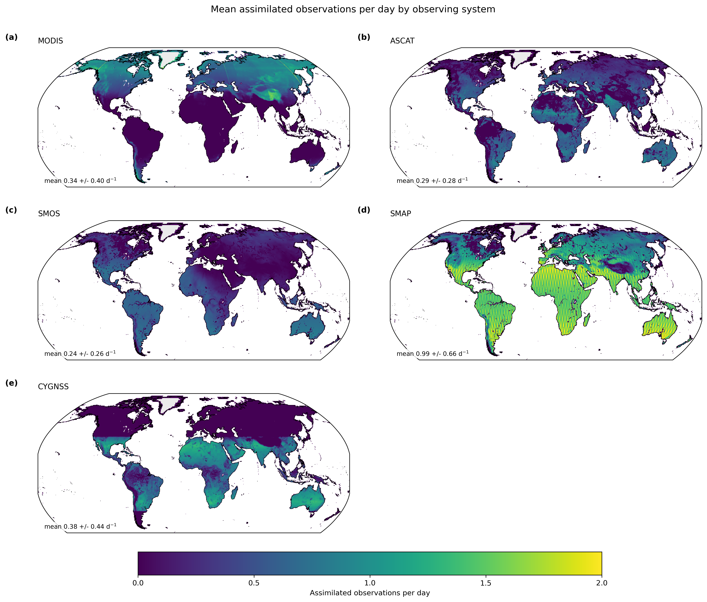

**Figure 2.** Mean number of assimilated observation records per active observing-system day for (a) MODIS SCF, (b) ASCAT soil moisture, (c) SMOS brightness temperature, (d) SMAP brightness temperature, and (e) CYGNSS soil moisture, aggregated over the period in which each observing system is available. Values are shown on the M36 grid, and the spatial mean and standard deviation are given in each panel. Counts represent accepted observation records entering the assimilation system and therefore reflect sensor sampling together with the applicable quality-control and environmental screening.

The temporal evolution makes the changing observational constraint still clearer (Fig. 3). During P1–P2, monthly counts are dominated by MODIS and exhibit a pronounced seasonal cycle associated with Northern Hemisphere snow cover. ASCAT introduces a persistent soil-moisture constraint in P3, and SMOS increases the diversity of the microwave observing system beginning in P4. The largest increase in observation volume occurs with SMAP in P6, after which the combined system maintains substantially greater year-round observational coverage than during the first half of the record. CYGNSS and changes in the ASCAT constellation further alter the composition of the observing system during P7–P9. The land analysis is therefore subject to distinctly different observational regimes through time rather than to a stationary set of constraints.

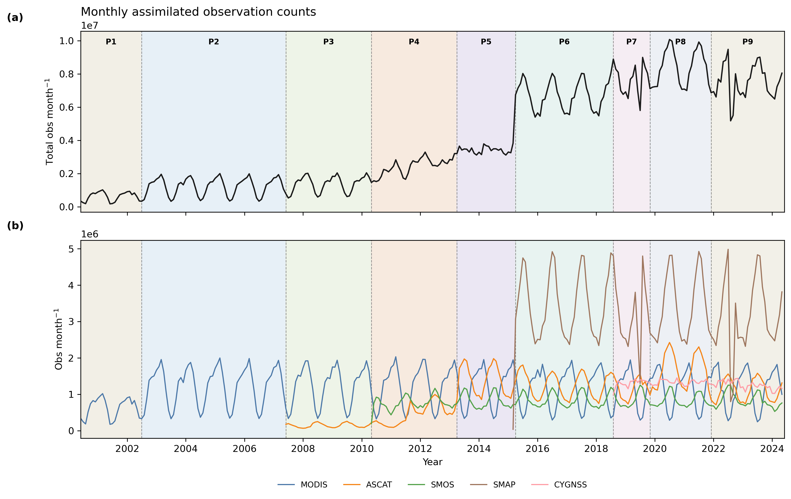

**Figure 3.** Temporal evolution of assimilated observations from June 2000 through May 2024. (a) Total number of accepted observations assimilated each month and (b) monthly counts separated into MODIS, ASCAT, SMOS, SMAP, and CYGNSS observation groups. Background shading denotes the P1–P9 periods defined in Fig. 1. Changes in both the total count and its sensor composition reflect mission availability together with quality-control and environmental screening.

### 3.2 Evolution of observational influence

The changing observing system is accompanied by corresponding changes in the agreement between the land-model background and the assimilated observations. Figure 4 shows the full-record relative reduction in the time-series standard deviation of the observation-minus-forecast (OmF) residuals, expressed as \((\sigma_{\mathrm{OL}}-\sigma_{\mathrm{DA}})/\sigma_{\mathrm{OL}}\), so that positive values indicate smaller residual variability in DA. OmF variability is reduced for each observation group over substantial portions of its sampling domain, but the magnitude and spatial coherence of the response differ among sensors. The later L-band observations, particularly SMAP, show the broadest and most coherent reductions, whereas ASCAT and CYGNSS responses are more spatially heterogeneous. These differences characterize how strongly the common DA system constrains the model background; they are not an independent assessment of observation quality or sensor skill.

MODIS exhibits a different response because SCF is highly seasonal and directly constrained by its assimilation. Large reductions in SCF OmF variability occur across much of the seasonal-snow domain. The normalized magnitude can become large where OL SCF residual variability is small or intermittent, however, and is not directly comparable with the microwave percentages. The MODIS result is therefore interpreted primarily as evidence of strong direct constraint on modeled snow occurrence.

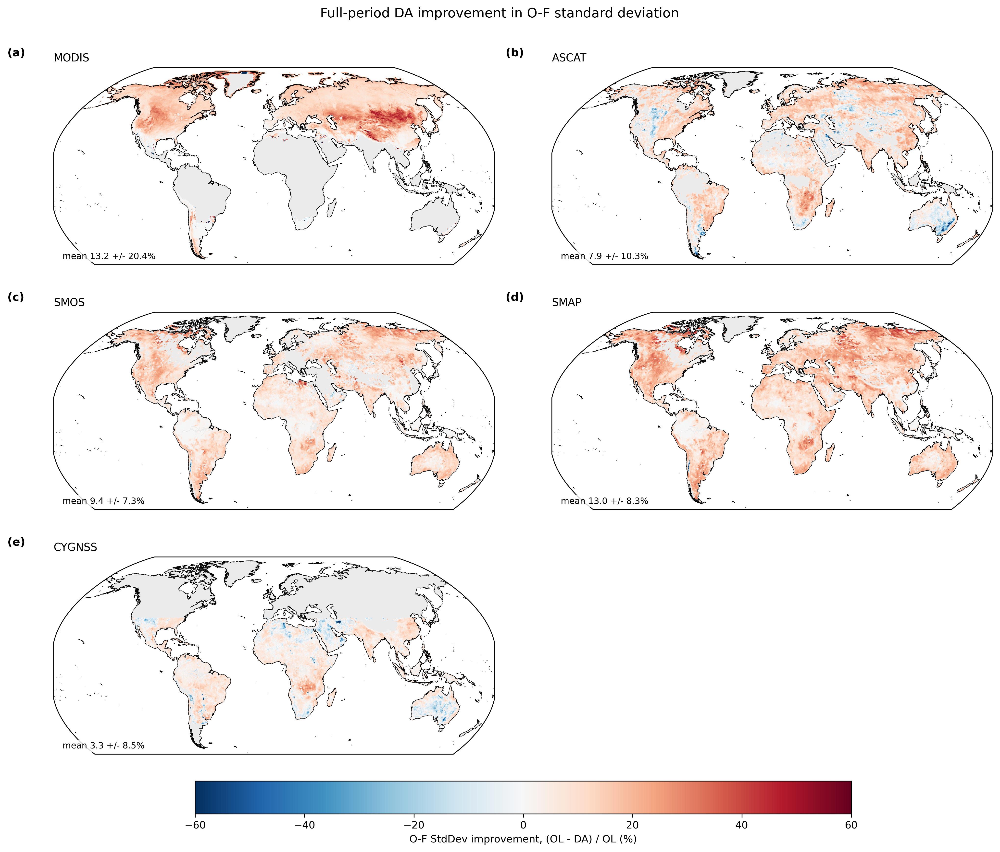

**Figure 4.** Full-period relative reduction in the time-series standard deviation of observation-minus-forecast (OmF) residuals for (a) MODIS SCF, (b) ASCAT soil moisture, (c) SMOS brightness temperature, (d) SMAP brightness temperature, and (e) CYGNSS soil moisture. Improvement is calculated as \((\sigma_{\mathrm{OL}}-\sigma_{\mathrm{DA}})/\sigma_{\mathrm{OL}}\times100\%\); positive values indicate that the DA background has lower OmF variability than OL. Values in each panel give the spatial mean and standard deviation over locations with sufficient observations.

More important for the present study is how this influence evolves through time (Fig. 5). The transition to the SMAP era does not produce a uniform increase in OmF improvement across the existing microwave observation streams. Between P5 and P6, mean SMOS improvement increases from 6.3% to 15.4%, whereas ASCAT decreases from 13.8% to 6.4%; SMAP enters the observing system with a mean improvement of 15.3%. The response to the P5–P6 transition is therefore better characterized as a reorganization of observational influence within the multi-sensor analysis than as a simple increase in constraint across all sensors. This changing response demonstrates that the effect of adding an observing system depends on its interaction with the observations already being assimilated.

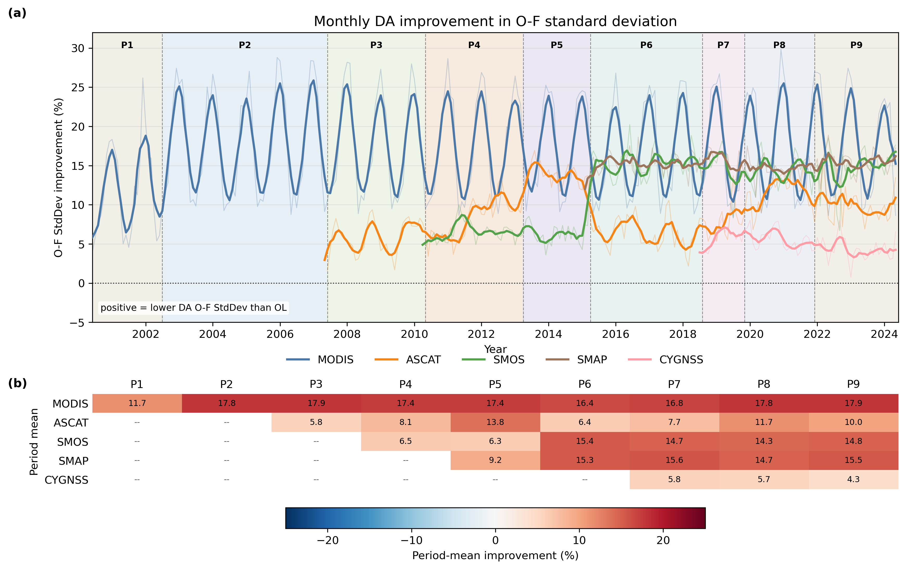

**Figure 5.** Evolution of the relative reduction in OmF standard deviation through the observing-system record. (a) Monthly improvement for MODIS, ASCAT, SMOS, SMAP, and CYGNSS, calculated as \((\sigma_{\mathrm{OL}}-\sigma_{\mathrm{DA}})/\sigma_{\mathrm{OL}}\times100\%\). Thin lines show monthly values and thick lines the centered five-month running means. Background shading denotes P1–P9. (b) Mean improvement for each observation group within each P1–P9 period. Positive values indicate smaller OmF variability in DA than in OL.

The period-specific maps show that the temporal evolution is also spatially structured (Fig. 6). Early microwave periods exhibit a comparatively heterogeneous response, whereas the later multi-sensor periods show broader regions in which assimilation reduces OmF variability. Spatial heterogeneity nevertheless remains, indicating that increasing observational density does not make the different observation constraints mutually consistent everywhere. The maps therefore reinforce the principal result from Fig. 5: the strength and spatial organization of observational influence change substantially as the observing system evolves.

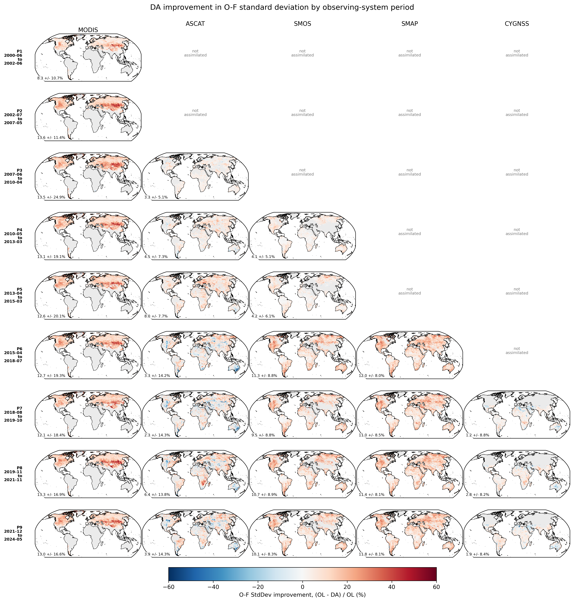

**Figure 6.** Spatial distribution of the relative reduction in OmF standard deviation for each observation group and P1–P9 observing-system period in which data are available. Columns show MODIS, ASCAT, SMOS, SMAP, and CYGNSS, and rows correspond to the periods defined in Fig. 1. The metric and sign convention are the same as in Figs. 4–5, with positive values indicating lower OmF variability in DA. Empty or gray regions denote unavailable or insufficient observations.

Together, Figs. 4–6 demonstrate that observational influence is nonstationary across the 24-yr record. As new observing systems are introduced, both the magnitude and spatial organization of the OmF response change, and these changes are not uniform across the observation streams already present. The P5–P6 transition is particularly clear, with strong SMAP and SMOS responses accompanied by a reduction in the ASCAT OmF improvement. Section 3.7 tests whether this reorganization of observational influence is accompanied by a detectable structural change in the soil-water analysis and its long-term behavior.

### 3.3 Independent soil-moisture evaluation

Independent evaluation against in situ observations shows a progression consistent with the changing observational influence in Figs. 4–6 (Fig. 7). During the SCF-only period (P1–P2), when no soil-moisture observations are assimilated, changes in surface and root-zone skill are generally small and most uncertainty intervals include zero. Positive soil-moisture responses become more apparent during the Pre-SMAP microwave period (P3–P5) and are generally largest and most consistent at the surface during the SMAP-era microwave period (P6–P9). The response is weaker and more heterogeneous in the root zone throughout the microwave periods.

For surface soil moisture, R increases during the Pre-SMAP microwave period range from 0.016 to 0.046 across SNOTEL, SCAN, USCRN, and ARM. During the SMAP-era microwave period, the median R increase across the six networks is 0.049; increases are 0.044–0.060 for SNOTEL, USCRN, and OzNet, while ARM has a larger but more uncertain increase of 0.157 based on four paired sites. Surface anomR shows a similar progression, reaching 0.074 for SNOTEL and 0.090 for OzNet, with the four-site ARM estimate again larger and less certain. Surface ubRMSE decreases by 0.0022–0.0039 m³ m⁻³ for SNOTEL, SCAN, USCRN, and OzNet during this later period, whereas the SMOSMANIA change is near zero. The variation in both response magnitude and interval width indicates that the period progression is not spatially uniform and should not be interpreted as a common response across all networks.

Root-zone changes are smaller. During the SMAP-era microwave period, network-mean R changes range from 0.010 to 0.045, with a median of 0.019, and anomR changes range from 0.004 to 0.063, with a median of 0.036. Root-zone ubRMSE changes are centered closer to zero, with a median improvement of 0.0011 m³ m⁻³; SMOSMANIA is nearly neutral and OzNet shows a decrease in skill of 0.0047 m³ m⁻³. Many root-zone uncertainty intervals overlap zero, consistent with a weaker and less uniform response than at the surface. The independent measurements therefore show that the evolving observational constraint is accompanied by improved soil-moisture skill, particularly near the surface, rather than only by closer agreement with the assimilated observations.

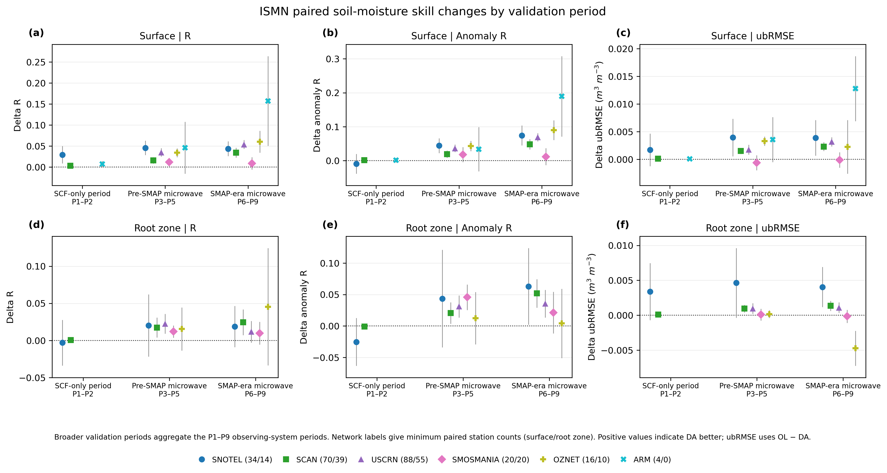

**Figure 7.** Paired differences in soil-moisture skill between the data-assimilation experiment (DA) and open-loop experiment (OL) against in situ observations from the International Soil Moisture Network. Columns show correlation (R), anomaly correlation (anomR), and unbiased RMSE (ubRMSE) for surface and root-zone soil moisture. Results are aggregated over the SCF-only period (P1–P2), Pre-SMAP microwave period (P3–P5), and SMAP-era microwave period (P6–P9). Differences are DA−OL for R and anomR and OL−DA for ubRMSE, so positive values indicate better DA skill for all metrics. Symbols show network means of paired station-level differences; error bars are 95% Student-t confidence intervals for each network mean, calculated from the across-station standard error of the paired differences. SNOTEL and SCAN contribute surface and root-zone results in all three periods; ARM contributes surface results in all three periods but has no root-zone result; USCRN, SMOSMANIA, and OzNet contribute to the later two periods.

### 3.4 Snow-cover, SWE, and snow-depth evaluation

Independent snow evaluation shows a pronounced contrast between the response of snow occurrence and that of bulk snowpack properties (Figs. 8–10). Relative to IMS, DA improves the representation of snow presence across much of the Northern Hemisphere seasonal-snow domain (Fig. 8). Domain-mean accuracy increases from 0.901 in OL to 0.912 in DA, while hit rate increases from 0.824 to 0.863 and miss rate decreases from 0.176 to 0.137. These gains are accompanied by a much smaller deterioration in snow-free classification: the false alarm ratio increases from 0.116 to 0.118 and the correct rejection rate decreases from 0.942 to 0.938. Spatially, the largest improvements are associated with increased hit rate and reduced misses across major seasonal-snow regions, whereas the false-alarm response is smaller and more heterogeneous. A common-support comparison of the early MODIS periods similarly shows a larger hit-rate improvement during the Terra+Aqua period (P2; +0.0655) than during the Terra-only period (P1; +0.0433), consistent with the stronger snow-cover observational constraint after Aqua observations are added.

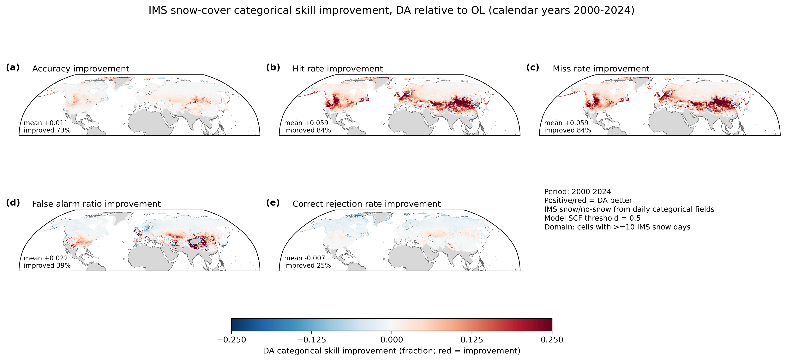

**Figure 8.** Differences in categorical snow-cover skill between the data-assimilation experiment (DA) and open-loop experiment (OL) relative to daily IMS observations over the Northern Hemisphere. Panels show changes in accuracy, hit rate, miss rate, false alarm ratio, and correct rejection rate. Differences are expressed as DA−OL for accuracy, hit rate, and correct rejection rate and as OL−DA for miss rate and false alarm ratio, such that positive values indicate better DA performance throughout. Model snow cover is defined using a snow-cover-fraction threshold of 0.5, and the evaluation is restricted to grid cells with at least 10 IMS-observed snow days during the analysis period.

The response of snow water equivalent is much smaller (Fig. 9). Against SNOTEL, the all-season station-mean RMSE decreases only slightly, from approximately 246.8 to 246.0 kg m⁻², while ubRMSE is nearly unchanged at approximately 176.3 and 176.2 kg m⁻² in OL and DA, respectively. Seasonal RMSE changes are similarly modest, including reductions from about 31.2 to 30.3 kg m⁻² in SON and from 215.1 to 213.2 kg m⁻² in DJF. The station-level maps show substantial spatial heterogeneity, with local improvements offset by degradations elsewhere. Thus, the strong improvement in snow occurrence does not translate into a comparable domain-wide improvement in SWE magnitude.

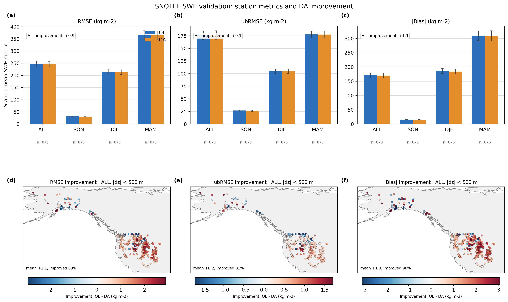

**Figure 9.** Seasonal snow-water-equivalent (SWE) performance against SNOTEL observations for OL and DA. The top row shows station-mean RMSE, unbiased RMSE (ubRMSE), and absolute bias for the all-season snow period (excluding JJA), SON, DJF, and MAM, with 95% confidence intervals estimated by station bootstrap. The bottom row shows station-level OL−DA differences for the corresponding metrics, so positive values indicate lower error in DA. The mapped station sample is additionally restricted to locations for which the absolute difference between station and model-tile elevation is less than 500 m.

Snow-depth evaluation against GHCN shows a similar but somewhat clearer small improvement (Fig. 10). Across the 9,451-station baseline sample, all-season RMSE decreases from 126.3 mm in OL to 124.4 mm in DA, ubRMSE from 100.6 to 99.1 mm, and absolute bias from 66.8 to 65.7 mm. Comparable small reductions occur during DJF and MAM, whereas the SON response is weaker and absolute bias slightly increases. The station maps remain spatially mixed, with improvements across many locations accompanied by regional degradations. The snow-depth response is therefore more consistent with a modest redistribution and reduction of error than with a uniform improvement in snowpack magnitude.

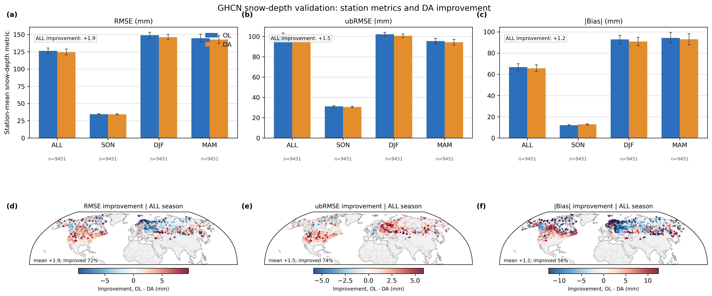

**Figure 10.** Seasonal snow-depth performance against GHCN-Daily observations for OL and DA. The top row shows station-mean RMSE, ubRMSE, and absolute bias for the all-season snow period (excluding JJA), DJF, MAM, and SON, with 95% confidence intervals estimated by station bootstrap. The bottom row shows station-level OL−DA differences for the corresponding metrics, such that positive values indicate lower DA error. Results use the 9,451-station Northern Hemisphere baseline-core sample satisfying the common OL/DA coverage, distance, and elevation-difference requirements.

Taken together, Figs. 8–10 show that MODIS SCF assimilation most clearly improves the occurrence and seasonal extent of modeled snow, whereas changes in SWE and snow depth are smaller and more heterogeneous. This contrast is consistent with the information supplied by the assimilated observations: SCF directly constrains whether and how much of a land element is snow covered, while the associated SWE and depth adjustments do not uniquely determine subsequent snowpack magnitude, which also depends on snowfall, density evolution, thermodynamics, and melt. The comparatively modest SWE and snow-depth validation response should therefore not be interpreted as evidence that snow-cover assimilation has little hydrologic consequence. Section 3.6 shows that the snow-water corrections required to enforce the SCF constraint subsequently propagate strongly through melt-season soil moisture, runoff, evapotranspiration, and land-water storage.

### 3.5 Comparison with ERA5-Land

The ERA5-Land comparison provides a complementary large-scale assessment of how the OL and DA land states evolve relative to another long-term land-reanalysis product (Figs. 11–13). The comparison is interpreted as a measure of consistency rather than as a direct test of correctness because ERA5-Land is itself model based. For soil moisture, differences between OL and DA are small during the SCF-only period (P1–P2), become more apparent during the Pre-SMAP microwave period (P3–P5), and are largest during the SMAP-era microwave period (P6–P9; Fig. 11). The progression is clearest at the surface, where both correlation and anomaly correlation increase and ubRMSE decreases relative to OL during the later periods. During P6–P9, surface R increases by 0.036, surface anomaly R increases by 0.057, and surface ubRMSE decreases by 0.00227 m³ m⁻³. Root-zone responses are smaller and less consistent, in agreement with the surface-to-root-zone contrast found in the in situ evaluation in Section 3.3.

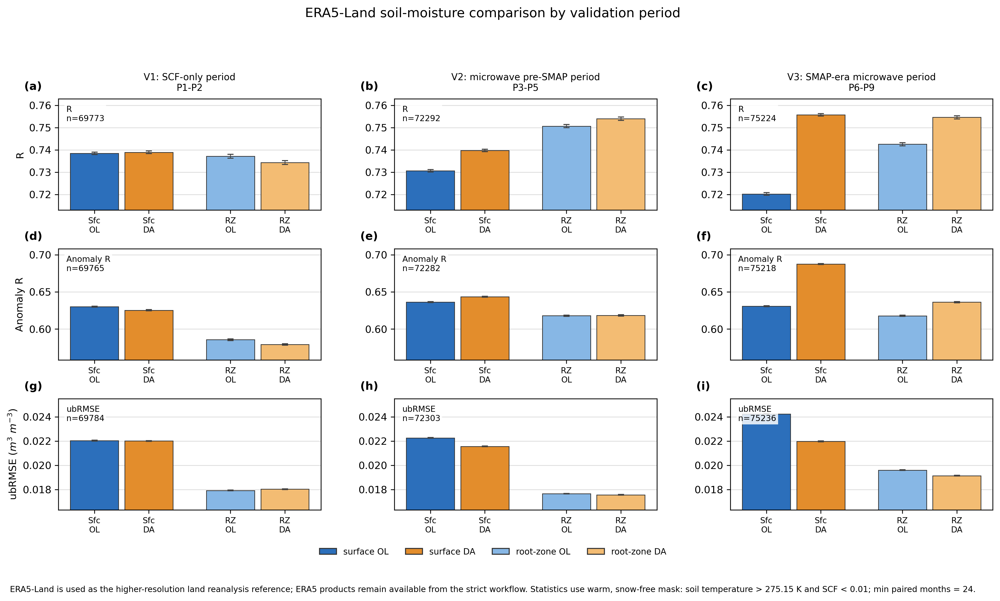

**Figure 11.** Spatially averaged agreement of OL and DA soil moisture with ERA5-Land over the SCF-only period (P1–P2), Pre-SMAP microwave period (P3–P5), and SMAP-era microwave period (P6–P9). Rows show correlation (R), anomaly correlation (anomR), and unbiased RMSE (ubRMSE); each panel compares surface and root-zone OL and DA values. Error bars denote the standard error of the spatial mean over finite M36 grid cells. Statistics use the common warm, snow-free comparison mask and require at least 24 paired monthly values. ERA5-Land is used here as a large-scale reanalysis consistency reference, not as an observational benchmark.

The spatial patterns reinforce this temporal progression (Fig. 12). Surface-soil-moisture changes are weak and spatially mixed during P1–P2, become more broadly positive during P3–P5, and show the greatest spatial coherence during P6–P9. In the later period, the spatial-mean gains in agreement are +0.029 for surface R, +0.057 for surface anomaly R, and +0.0021 m³ m⁻³ for surface ubRMSE. Root-zone responses remain smaller and more heterogeneous, with corresponding P6–P9 spatial-mean values of +0.0067, +0.017, and +0.0005 m³ m⁻³. The increased observational constraint is therefore expressed most consistently in near-surface soil moisture, while propagation into the root zone remains more dependent on regional land-surface dynamics.

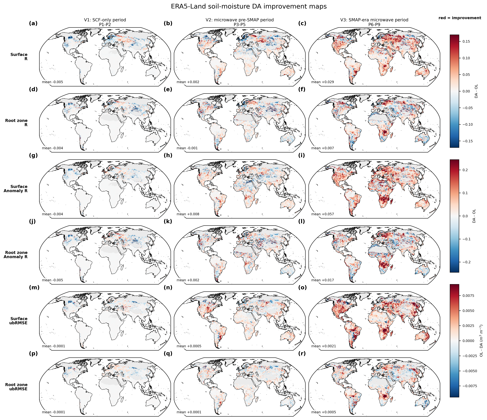

**Figure 12.** Spatial distribution of changes in soil-moisture agreement with ERA5-Land for the SCF-only period (P1–P2), Pre-SMAP microwave period (P3–P5), and SMAP-era microwave period (P6–P9). Rows show surface and root-zone correlation, anomaly correlation, and ubRMSE. Correlation differences are DA−OL and ubRMSE differences are OL−DA, so positive values and red shading indicate better DA agreement throughout. Values shown within the panels give the spatial mean improvement over finite grid cells.

The snow comparison shows the same variable dependence identified by the observational evaluations in Section 3.4 (Fig. 13). Over the complete June 2000–May 2024 record, SCF exhibits the clearest improvement in agreement with ERA5-Land: RMSE decreases from 0.1178 in OL to 0.1087 in DA, ubRMSE decreases from 0.0660 to 0.0597, and the absolute bias decreases by 0.0144. Changes in bulk snowpack magnitude are substantially smaller, with RMSE and ubRMSE reductions of 0.00121 and 0.00028 m for SWE and 0.00489 and 0.00115 m for snow depth. Thus, the ERA5-Land comparison shows neither a large systematic improvement nor degradation in bulk snowpack magnitude, but does show substantially greater consistency in snow-cover occurrence after assimilation. This result is consistent with the IMS, SNOTEL, and GHCN evaluations: the strongest direct snow-analysis response occurs in snow-cover extent, whereas the resulting SWE and depth changes are more heterogeneous.

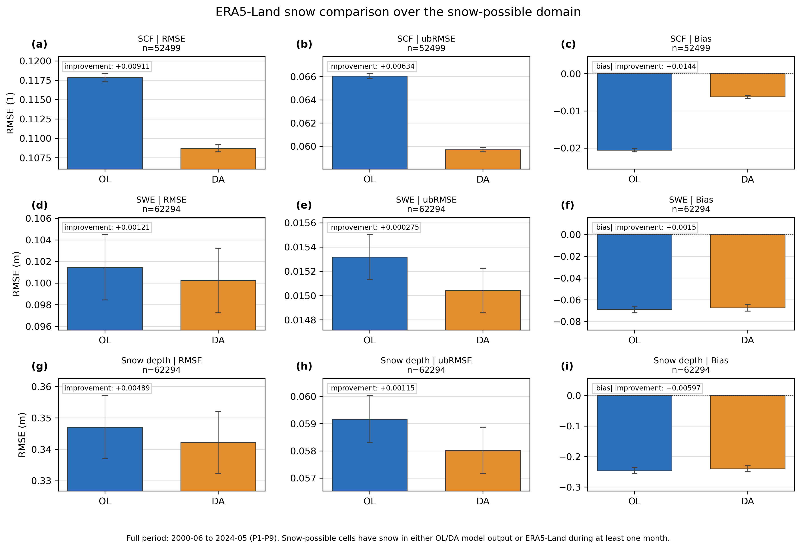

**Figure 13.** Full-period June 2000–May 2024 comparison of OL and DA snow variables with ERA5-Land over the snow-possible domain. Rows show snow-cover fraction (SCF), snow water equivalent (SWE), and snow depth, and columns show RMSE, ubRMSE, and bias. Error bars denote the standard error of the spatial mean over finite grid cells. Panel annotations give DA improvement as OL−DA for RMSE and ubRMSE and as the reduction in absolute bias for the bias panels. Positive improvement therefore denotes closer DA agreement with ERA5-Land.

Overall, Figs. 11–13 show that the changing observational constraint increasingly modifies GEOS LDAS toward the large-scale soil-moisture variability represented by ERA5-Land, with the clearest response at the surface and during the SMAP-era microwave period. Because ERA5-Land is another model-based land reanalysis, these results are interpreted as evidence of increasing cross-reanalysis consistency and are complementary to, rather than a substitute for, the independent observational evaluations in Sections 3.3–3.4.

### 3.6 Hydrologic consequences of snow-cover assimilation

Although the SWE and snow-depth validation response in Section 3.4 is modest, the snow-water corrections required to enforce the SCF constraint are large in mass terms and propagate strongly through the modeled hydrologic cycle. Across the six complete MODIS-only water years WY2001–WY2006, the area-weighted mean signed snow-DA input was 58.2 kg m⁻² yr⁻¹ (Fig. 14a). The corresponding runoff response varied from 55.6% to 70.1% of the annual net input, indicating that runoff was consistently a major fate of the assimilation-induced snow water rather than the result being dominated by a single year. The six-year mean budget had a small negative residual of −2.67 kg m⁻² yr⁻¹, equivalent to −4.6% of the net snow-water input.

The partition is clearer when the analysis is restricted to the 247,545 tile-years in which snow assimilation added water (Fig. 14b). Of the added snow water, 43.1% subsequently left as surface runoff and 21.2% as baseflow, giving a total runoff fraction of 64.3%. The 5° spatial-block bootstrap interval for total runoff was 61.1–67.2%. Evapotranspiration accounted for a further 35.9%, whereas only 3.9% remained as additional land-water storage at the end of the water year. The residual was −4.1%. Thus, most snow water added by MODIS SCF assimilation subsequently left the land column as runoff, with a substantial additional loss through evapotranspiration and relatively little remaining in storage by the end of the accounting period.

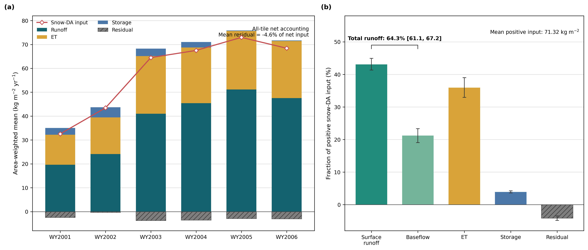

**Figure 14.** Differential water-budget response to MODIS snow-cover assimilation during the six complete MODIS-only water years, WY2001–WY2006. (a) Area-weighted annual accounting over the Northern Hemisphere seasonal-snow domain. Diamonds show the signed snow-water input from the analysis increments; bars show the corresponding DA−OL changes in total runoff, evapotranspiration (ET), September-to-September total land-water storage, and the residual. (b) Fate of positive snow-DA input for the 247,545 snow-addition tile-years. Error bars denote 95% intervals from the 5° spatial-block bootstrap. Surface runoff and baseflow together account for 64.3% of the added snow water, with a 61.1–67.2% bootstrap interval.

A controlled water-year regression corroborates this partition using a different identifying contrast. After removal of persistent within-tile differences and accounting for common year effects and the within-tile anomaly of OL March–May mean snow mass, the estimated response per unit snow-water input was 0.749 for runoff (95% interval 0.711–0.783), 0.182 for ET (0.155–0.213), and 0.085 for end-of-year storage (0.075–0.097), with a small residual of −0.016 (−0.022 to −0.011). These coefficients describe the marginal response to anomalous input and are not expected to reproduce the direct accounting numerically; the direct mass budget remains the primary partition estimate, and the agreement in ordering provides independent support for the runoff-dominated response.

The monthly evolution provides the corresponding process pathway (Fig. 15). Positive snow-water increments accumulated during the snow season and were followed by increased DA−OL snowmelt and a sustained positive soil-moisture response into spring. Across snow-addition tile-years, the mean within-year peak RZMC difference was 0.0189 m³ m⁻³, with May the most common month of the peak; the mean May–July RZMC difference was 0.0108 m³ m⁻³. Increased runoff and ET accompanied the spring release of the added snow water. A stricter analysis using only October–March snow input and subsequent non-overlapping response windows retained positive responses in RZMC, ET, runoff, and total land-water storage. Delayed infiltration was the exception and was not distinguishable from zero under this stricter formulation. These results support the sequence of snow-water addition, subsequent melt, soil-water recharge, and eventual partitioning into runoff, ET, and storage, while treating snowmelt itself as a transit term rather than a terminal component of the water budget.

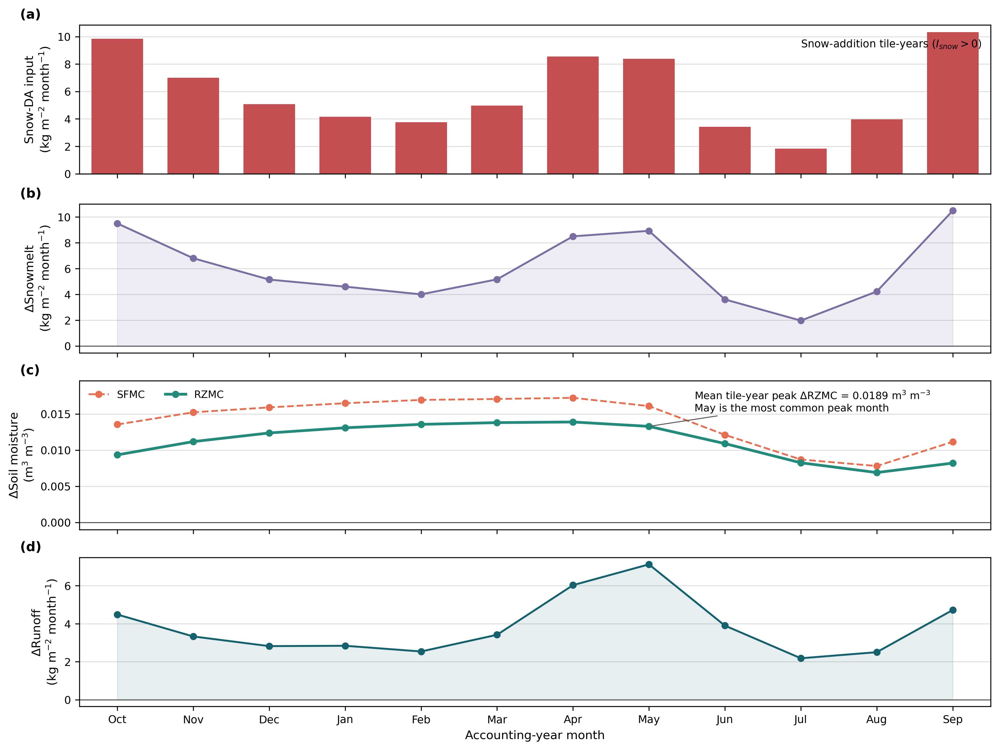

**Figure 15.** Monthly hydrologic response to snow-water addition during WY2001–WY2006 for the same 247,545 snow-addition tile-years used in Fig. 14b. Area-weighted October–September means are shown for (a) signed snow-DA input, (b) DA−OL snowmelt, (c) DA−OL surface (SFMC) and root-zone (RZMC) soil moisture, and (d) DA−OL total runoff and evapotranspiration. The mean tile-year peak RZMC response is 0.0189 m³ m⁻³, and May is the most common month of peak RZMC response. The analysis period ends in September 2006, before microwave soil-moisture assimilation begins.

The modeled energy response was consistent with this hydrologic propagation. Under warm, snow-free conditions, wetter DA−OL root-zone states were associated with increased ET and latent heat flux, reduced sensible heat flux, and increased evaporative fraction. These relationships provide model-internal evidence that assimilation-induced soil-water changes propagate into the surface-energy balance, but do not constitute independent validation of the simulated fluxes.

After microwave soil-moisture assimilation began, there was no robust evidence that locations experiencing stronger snow DA subsequently required larger soil-moisture analysis corrections. The signed corrections nevertheless showed a systematic tendency: where preceding snow assimilation had added water, later soil-moisture corrections were on average more negative. This population-level response suggests partial opposition to snow-induced wetting rather than a simple increase in subsequent assimilation activity; the tile-year relationship was weak and did not eliminate the snow-to-hydrology response described above.

### 3.7 Long-term trends and observing-system transitions

Despite the substantial evolution in observational constraint, DA generally preserves the broad long-term behavior of the OL simulation. The common precipitation forcing provides a useful null-behavior check: OL and DA precipitation trends are nearly identical, with an OL–DA tile-slope correlation of 0.9998 and no significant paired DA−OL trends after field-significance control. Paired long-term trends are likewise essentially absent for snow mass and snow depth, and significant paired surface-soil-moisture trends are limited to 1.25% of valid-land tiles.

The principal state differences are summarized in Fig. 16. Significant paired RZMC trends occur at 7.01% of valid-land tiles and are predominantly positive, with regional concentrations across Australia, North Africa and the Middle East, southern Africa, and parts of the Americas and northern Eurasia. Nevertheless, the area-weighted OL, DA, and DA−OL RZMC trends are all nonsignificant, indicating regional modification rather than global DA-induced wetting. SCF shows the opposite pattern: it declines significantly in both simulations at nearly identical rates (−0.000554 yr⁻¹ in OL and −0.000549 yr⁻¹ in DA), while the paired DA−OL trend is essentially zero. Snow-cover assimilation therefore leaves the broad long-term SCF decline largely unchanged.

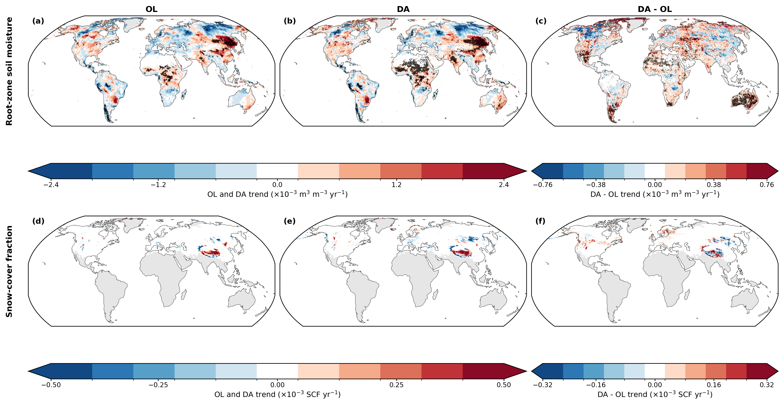

**Figure 16.** Long-term June 2000–May 2024 trends in (a–c) root-zone soil moisture (RZMC) and (d–f) snow-cover fraction (SCF) for the open-loop (OL), data-assimilation (DA), and paired DA−OL series. Trends are exact Theil–Sen slopes after trend-preserving removal of the calendar-month climatology. Black stippling denotes trends significant after Benjamini–Hochberg false-discovery-rate control at 0.05. RZMC uses the valid-land domain and SCF the Northern Hemisphere seasonal-snow domain. The DA−OL panels show the trend of the paired difference series rather than the difference between independently estimated OL and DA trends. The RZMC DA−OL panel uses a separately optimized color scale, whereas the SCF DA−OL panel retains the OL/DA scale to avoid visually amplifying the near-null assimilation-induced SCF trend.

The corresponding analysis of ET, total runoff, and total land-water storage gives the same broad temporal-consistency result. None of the area-weighted OL, DA, or DA−OL series has a significant whole-record trend. At the tile scale, significant paired trends affect 3.66% of tiles for ET, 4.83% for total runoff, and 7.63% for total storage and are predominantly positive. OL and DA spatial trend patterns remain strongly correlated (0.932–0.968). Thus, DA superimposes geographically organized regional changes, strongest in total land-water storage, without generating a resolved global secular trend.

The absence of widespread long-term drift does not imply stationary analysis behavior. A pronounced transition occurs at the P5–P6 boundary in April 2015, coincident with the introduction of SMAP brightness-temperature assimilation and with the reorganization of observational influence identified in Section 3.2 (Fig. 17). RZMC DA−OL increases by 0.00102 m³ m⁻³ over valid land (95% bootstrap interval 0.00049–0.00156 m³ m⁻³), together with increased surface and root-zone correction activity. Absolute prognostic soil-water correction activity increases by 10.61 kg m⁻² month⁻¹. The signed period-mean correction simultaneously shifts from −1.01 kg m⁻² month⁻¹ during P3–P5 to −0.09 kg m⁻² month⁻¹ during P6–P9, indicating that the later observing system largely removes a pre-existing net drying tendency rather than producing a sustained positive water input.

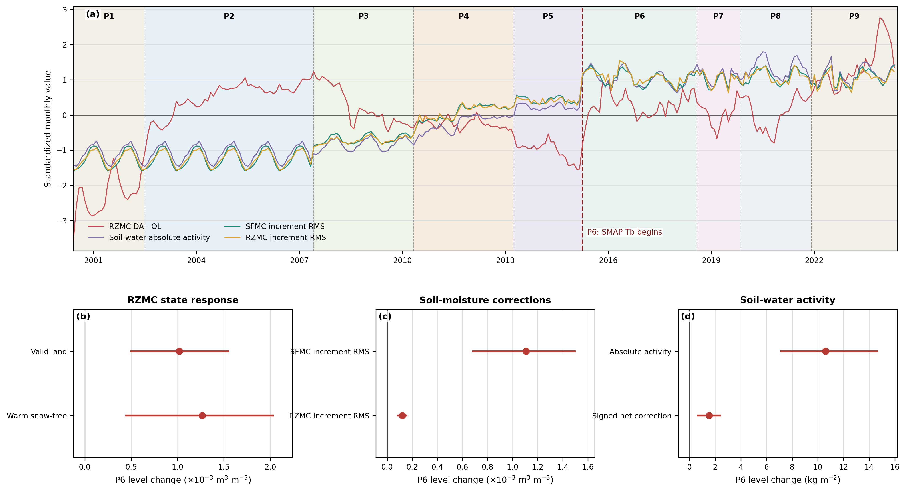

**Figure 17.** Changes in soil-water data-assimilation behavior across the P1–P9 observing-system periods. (a) Standardized area-weighted monthly RZMC DA−OL and soil-water analysis-correction diagnostics during June 2000–May 2024. Background shading denotes the P1–P9 periods defined in Fig. 1; the P5–P6 boundary in April 2015 marks the introduction of SMAP brightness-temperature assimilation. The seasonally adjusted series are standardized using their full-record mean and sample standard deviation for display only; statistical inference is performed in native units. (b) Estimated P6 level changes in RZMC DA−OL for valid-land and warm, snow-free conditions. (c) Corresponding changes in SFMC and RZMC analysis-correction RMS. (d) Changes in absolute and signed net prognostic soil-water correction activity. Symbols show the estimated level changes and horizontal bars the 95% fitted-AR(1) bootstrap intervals. Statistical significance uses boundary-family false-discovery-rate control at 0.05.

Total land-water storage provides the clearest corresponding hydrologic response at P6, increasing by 2.144 kg m⁻² (95% bootstrap interval 0.932–3.266 kg m⁻²; q = 0.009). ET also increases by 0.502 kg m⁻² month⁻¹ and an independently detected changepoint occurs in April 2015, although the prescribed-date ET response does not survive FDR control (q = 0.072). Total runoff has no resolved P6 level change (+0.230 kg m⁻² month⁻¹; q = 0.478). A separate period-mean differential budget supports this interpretation: the increase in soil-water analysis input between P3–P5 and P6–P9 is balanced primarily by increased ET and land-water storage tendency rather than runoff, with closure to within about 5% for the primary comparison and 6–14% across alternative baselines. The April 2015 transition is therefore expressed primarily through soil-water correction activity, wetter root-zone conditions, increased total storage, and a shift in water partitioning toward ET and storage.

Independent changepoint detection corroborates the principal April 2015 transition without being supplied the observing-system date, including breaks in the main soil-water diagnostics and in total storage. Numerous unmatched changepoints also occur elsewhere in the record, however, which argues against automatically assigning every detected change to the nearest observing-system event. The independent detection is therefore used as corroboration of the strongest prescribed-date transitions rather than as a basis for retrospective sensor attribution.

A second physically relevant transition occurs early in the MODIS-only record. At P2, total runoff DA−OL increases by 0.790 kg m⁻² month⁻¹ (95% interval 0.379–1.176 kg m⁻² month⁻¹; q = 0.0045), and an independently detected runoff break occurs in June 2002, one month before the registered July P2 boundary. Because snow-cover assimilation is the only satellite land DA operating during this period, the runoff transition is consistent with the MODIS-only water-budget result in Section 3.6, in which runoff is the dominant fate of assimilation-added snow water, and with the stronger snow-cover constraint indicated by the Terra-only and Terra+Aqua comparison in Section 3.4. The temporal correspondence does not establish Aqua as the unique cause of the change.

Taken together, the trend and transition analyses distinguish regional and discrete changes from global secular drift. The evolving observing system produces detectable changes in correction activity, root-zone soil moisture, total land-water storage, ET, and runoff, but these effects do not accumulate into a resolved global long-term trend. The persistent effects are instead geographically organized, while the clearest discrete transition occurs in April 2015 and the strongest runoff transition occurs earlier during the MODIS-only period.

## 4. Discussion

### 4.1 Evolving observational constraint in long-term land analysis

### 4.2 From direct observational constraint to model-mediated hydrologic response

### 4.3 Observing-system transitions and long-term trend fidelity

### 4.4 Limitations and implications for future multi-sensor reanalysis

## 5. Conclusions

## References

Benjamini, Y., and Y. Hochberg, 1995: Controlling the false discovery rate: A practical and powerful approach to multiple testing. *Journal of the Royal Statistical Society, Series B (Methodological)*, **57**, 289–300. https://doi.org/10.1111/j.2517-6161.1995.tb02031.x.

Hamed, K. H., and A. R. Rao, 1998: A modified Mann–Kendall trend test for autocorrelated data. *Journal of Hydrology*, **204**, 182–196. https://doi.org/10.1016/S0022-1694(97)00125-X.

Helsel, D. R., R. M. Hirsch, K. R. Ryberg, S. A. Archfield, and E. J. Gilroy, 2020: *Statistical Methods in Water Resources*. U.S. Geological Survey Techniques and Methods, book 4, chap. A3, 458 pp. https://doi.org/10.3133/tm4A3.

Killick, R., P. Fearnhead, and I. A. Eckley, 2012: Optimal detection of changepoints with a linear computational cost. *Journal of the American Statistical Association*, **107**, 1590–1598. https://doi.org/10.1080/01621459.2012.737745.

Prais, S. J., and C. B. Winsten, 1954: Trend estimators and serial correlation. Cowles Commission Discussion Paper, Statistics No. 383, University of Chicago, Chicago, 26 pp. [Available online at https://cowles.yale.edu/sites/default/files/files/pub/cdp/s-0383.pdf.]

Truong, C., L. Oudre, and N. Vayatis, 2020: Selective review of offline change point detection methods. *Signal Processing*, **167**, 107299. https://doi.org/10.1016/j.sigpro.2019.107299.

Wilks, D. S., 2016: “The stippling shows statistically significant grid points”: How research results are routinely overstated and overinterpreted, and what to do about it. *Bulletin of the American Meteorological Society*, **97**, 2263–2273. https://doi.org/10.1175/BAMS-D-15-00267.1.

Wilks, D. S., 2019: *Statistical Methods in the Atmospheric Sciences*. 4th ed. Elsevier, 840 pp. ISBN 978-0-12-815823-4.
