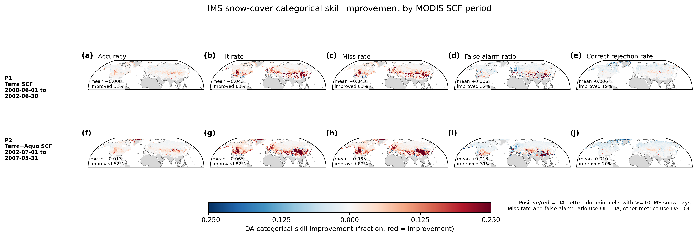
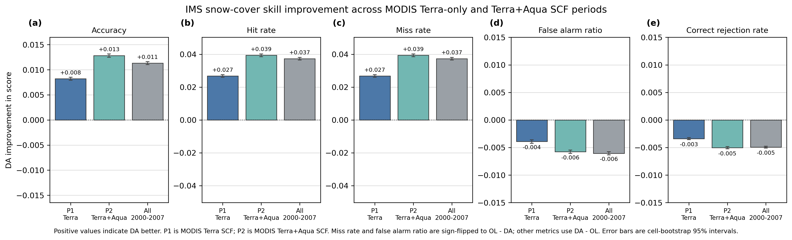
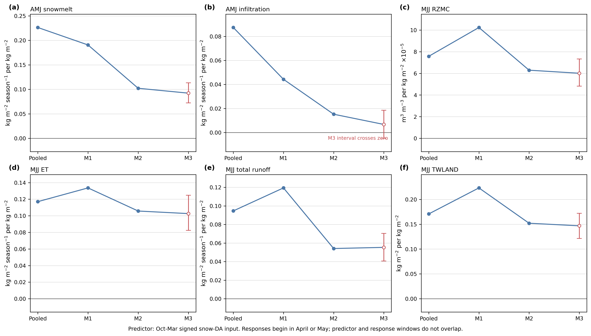
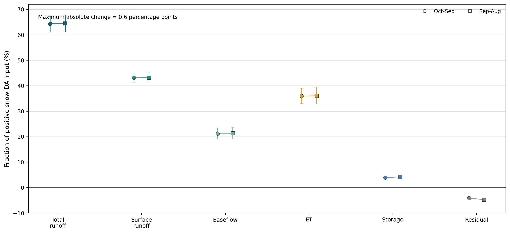
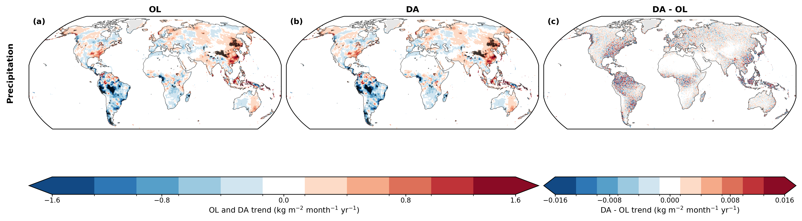
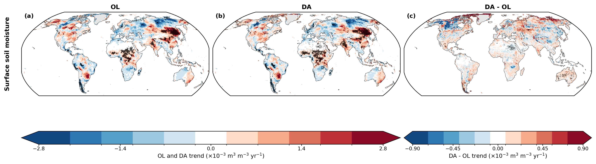
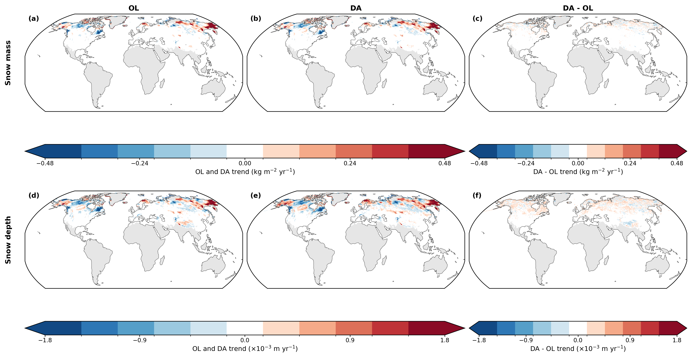
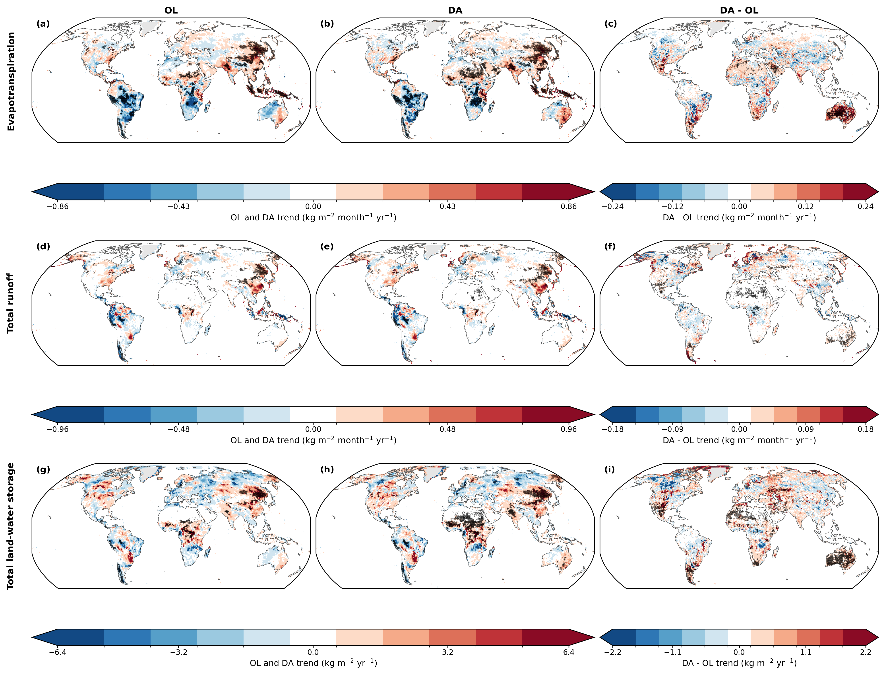
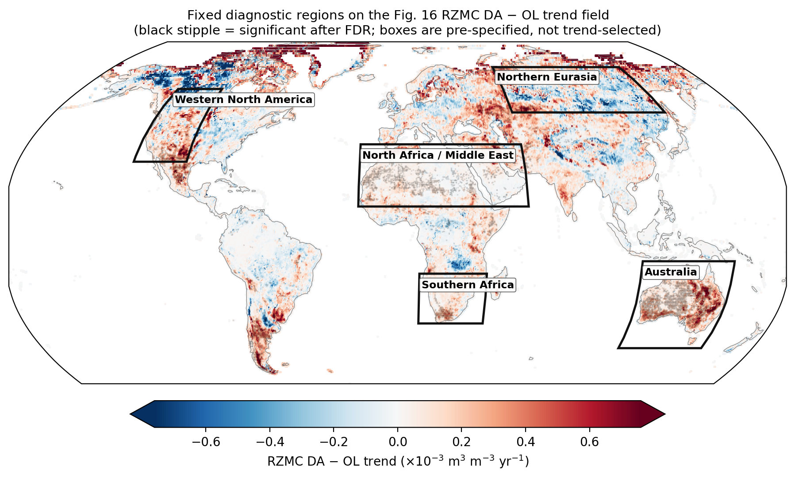
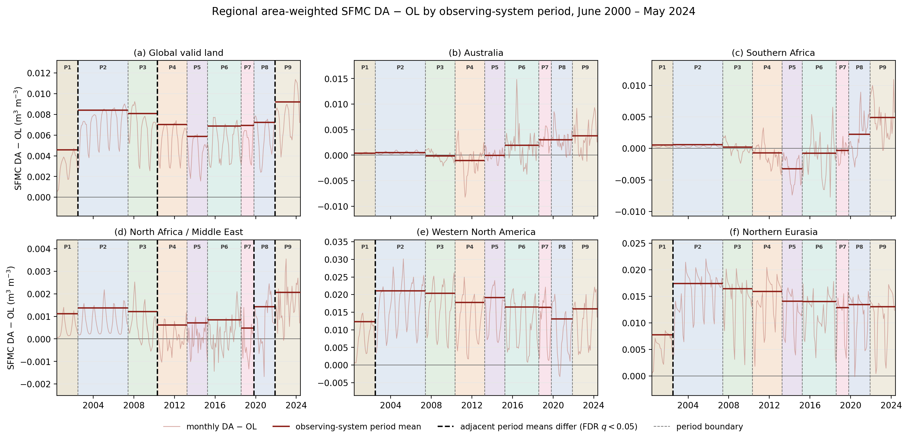

# Supplementary figures

## Figure S1. IMS Terra-only and Terra+Aqua snow-cover skill maps

Spatial differences in IMS categorical snow-cover skill for the P1 MODIS Terra-only SCF and P2 MODIS Terra+Aqua SCF observing-system scopes. Metric signs are oriented so positive values indicate DA improvement. The comparison uses metric-specific cells valid in both periods and characterizes the observing-system scopes rather than isolating a causal Aqua effect.

## Figure S2. IMS Terra-only and Terra+Aqua aggregate comparison

Domain-aggregate IMS snow-cover skill for P1, P2, and the combined 2000–2007 interval. Metric signs are oriented so positive values indicate DA improvement.

## Figure S3. Non-overlapping snow-DA attribution

October–March snow-input controls for the accepted spring and summer hydrologic responses. Restricting the predictor to October–March removes temporal overlap with responses beginning in April or May.

## Figure S4. Water-budget boundary sensitivity

Comparison of the accepted October–September water-year budget with the shifted September–August accounting boundary.

## Figure S5. Precipitation trend control

OL and DA precipitation trends and the paired DA−OL trend. The paired field tests the nominally common forcing used by both experiments.

## Figure S6. Surface soil-moisture trends

Theil–Sen trends for OL, DA, and paired DA−OL surface soil moisture over valid land, with the production spatial significance treatment.

## Figure S7. Snow-mass and snow-depth trends

Theil–Sen trends for OL, DA, and paired DA−OL snow mass and snow depth over the Northern Hemisphere seasonal-snow domain.

## Figure S8. Flux and storage trend diagnostics

Whole-record trend maps for evapotranspiration, total runoff, and total land-water storage in OL, DA, and the paired DA−OL fields.

## Figure S9. Regional masks on the RZMC trend field

The six fixed regional domains used for the observing-system period analysis, shown on the Figure 16 paired RZMC trend field. The five regional boxes do not tile the globe.

## Figure S10. Surface soil-moisture period sensitivity

Regional surface-soil-moisture DA−OL means by observing-system period, using the same regions, seasonal adjustment, uncertainty calculation, and false-discovery-rate structure as the RZMC analysis.

