# Monthly Synthesis Report-Out: Snow DA, Soil-Moisture DA, Hydrology, and Energy

## Purpose

The manuscript currently presents snow and soil-moisture DA results mostly as separate outcomes. This analysis asks whether the two parts of the GEOS LDAS multi-sensor reanalysis are connected through physically meaningful land-surface pathways.

The process-chain question is:

```text
snow DA increments
  -> snow storage and melt
  -> infiltration and soil moisture
  -> runoff / storage / ET
  -> surface-energy partitioning
```

These are model-internal `DA - OL` diagnostics. They are useful for process interpretation, but they are not independent validation.

Figures in this report are copied into `projects/M21C_ls/docs/monthly_synthesis_report_figures/` and referenced with relative links so the document renders on GitHub.

## Data and Periods

The analysis uses monthly M36 tile-space GEOS LDAS data from June 2000 through May 2024.

Main inputs:

- Matched DA and OL monthly state, hydrology, flux, latent-component, and energy fields.
- Raw cumulative prognostic increment product:
  `catch_progn_raw_monthly_cumulative_200006_202405.nc`
- Raw diagnostic forecast-analysis product:
  `inst3_fcstana_raw_monthly_diagnostic_200006_202405.nc`

Observing-system periods:

| Period | Date range | Clean season years | Interpretation |
|---|---:|---:|---|
| MODIS-only / snow-only | 2000-06 to 2007-05 | 2001-2006 | Snow DA active; microwave SM DA not active |
| Microwave pre-SMAP | 2007-06 to 2015-03 | 2008-2014 | Snow DA plus pre-SMAP microwave SM DA |
| SMAP-era microwave | 2015-04 to 2024-05 | 2016-2023 | Snow DA plus SMAP-era microwave SM DA |

## Key Definitions

`DA - OL` means the data-assimilation run minus the matched open-loop run.

Positive `DA - OL` means the DA trajectory is larger than OL for that variable.

Important snow increment terms:

- `snow_net`: signed cumulative snow-water increment, in `kg m-2`.
  Positive values mean snow DA added snow water equivalent; negative values mean it removed snow water equivalent.
- `snow_abs_netpack`: cumulative absolute snow DA activity, in `kg m-2`.
  This measures how much snow DA adjusted the snowpack, regardless of sign.

Important soil-moisture DA activity terms:

- `RZMC_INC_RMS`: diagnostic root-zone soil-moisture ANA-FCST activity, in `m3 m-3`.
  This is not cumulative water. It measures the typical size of root-zone soil-moisture analysis corrections.
- `soil_water_abs_activity`: native prognostic soil-water increment activity, in `kg m-2`.
  This measures the absolute magnitude of soil-water DA corrections in prognostic water variables.

Important caution:

- Snow DA increments are real mass corrections to snow storage.
- Diagnostic SM variables such as `RZMC_INC_RMS` are activity metrics, not water-budget terms.

## Main Message

Snow DA and SM DA are not just separate skill stories.

The strongest result is that MODIS snow DA produces real snow-water corrections that propagate through melt-season hydrology. The hydro-energy response is also physically coherent: DA-induced soil-water differences alter ET and turbulent heat partitioning in the expected direction.

The post-2007 snow-to-SM question now splits into two different findings. The magnitude/activity relationship between prior snow DA activity and later SM DA activity is not robust enough to use as a headline result. But the signed relationship is more coherent: where snow DA adds water, the later SM DA correction tends to be more negative, suggesting that the subsequent SM analysis partially counteracts the snow-DA wetting signal.

The overall synthesis is therefore:

```text
snow DA changes snow water and melt-season hydrology;
later SM DA does not simply become more active where snow DA was more active;
but signed SM corrections tend to oppose prior snow-added water at the population level.
```

## Highlight 1: Snow DA Propagates Into Hydrology

This is the clearest result and the best candidate for a manuscript synthesis point.

Why Analysis A is strong:

- It uses the MODIS-only period, before microwave SM DA is active.
- Snow DA is therefore the active observational constraint.
- Snow increments are real snow-water mass corrections, not scaled diagnostic quantities.

Main finding:

High MAM snow DA activity is associated with larger AMJ/MJJ hydrologic responses in seasonal-snow regions.

Responses include:

- snowmelt,
- infiltration,
- root-zone soil moisture,
- evapotranspiration,
- total runoff,
- total water storage.

Suggested wording:

> During the MODIS-only period, snow DA produces real snow-water corrections that propagate into melt-season hydrology. Regions and years with stronger MAM snow DA activity show larger subsequent DA-OL responses in infiltration, root-zone soil moisture, ET, runoff, and total water storage.

Interpretation:

This supports a physically coherent snow-to-hydrology pathway:

```text
snow increment -> melt / infiltration -> RZMC / storage -> ET / runoff
```

**Figure 1. Analysis A process-chain maps**

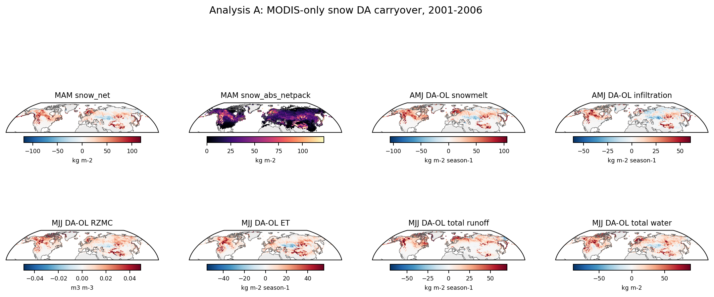

The maps summarize the MODIS-only period, when snow DA is the active observational constraint and microwave SM DA is not yet active. They show where MAM snow DA activity lines up spatially with later AMJ/MJJ `DA - OL` responses in snowmelt, infiltration, soil moisture, ET, runoff, and storage.

**Figure 2. Analysis A binned snow activity versus hydrologic response magnitude**

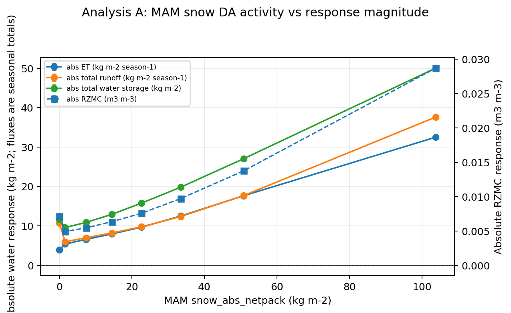

This binned summary uses seasonal-snow grid-cell/year samples from the MODIS-only period. The x-axis groups samples by MAM `snow_abs_netpack`, the cumulative absolute snow DA activity in `kg m-2`; the y-axes show later AMJ/MJJ hydrologic `DA - OL` response magnitudes. The point is not independent validation, but that stronger snow DA activity is associated with larger modeled hydrologic departures from OL.

## Highlight 2: Later SM DA Response Splits Into Two Claims

Analysis B is now two separable results with different levels of support.

Question:

Does prior snow DA predict later SM DA behavior?

### 2a. Magnitude/activity: drop as a substantive claim

The original magnitude/activity question was:

> Does stronger MAM snow DA activity lead to larger later SM DA activity?

This should be dropped from the report as a substantive finding.

Evidence:

- Raw snow-activity bins do not provide a clear positive relationship between MAM snow DA activity and later SM DA activity.
- Within-tile anomaly controls are weak or nearly flat.
- Tile-wise correlations are small.

Suggested wording:

> Stronger MAM snow DA activity does not translate into a robust, interpretable increase in later SM DA activity magnitude.

Interpretation:

This is a useful negative result, but not a headline. The cleaner post-2007 signal is directional, not magnitude-based.

### 2b. Signed/directional response: new substantive finding

The signed question is different:

> When snow DA adds water in MAM, what is the sign of the later SM DA correction?

Main finding:

Tiles/years where MAM snow DA adds water are followed by increasingly negative later SM DA corrections. In plain language, the snow-DA wetting signal appears to be partially counteracted by the subsequent SM DA correction.

Evidence:

- `analysisB_binned_signed_snow_vs_signed_sm_correction.png` shows a clean monotonic downward trend in both microwave periods.
- The same tendency is visible at the raw tile-year level in `analysisB_smapera_signed_snow_vs_rzmc_hexbin.png`, although the raw cloud is noisy.

Suggested wording:

> In the microwave periods, positive MAM snow-water increments are followed by more negative later SM DA corrections. This suggests that the later SM analysis partially counteracts the wetting introduced by snow DA. This is a population-level tendency rather than a strong tile-level predictor.

Caveat:

Tile-wise correlations remain weak, with median `r` around `-0.03` to `-0.06`. This means the relationship is real in aggregate, but noisy at the individual tile-year level. Do not say that any given tile with snow-added water will necessarily require a drying SM correction.

Interpretation:

This is a more specific answer to the snow-SM coupling question than the original magnitude analysis. Snow DA does not simply predict larger later SM DA activity. Instead, the signed correction tendency suggests a compensating interaction: snow DA can wet the modeled land trajectory, and later SM DA tends to adjust back in the drying direction.

**Figure 3. Analysis B signed snow correction versus signed later SM correction**

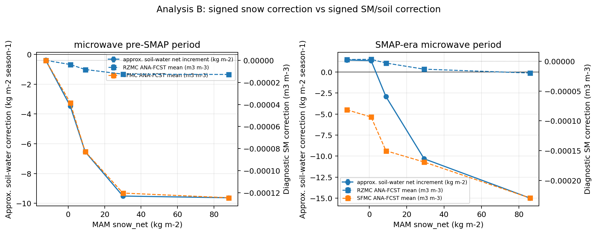

This is the key revised Analysis B figure. Samples are binned by signed MAM `snow_net`, where positive values mean snow DA added snow water. The responses are signed later-season SM and soil-water corrections. The downward tendency means that larger positive snow-water increments are followed, on average, by more negative later SM DA corrections.

**Figure 4. Analysis B SMAP-era raw tile-year cloud**

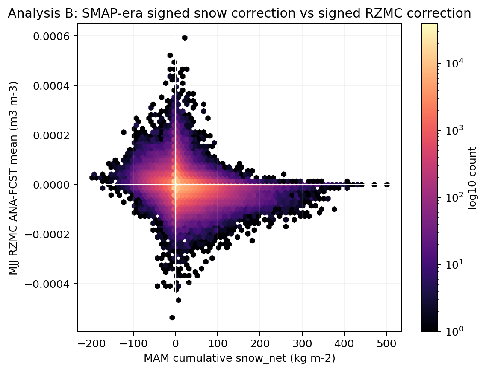

This raw tile-year view is intentionally included as a caution. The aggregate binned tendency is real, but the raw relationship is noisy. This is why the result should be described as a population-level tendency, not as a strong predictor for individual tiles or years.

## Highlight 3: DA Soil-Water Differences Project Into Energy Partitioning

Analysis C is the other strong result.

Question:

When the DA trajectory is wetter or drier than OL in warm-season, snow-free conditions, does the surface-energy response behave physically?

Main finding:

Yes. In warm snow-free JJA conditions, positive `DA - OL RZMC` corresponds to:

- higher evapotranspiration,
- higher latent heat,
- lower sensible heat,
- higher evaporative fraction,
- physically interpretable latent-component changes.

These are net `DA - OL` changes.

Suggested wording:

> Where the DA trajectory is wetter than OL, the model partitions more energy into latent heat and less into sensible heat. This is consistent with expected land-atmosphere coupling behavior and indicates that DA-induced soil-water differences project into surface-energy partitioning.

Important caveat:

This is not evidence that DA improves ET or sensible heat. It is internal consistency evidence showing how the DA trajectory differs from OL.

**Figure 5. Analysis C warm-season energy-partitioning maps**

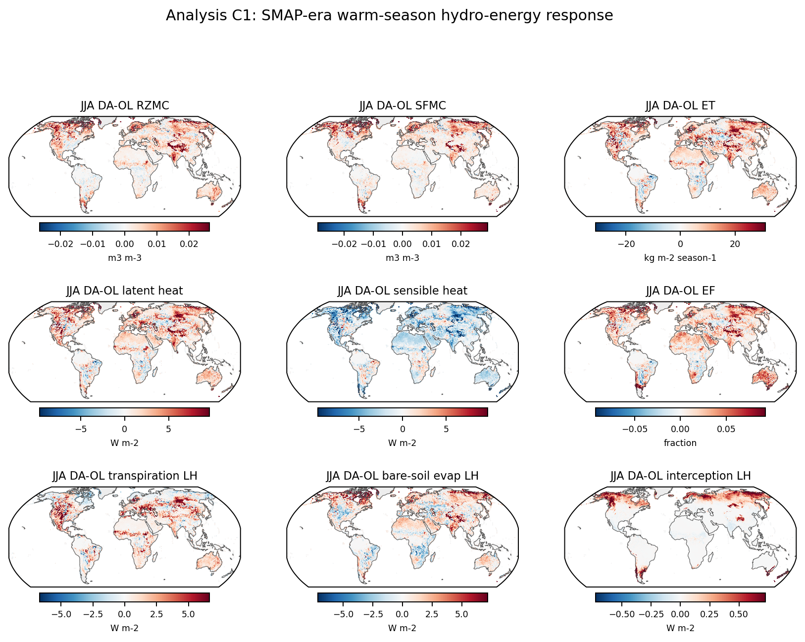

These maps show spatially coherent warm-season, snow-free `DA - OL` differences in root-zone soil moisture and surface-energy variables. They are useful as the map-level counterpart to the binned relationship below: places where DA differs from OL in root-zone soil moisture also show organized differences in latent heat, sensible heat, ET, and evaporative fraction.

**Figure 6. Analysis C warm-season RZMC response versus energy partitioning**

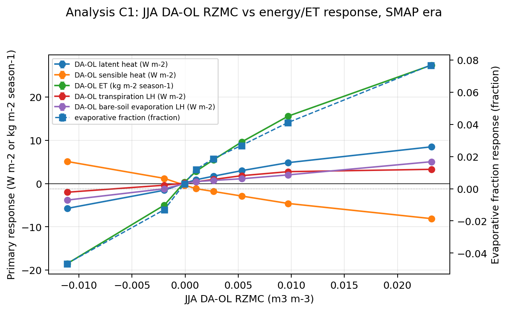

This figure bins warm-season, snow-free samples by `DA - OL RZMC`. Positive x-axis values mean the DA trajectory is wetter than OL in the root zone. The y-axes show net `DA - OL` changes in evaporative fraction, latent heat, sensible heat, and ET-related variables. Wetter DA conditions correspond to more latent heat/ET and less sensible heat, which is the physically expected energy-partitioning response.

### Percent-change companions

The absolute-unit figures above should remain the primary interpretation because they preserve the physical size of the response. The percent-change figures below are useful companions: they show `100 * (DA - OL) / OL`, with small-denominator masking to avoid near-zero OL values dominating the plots.

Percent changes answer a slightly different question: where does DA create a large relative departure from OL? They should be used for context, not as a replacement for the absolute `DA - OL` maps and binned relationships.

**Supporting Figure C1. Analysis C warm-season energy-partitioning maps, percent change**

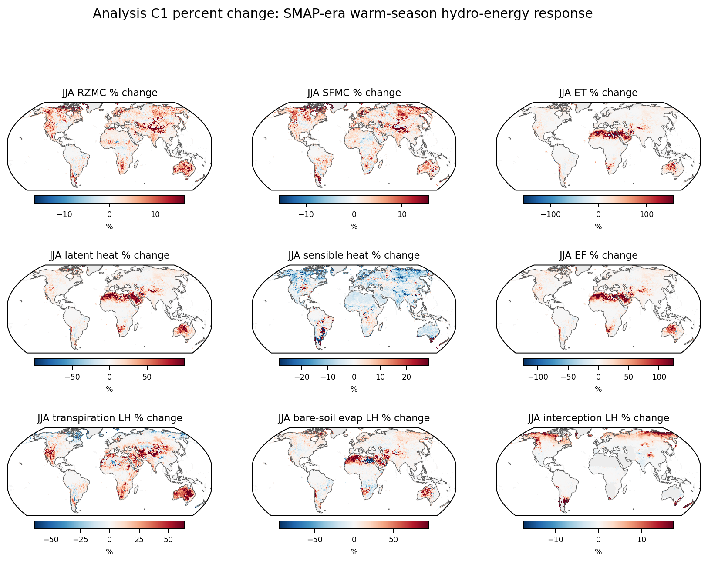

This figure shows the same SMAP-era warm-season, snow-free hydro-energy response as Figure 5, but expressed as percent change relative to OL. It highlights relative departures in root-zone soil moisture, ET, turbulent heat fluxes, evaporative fraction, and latent-heat components.

**Supporting Figure C2. Analysis C RZMC response versus energy partitioning, percent change**

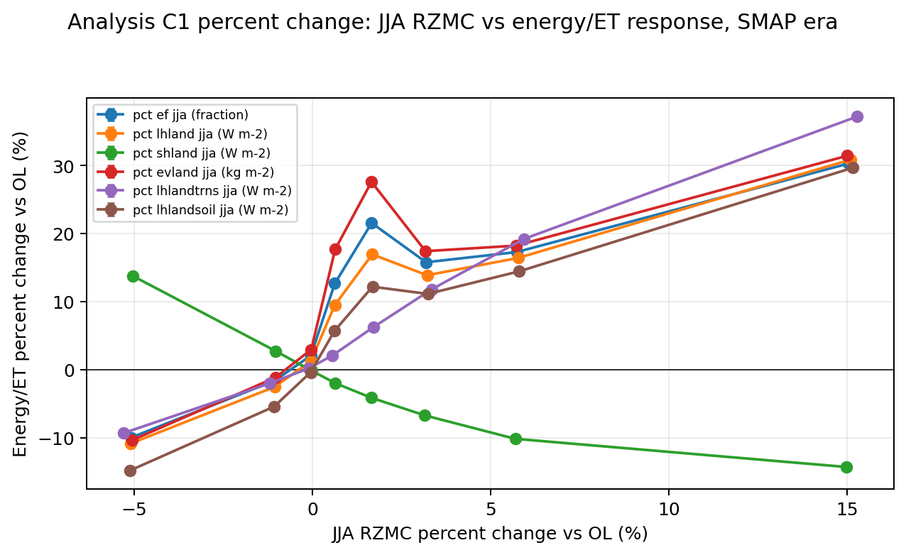

This binned summary repeats Figure 6 using percent changes relative to OL. The main interpretation remains the same: wetter DA root-zone conditions are associated with higher relative latent heat/ET response and lower relative sensible-heat response.

## Highlight 4: Observing-System Evolution Makes Sense

Analysis D provides useful context.

Main finding:

The time series reflect the observing-system eras.

- Soil-water DA activity is near zero in the MODIS-only period.
- Soil-water DA activity increases after microwave SM DA begins.
- Soil-water DA activity is strongest and most structured in the SMAP era.
- Snow DA remains strongly seasonal throughout the record.

Interpretation:

Before 2007, DA-OL hydrologic responses in snow regions are most cleanly interpreted as snow DA effects. After 2007, snow and SM DA are both active, so DA-OL responses should be interpreted as combined observing-system responses.

**Figure 7. Analysis D observing-system time series**

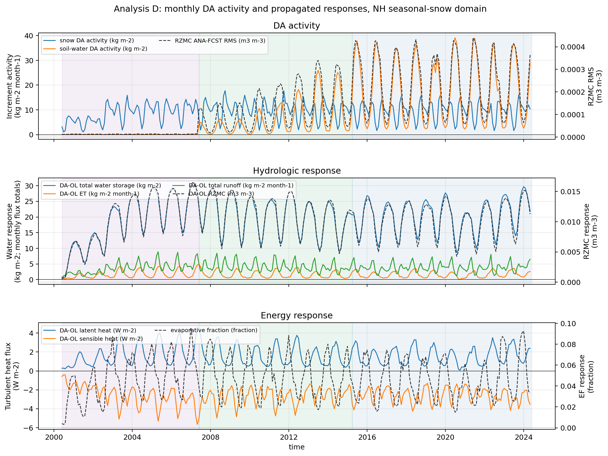

The time series provide context for the observing-system eras. Snow DA activity is seasonal throughout the record, while soil-water DA activity is near zero in the MODIS-only period and increases after microwave SM DA begins, especially in the SMAP-era period.

**Supporting Figure D1. Analysis D observing-system time series, percent change**

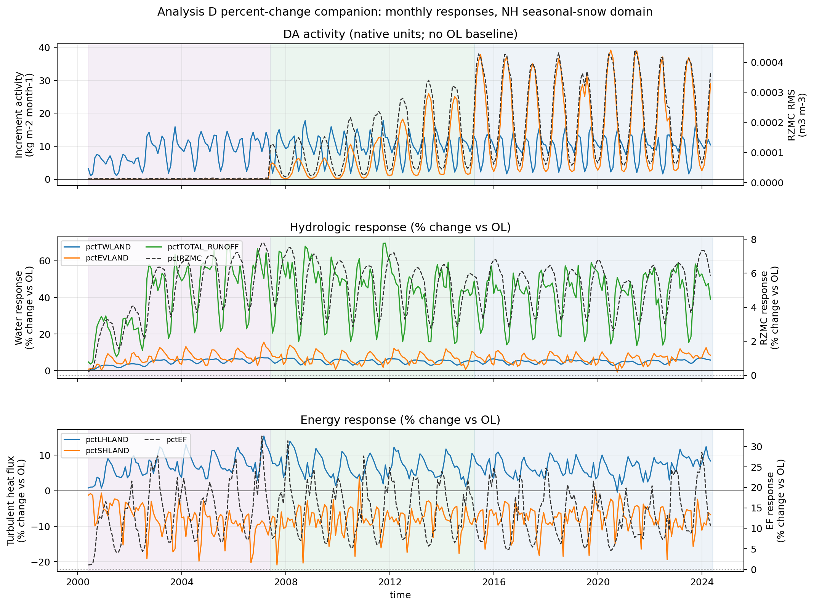

This companion keeps the increment-activity panel in native units, then plots monthly hydrologic and energy responses as percent changes relative to OL. It is useful for judging relative response size across periods while retaining the native activity context.

## Water-Budget Sanity Check

Analysis E is a guardrail, not a headline.

The residual shown in the notebook is:

```text
-(dE + dRUNOFF + dWCHANGELAND)
```

Main use:

- Confirm that residuals are small enough to support the interpretation of DA-driven hydrologic response.

Caveat:

The residual still depends on the `WCHANGELAND` sign convention and monthly collection details, so it should remain a sanity check rather than a headline result.

Quick result:

The median NH seasonal-snow residual over the full record is about `-0.10 kg m-2 month-1`, small enough for the process interpretation here, but still not a formal closure term.

**Supporting Figure E1. Water-budget sanity check**

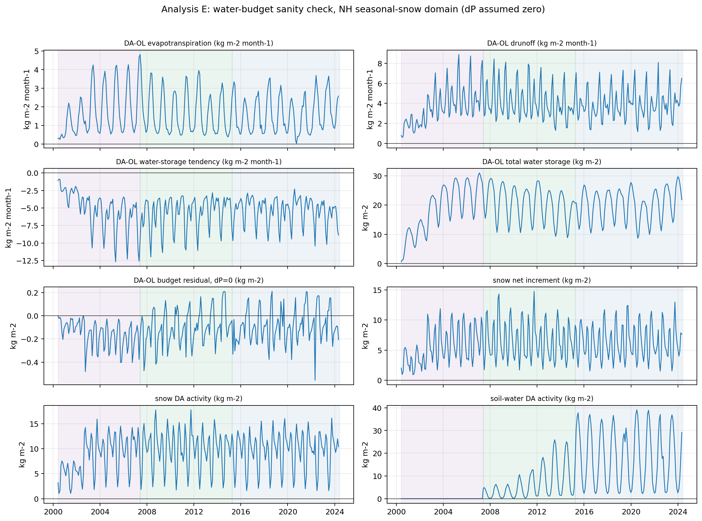

This figure tracks the monthly `DA - OL` water-budget terms and increment context in the NH seasonal-snow domain. It is useful as a guardrail on the snow-to-hydrology interpretation, not as an independent result.

## Suggested Figure Set

For a short report-out, use four figures.

1. **Analysis A process-chain maps**
   - Shows spatial coherence from MAM snow increments to AMJ/MJJ hydrology.

2. **Analysis A binned snow activity versus response magnitude**
   - Shows that stronger snow DA activity corresponds to larger hydrologic response magnitude during the MODIS-only period.

3. **Analysis B signed snow correction versus signed SM correction**
   - Shows the new directional result: snow-added water is followed by more negative later SM DA corrections.

4. **Analysis C RZMC versus energy partitioning**
   - Shows physically coherent hydro-energy response when DA makes root-zone soil moisture wetter or drier than OL.

Optional supporting figures:

- Analysis D observing-system time series.
- Analysis C and D percent-change companions.
- Analysis E water-budget sanity check.

## Suggested Final Takeaway

The strongest new result is that MODIS snow DA produces real snow-water corrections that propagate into melt-season hydrology. The coupled hydro-energy response is also physically coherent: DA-induced soil-water differences alter ET and turbulent heat partitioning in expected directions.

The post-2007 snow-to-SM relationship is directional rather than magnitude-based. The magnitude/activity relationship should be dropped as a headline result. The stronger signal is signed: where snow DA adds water, later SM DA corrections tend to be more negative, suggesting partial compensation of the snow-DA wetting signal by the subsequent SM analysis.

This suggests that the snow and SM observing systems are connected through land-model hydrology and subsequent analysis corrections, but not through a simple "more snow DA activity means more later SM DA activity" relationship.

## Short Version

Snow DA adds or removes real snow water. In the MODIS-only period, those corrections propagate into melt-season hydrology: infiltration, root-zone soil moisture, ET, runoff, and storage. DA-induced soil-water differences also produce physically coherent energy-partitioning responses. The post-2007 snow-to-SM result is not that stronger snow DA activity produces larger later SM DA activity. The stronger result is directional: snow-added water is followed by more negative later SM DA corrections, suggesting partial compensation by the subsequent SM analysis.
