# Monthly Synthesis Report-Out: Snow DA, Soil-Moisture DA, Hydrology, and Energy

## Purpose

The manuscript currently presents snow and soil-moisture DA results mostly as separate outcomes. This analysis asks whether the two parts of the GEOS LDAS multi-sensor reanalysis are connected through physically meaningful land-surface pathways.

The process-chain question is:

```text
snow DA increments
  -> snow storage and melt
  -> infiltration and soil moisture
  -> runoff / storage / ET
  -> surface-energy partitioning
```

These are model-internal `DA - OL` diagnostics. They are useful for process interpretation, but they are not independent validation.

Figures in this report are copied into `projects/M21C_ls/docs/monthly_synthesis_report_figures/` and referenced with relative links so the document renders on GitHub.

## Data and Periods

The analysis uses monthly M36 tile-space GEOS LDAS data from June 2000 through May 2024.

Main inputs:

- Matched DA and OL monthly state, hydrology, flux, latent-component, and energy fields.
- Raw cumulative prognostic increment product:
  `catch_progn_raw_monthly_cumulative_200006_202405.nc`
- Raw diagnostic forecast-analysis product:
  `inst3_fcstana_raw_monthly_diagnostic_200006_202405.nc`

Observing-system periods:

| Period | Date range | Clean season years | Interpretation |
|---|---:|---:|---|
| MODIS-only / snow-only | 2000-06 to 2007-05 | 2001-2006 | Snow DA active; microwave SM DA not active |
| Microwave pre-SMAP | 2007-06 to 2015-03 | 2008-2014 | Snow DA plus pre-SMAP microwave SM DA |
| SMAP-era microwave | 2015-04 to 2024-05 | 2016-2023 | Snow DA plus SMAP-era microwave SM DA |

## Key Definitions

`DA - OL` means the data-assimilation run minus the matched open-loop run.

Positive `DA - OL` means the DA trajectory is larger than OL for that variable.

Important snow increment terms:

- `snow_net`: signed cumulative snow-water increment, in `kg m-2`.
  Positive values mean snow DA added snow water equivalent; negative values mean it removed snow water equivalent.
- `snow_abs_netpack`: cumulative absolute snow DA activity, in `kg m-2`.
  This measures how much snow DA adjusted the snowpack, regardless of sign.

Important soil-moisture DA activity terms:

- `RZMC_INC_RMS`: diagnostic root-zone soil-moisture ANA-FCST activity, in `m3 m-3`.
  This is not cumulative water. It measures the typical size of root-zone soil-moisture analysis corrections.
- `soil_water_abs_activity`: native prognostic soil-water increment activity, in `kg m-2`.
  This measures the absolute magnitude of soil-water DA corrections in prognostic water variables.

Important caution:

- Snow DA increments are real mass corrections to snow storage.
- Diagnostic SM variables such as `RZMC_INC_RMS` are activity metrics, not water-budget terms.

## Main Message

Snow DA and SM DA are not just separate skill stories.

The strongest result is that MODIS snow DA produces real snow-water corrections that propagate through melt-season hydrology. The hydro-energy response is also physically coherent: DA-induced soil-water differences alter ET and turbulent heat partitioning in the expected direction.

The post-2007 snow-to-SM question now splits into two different findings. The magnitude/activity relationship between prior snow DA activity and later SM DA activity is not robust enough to use as a headline result. But the signed relationship is more coherent: where snow DA adds water, the later SM DA correction tends to be more negative, suggesting that the subsequent SM analysis partially counteracts the snow-DA wetting signal.

The overall synthesis is therefore:

```text
snow DA changes snow water and melt-season hydrology;
later SM DA does not simply become more active where snow DA was more active;
but signed SM corrections tend to oppose prior snow-added water at the population level.
```

## Highlight 1: Snow DA Propagates Into Hydrology

This is the clearest result and the best candidate for a manuscript synthesis point.

Why Analysis A is strong:

- It uses the MODIS-only period, before microwave SM DA is active.
- Snow DA is therefore the active observational constraint.
- Snow increments are real snow-water mass corrections, not scaled diagnostic quantities.

Main finding:

Across the six clean MODIS-only seasons, high MAM snow DA activity is associated with larger AMJ/MJJ hydrologic responses in seasonal-snow regions. The association remains positive within tiles after common year effects and within-tile OL MAM snow amount are controlled.

Responses include:

- snowmelt,
- infiltration,
- root-zone soil moisture,
- evapotranspiration,
- total runoff,
- total water storage.

Suggested wording:

> Across six MODIS-only seasons (2001–2006), unusually strong MAM snow-DA corrections within a seasonal-snow tile are associated with unusually large subsequent modeled DA-OL responses in infiltration, root-zone soil moisture, ET, runoff, and total water storage, including after common year effects and OL MAM snow amount are controlled.

Interpretation:

This supports a physically coherent snow-to-hydrology pathway:

```text
snow increment -> melt / infiltration -> RZMC / storage -> ET / runoff
```

**Figure 1. Analysis A process-chain maps**


The maps summarize the MODIS-only period, when snow DA is the active observational constraint and microwave SM DA is not yet active. They show where MAM snow DA activity lines up spatially with later AMJ/MJJ `DA - OL` responses in snowmelt, infiltration, soil moisture, ET, runoff, and storage.

**Figure 2. Analysis A binned snow activity versus hydrologic response magnitude**


This binned summary uses seasonal-snow grid-cell/year samples from the MODIS-only period. The x-axis groups samples by MAM `snow_abs_netpack`, the cumulative absolute snow DA activity in `kg m-2`; the y-axes show later AMJ/MJJ hydrologic `DA - OL` response magnitudes. The point is not independent validation, but that stronger snow DA activity is associated with larger modeled hydrologic departures from OL.

### Analysis A Percent-Change Companions

The absolute-unit Analysis A figures should remain primary because they show the physical size of the snow-DA impact. The percent-change companions show where the MODIS-only snow DA response is large relative to the OL baseline, with small-denominator masking to avoid near-zero OL values dominating the result.

**Supporting Figure A1. Analysis A process-chain maps, percent change**

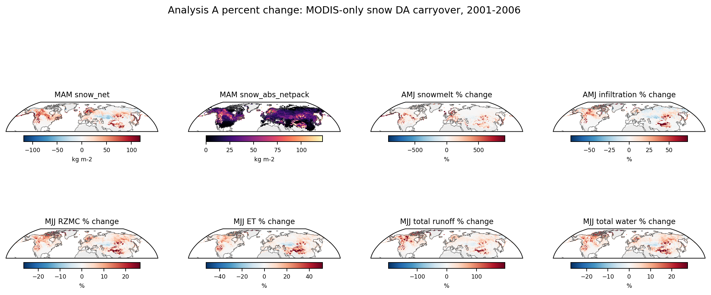

The first two panels keep MAM snow DA increments in native units because the increment fields do not have an OL baseline. The response panels show AMJ/MJJ hydrologic percent changes relative to OL.

**Supporting Figure A2. Analysis A binned snow activity versus hydrologic response magnitude, percent change**

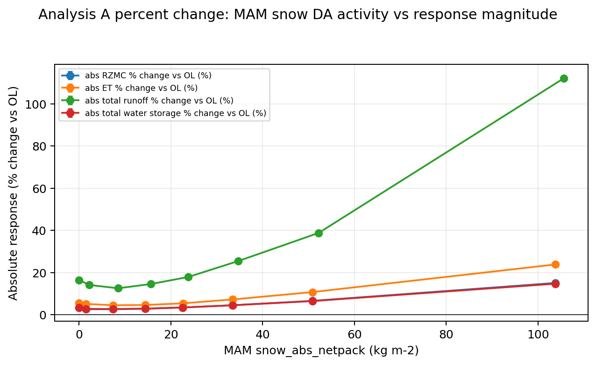

This repeats Figure 2 with response magnitudes expressed as percent changes relative to OL. It is a relative-impact companion, not a replacement for the absolute response-magnitude figure.

## Analysis A robustness: spatial and temporal snow-climatology controls

This falsification analysis preserves the original 2001–2006 MODIS-only Analysis A and asks whether its pooled snow-activity relationship survives removal of persistent tile climatology, common year effects, and within-tile variation in open-loop MAM snow mass. It remains a model-internal `DA - OL` analysis, not causal proof or independent hydrologic validation.

The original eight-bin Figure 2 sample and statistics were reproduced numerically before controls were applied. Every response then used one response-specific complete-case sample restricted to tiles with at least four of the six years. Between-tile fits are weighted by each tile's valid-year count. Confidence intervals use 1,000 spatial-block bootstrap replicates with approximately 5° × 5° blocks; the 10° results are retained as a sensitivity. The local inputs do not contain a clean pre-assimilation MODIS availability count, so M4 was not fitted.

| Response | N tiles | N tile-years | Pooled β | Between β | Within M1 | + year FE M2 | + OL snow M3 [95% CI] | Retained | Tile-wise r median [IQR] | Signed M3 | 1–99% trim M3 | Evidence |
|---|---:|---:|---:|---:|---:|---:|---:|---:|---:|---:|---:|---|
| AMJ snowmelt | 48,067 | 288,402 | 0.748 | 0.764 | 0.696 | 0.673 | 0.679 [0.654, 0.701] | 91% | 0.729 [0.358, 0.911] | 0.751 | 0.649 | not classified |
| AMJ infiltration | 48,067 | 288,402 | 0.369 | 0.378 | 0.341 | 0.338 | 0.343 [0.322, 0.362] | 93% | 0.589 [0.177, 0.848] | 0.394 | 0.331 | not classified |
| MJJ RZMC | 48,067 | 288,402 | 0.000229 | 0.000238 | 0.000198 | 0.000152 | 0.000151 [0.000134, 0.000167] | 66% | 0.626 [0.248, 0.846] | 0.000174 | 0.000145 | survives |
| MJJ ET | 48,067 | 288,402 | 0.265 | 0.28 | 0.213 | 0.181 | 0.18 [0.16, 0.201] | 68% | 0.598 [0.211, 0.823] | 0.201 | 0.185 | survives |
| MJJ total runoff | 48,067 | 288,402 | 0.314 | 0.315 | 0.311 | 0.248 | 0.255 [0.229, 0.286] | 81% | 0.567 [0.198, 0.796] | 0.301 | 0.229 | survives |
| MJJ total water | 48,067 | 288,402 | 0.381 | 0.384 | 0.372 | 0.282 | 0.28 [0.252, 0.305] | 74% | 0.621 [0.232, 0.844] | 0.333 | 0.281 | survives |

Coefficient units are response units per `kg m-2` of the corresponding MAM snow-increment predictor. The signed M3 column uses signed `snow_net` and signed responses; the other coefficient columns use `snow_abs_netpack` and absolute response magnitude.

All six selected fields were finite throughout the static mask, so the >=4-year restriction retained the original 48,067 tiles and 288,402 tile-years. Consequently, the restricted and original-sample pooled coefficients are identical here; both are retained separately in the output table so a future input change cannot silently conflate them.

Adding OL MAM snow amount changes the primary M2 coefficients only modestly: MJJ ET -0.6%, MJJ total runoff +3.0%, MJJ total water -0.6%, MJJ RZMC -0.8%. Thus, year-to-year background snow amount does not explain away the within-tile relationship. All primary M3 intervals also remain above zero with 10° blocks and after trimming predictor anomalies below the 1st or above the 99th percentile.

Across the six pathways, 78.0–90.9% of eligible tiles have positive tile-wise correlations, depending on response and formulation. The medians and IQRs in the table summarize their full distributions; no individual six-year tile correlation is assigned significance.

### Identifying variation

The practical near-zero threshold was fixed before response fitting at a within-tile predictor SD of `0.1 kg m-2`. Adequate identification required at least half the eligible tiles to exceed this threshold and within-tile variation to account for at least 5% of total predictor variance.

| Predictor | Tiles | Tile-years | Within SD median [IQR] | Below threshold | Within / total variance | Between / total variance |
|---|---:|---:|---:|---:|---:|---:|
| snow activity | 48,067 | 288,402 | 12.04 [5.93, 19.86] | 5.4% | 22.6% | 77.4% |
| signed snow increment | 48,067 | 288,402 | 11.41 [4.99, 19.12] | 5.5% | 19.1% | 80.9% |

### Controlled diagnostics

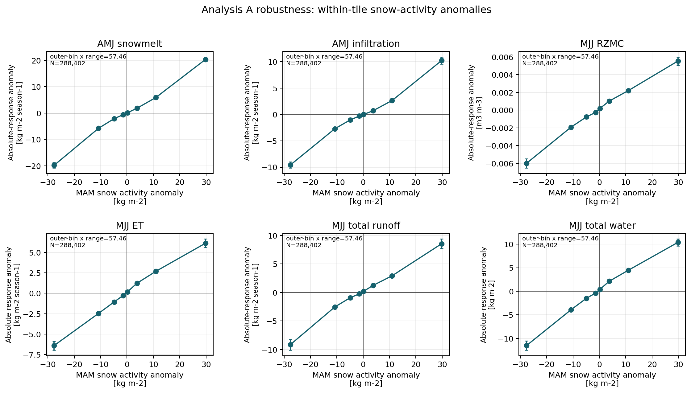

The points are equal-count within-tile anomaly bins; bars are 95% spatial-block bootstrap intervals. Each panel reports the outer-bin center range so a visually flat relation can be interpreted against the available predictor contrast.

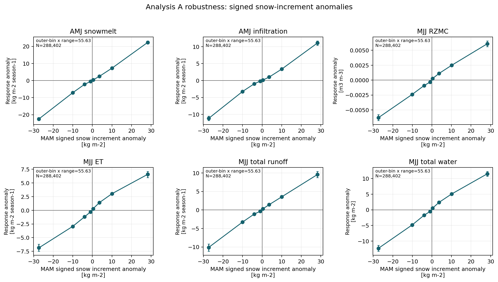

The signed version receives equal statistical treatment and greater interpretive weight where it conflicts with the absolute-magnitude result, because absolute responses can co-scale with background process variance.

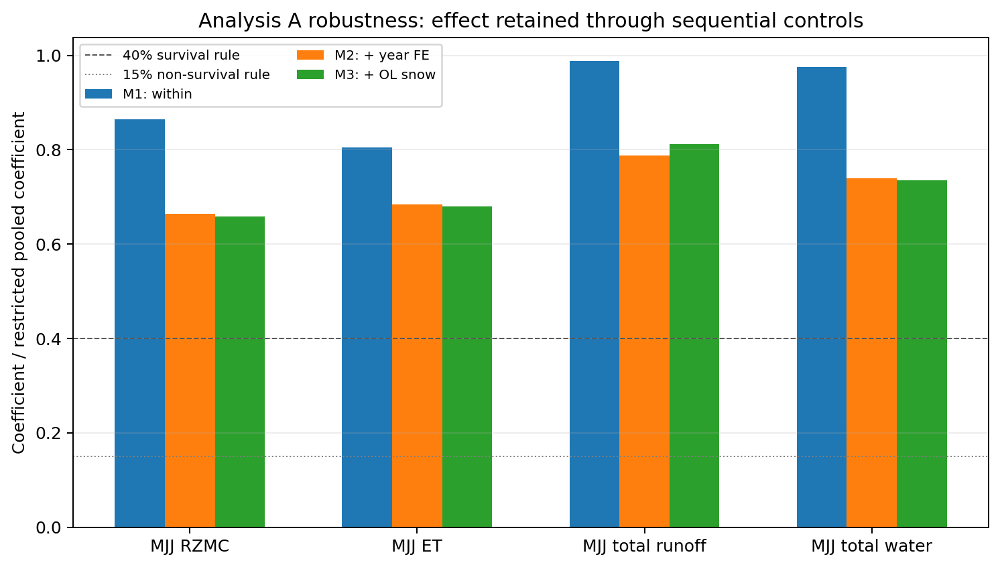

This figure makes the M2-to-M3 change explicit: M2 removes persistent tile effects and common year effects; M3 additionally asks whether snow-DA activity predicts response after accounting for whether OL itself was snowier than usual in that tile-year.

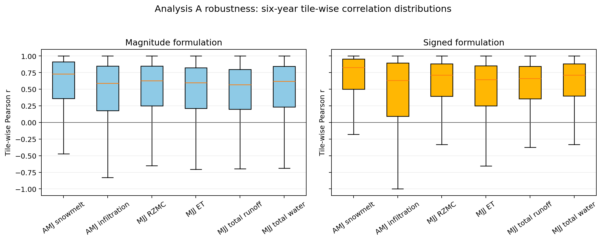

Individual six-year tile correlations are descriptive only; no tile-level significance is assigned. The 1st–99th percentile predictor-anomaly trim and the coarser 10° bootstrap are included in the machine-readable results table.

### Predeclared classification: A

At least three primary responses satisfy every predeclared survival criterion.

This classification is scoped to six MODIS-only seasons (2001–2006), the existing Northern Hemisphere seasonal-snow mask, and modeled `DA - OL` responses. Even a surviving relationship supports a physically coherent modeled propagation pathway under these controls; it does not establish a causal hydrologic effect through independent observations.

## Water-year differential snow-DA budget and soil-moisture response

This extension follows the native signed snow-water increments through six complete MODIS-only water years (October 2000 through September 2006). SFMC and RZMC diagnose the timing and persistence of the soil response but are excluded from the closing equation because total land-water storage already contains soil water.

### Storage-definition audit

Integrated `DA - OL WCHANGELAND` does not equal the change in the `DA - OL TWLAND` state anomaly. Instead, `dET + dRunoff + integrated dWCHANGELAND` is near zero, showing that WCHANGELAND is a model-process tendency that omits the discontinuous analysis mass injection. The closing storage term is therefore an endpoint difference in `DA - OL TWLAND`.

That endpoint is now the instantaneous 00Z October 1 state reconstructed from `catch_internal_rst` restarts as the 24-member ensemble mean of `CDCR2/(1-WPWET) - CATDEF + RZEXC + SRFEXC + CAPAC + WESNN1-3`. It replaces the September monthly-mean proxy used previously, which is retained as `dStorage_monthly_proxy` for comparison. The proxy is close in six-year aggregate but differs by up to about 20% in individual water years, and gets the sign wrong where the true change is small.

### Peat free-standing water

`catch_calc_wtotl` builds TWLAND from soil, canopy, and snow stores only; PEATCLSM free-standing surface water is deliberately excluded. On peat tiles (`POROS >= 0.9`) water moving into or out of that store therefore leaves the TWLAND-based budget entirely and lands in the residual. `PEATCLSM_FSWCHANGE` closes that gap and enters the budget as `dPeatFreeWater`. It is zero by construction on non-peat tiles, matching the model's own `FSW_CHANGE = 0.` initialization.

### Annual domain budgets

| Water year | Snow-DA input | Extra runoff | Extra ET | Storage change | Peat free water | Residual | Residual / input |
|---|---:|---:|---:|---:|---:|---:|---:|
| WY2001 | 32.57 | 19.61 | 12.60 | 2.56 | -0.95 | -1.25 | -3.8% |
| WY2002 | 43.46 | 24.14 | 15.31 | 6.12 | -0.84 | -1.27 | -2.9% |
| WY2003 | 64.50 | 40.98 | 24.15 | 2.66 | -2.10 | -1.19 | -1.8% |
| WY2004 | 67.50 | 45.44 | 23.27 | 1.89 | -1.93 | -1.17 | -1.7% |
| WY2005 | 72.97 | 51.14 | 24.53 | 0.37 | -1.91 | -1.16 | -1.6% |
| WY2006 | 68.43 | 47.57 | 24.13 | 0.34 | -2.41 | -1.21 | -1.8% |
| 6-WY mean | 58.24 | 38.15 | 20.67 | 2.32 | -1.69 | -1.21 | -2.1% |

The annual budget residual ranges from -3.8% to -1.6% of domain snow input. Conceptually identical precipitation forcing differs slightly after independent float32 compression: the maximum absolute annual tile discrepancy is 0.102 kg m-2 and the largest absolute annual area-weighted domain-mean discrepancy is 0.000127 kg m-2. Snowmelt and infiltration are retained as pathway diagnostics and are not added to the closing terms.

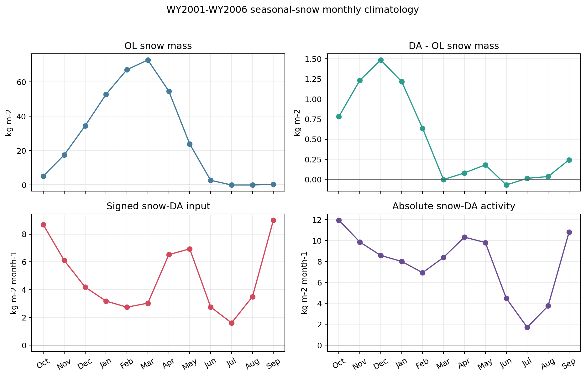

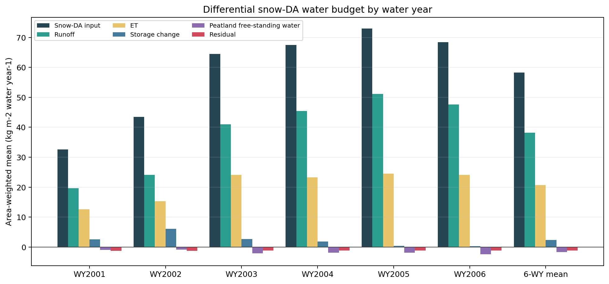

### Absolute closure of each run

The differential budget cancels precipitation and every process common to both runs, so its residual is magnified twice over: the two per-run closure offsets carry opposite signs and therefore add, and the sum is then divided by the much smaller snow-DA input rather than by total input. Each run closes far more tightly on its own.

| Run | Total input | ET | Runoff | Storage | Peat free water | Residual | Residual / input |
|---|---:|---:|---:|---:|---:|---:|---:|
| OL | 605.03 | 427.46 | 184.64 | -0.76 | -6.70 | +0.38 | +0.063% |
| DA | 663.26 | 448.13 | 222.79 | 1.57 | -8.39 | -0.82 | -0.124% |

All values are six-water-year means in kg m-2 water year-1 over the seasonal-snow mask.

### Positive-input partition

- total runoff: 64.3% [5-degree spatial-block 95% interval 61.1%, 67.4%]
- surface runoff: 43.1% [5-degree spatial-block 95% interval 41.1%, 45.1%]
- baseflow: 21.2% [5-degree spatial-block 95% interval 19.1%, 23.3%]
- ET: 35.9% [5-degree spatial-block 95% interval 32.8%, 39.1%]
- storage: 4.2% [5-degree spatial-block 95% interval 3.9%, 4.6%]
- peat free water: -2.7% [5-degree spatial-block 95% interval -3.4%, -2.1%]
- residual: -1.7% [5-degree spatial-block 95% interval -2.0%, -1.5%]

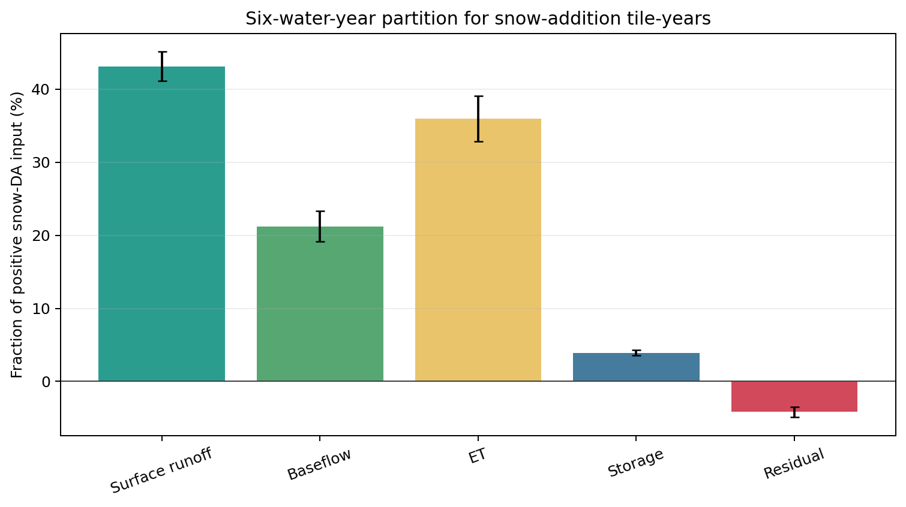

| Sample | Native signed input | Runoff | ET | Storage | Peat free water | Residual |
|---|---:|---:|---:|---:|---:|---:|
| All-sample net | 58.24 kg m-2 | 65.5% | 35.5% | 4.0% | -2.9% | -2.1% |
| Snow addition | 71.32 kg m-2 | 64.3% | 35.9% | 4.2% | -2.7% | -1.7% |
| Snow removal | -18.93 kg m-2 | 38.3% | 46.1% | 9.9% | 0.7% | 5.1% |

Fractions use native signed mass and are never based on absolute snow activity. The snow-removal row therefore reports signed response divided by signed input; its positive percentages describe same-direction water removal.

### Controlled water-year response

| Response | M3 beta | 5-degree block 95% CI |
|---|---:|---:|
| Runoff | 0.749 | [0.711, 0.783] |
| ET | 0.182 | [0.155, 0.213] |
| Storage | 0.085 | [0.074, 0.097] |
| Peat free water | -0.017 | [-0.022, -0.012] |
| Residual | 0.001 | [0.000, 0.001] |

These dimensionless M3 slopes use within-tile signed snow input, year effects, and OL MAM snow amount. By construction, the runoff, ET, storage, peat free-water, and residual slopes sum to one; the direct domain accounting remains the primary budget result.

### Soil-moisture consequence

For snow-addition tile-years, the area-weighted mean peak RZMC response is 0.0189 m3 m-3 and May is the most common peak month, although peak timing is broad. The MJJ mean response is 0.0108 m3 m-3, RZMC is positive for 11.7 of 12 months on average, and the mean September response remains 0.0082 m3 m-3.

Persistence is strongly right-censored: 67.2% of snow-addition tile-years never fall below 0.001 m3 m-3 after their within-year peak by September. Among the uncensored cases, the area-weighted mean time to the threshold is 4.5 months. Because the mean DA-minus-OL RZMC anomaly is already positive in October, these counts include inherited state differences from prior assimilation and should not be read as the residence time of only the current water-year increment. They are state diagnostics, not additional mass terms.

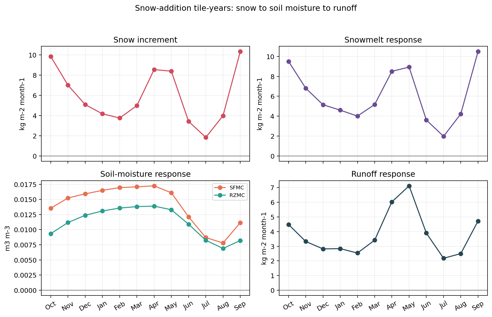

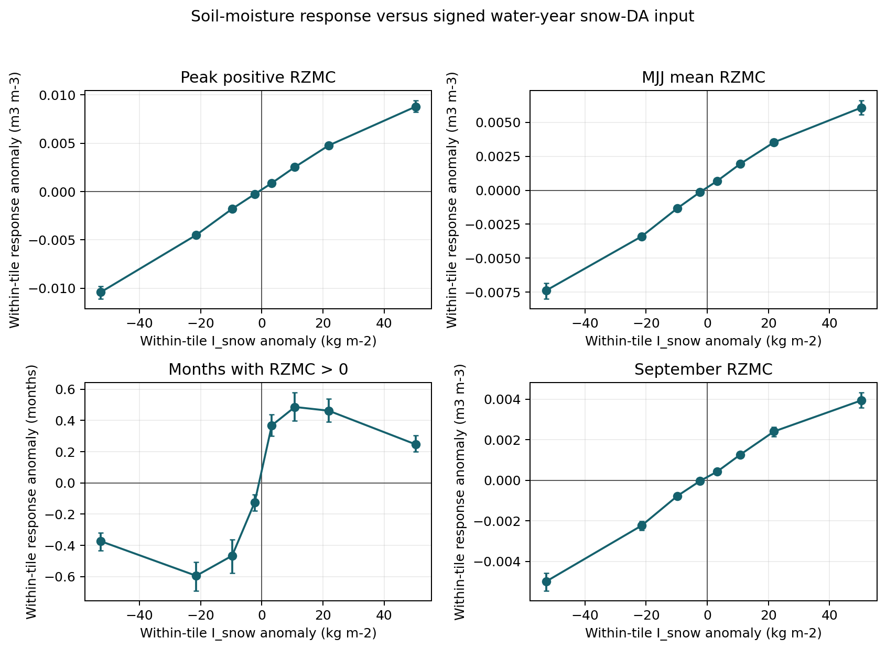

The interpretation is deliberately model-internal: snow DA modifies snow water, the root zone becomes wetter during melt, and the model redistributes that perturbation through ET, runoff, and changing storage. RZMC and SFMC describe how strongly and for how long the soil state changes; they are not independent validation and do not enter the mass balance twice.

## Highlight 2: Later SM DA Response Splits Into Two Claims

Analysis B is now two separable results with different levels of support.

Question:

Does prior snow DA predict later SM DA behavior?

### 2a. Magnitude/activity: drop as a substantive claim

The original magnitude/activity question was:

> Does stronger MAM snow DA activity lead to larger later SM DA activity?

This should be dropped from the report as a substantive finding.

Evidence:

- Raw snow-activity bins do not provide a clear positive relationship between MAM snow DA activity and later SM DA activity.
- Within-tile anomaly controls are weak or nearly flat.
- Tile-wise correlations are small.

Suggested wording:

> Stronger MAM snow DA activity does not translate into a robust, interpretable increase in later SM DA activity magnitude.

Interpretation:

This is a useful negative result, but not a headline. The cleaner post-2007 signal is directional, not magnitude-based.

### 2b. Signed/directional response: new substantive finding

The signed question is different:

> When snow DA adds water in MAM, what is the sign of the later SM DA correction?

Main finding:

Tiles/years where MAM snow DA adds water are followed by increasingly negative later SM DA corrections. In plain language, the snow-DA wetting signal appears to be partially counteracted by the subsequent SM DA correction.

Evidence:

- `analysisB_binned_signed_snow_vs_signed_sm_correction.png` shows a clean monotonic downward trend in both microwave periods.
- The same tendency is visible at the raw tile-year level in `analysisB_smapera_signed_snow_vs_rzmc_hexbin.png`, although the raw cloud is noisy.

Suggested wording:

> In the microwave periods, positive MAM snow-water increments are followed by more negative later SM DA corrections. This suggests that the later SM analysis partially counteracts the wetting introduced by snow DA. This is a population-level tendency rather than a strong tile-level predictor.

Caveat:

Tile-wise correlations remain weak, with median `r` around `-0.03` to `-0.06`. This means the relationship is real in aggregate, but noisy at the individual tile-year level. Do not say that any given tile with snow-added water will necessarily require a drying SM correction.

Interpretation:

This is a more specific answer to the snow-SM coupling question than the original magnitude analysis. Snow DA does not simply predict larger later SM DA activity. Instead, the signed correction tendency suggests a compensating interaction: snow DA can wet the modeled land trajectory, and later SM DA tends to adjust back in the drying direction.

**Figure 3. Analysis B signed snow correction versus signed later SM correction**


This is the key revised Analysis B figure. Samples are binned by signed MAM `snow_net`, where positive values mean snow DA added snow water. The responses are signed later-season SM and soil-water corrections. The downward tendency means that larger positive snow-water increments are followed, on average, by more negative later SM DA corrections.

**Figure 4. Analysis B SMAP-era raw tile-year cloud**


This raw tile-year view is intentionally included as a caution. The aggregate binned tendency is real, but the raw relationship is noisy. This is why the result should be described as a population-level tendency, not as a strong predictor for individual tiles or years.

## Highlight 3: DA Soil-Water Differences Project Into Energy Partitioning

Analysis C is the other strong result.

Question:

When the DA trajectory is wetter or drier than OL in warm-season, snow-free conditions, does the surface-energy response behave physically?

Main finding:

Yes. In warm snow-free JJA conditions, positive `DA - OL RZMC` corresponds to:

- higher evapotranspiration,
- higher latent heat,
- lower sensible heat,
- higher evaporative fraction,
- physically interpretable latent-component changes.

These are net `DA - OL` changes.

Suggested wording:

> Where the DA trajectory is wetter than OL, the model partitions more energy into latent heat and less into sensible heat. This is consistent with expected land-atmosphere coupling behavior and indicates that DA-induced soil-water differences project into surface-energy partitioning.

Important caveat:

This is not evidence that DA improves ET or sensible heat. It is internal consistency evidence showing how the DA trajectory differs from OL.

**Figure 5. Analysis C warm-season energy-partitioning maps**


These maps show spatially coherent warm-season, snow-free `DA - OL` differences in root-zone soil moisture and surface-energy variables. They are useful as the map-level counterpart to the binned relationship below: places where DA differs from OL in root-zone soil moisture also show organized differences in latent heat, sensible heat, ET, and evaporative fraction.

**Figure 6. Analysis C warm-season RZMC response versus energy partitioning**


This figure bins warm-season, snow-free samples by `DA - OL RZMC`. Positive x-axis values mean the DA trajectory is wetter than OL in the root zone. The y-axes show net `DA - OL` changes in evaporative fraction, latent heat, sensible heat, and ET-related variables. Wetter DA conditions correspond to more latent heat/ET and less sensible heat, which is the physically expected energy-partitioning response.

### Percent-change companions

The absolute-unit figures above should remain the primary interpretation because they preserve the physical size of the response. The percent-change figures below are useful companions: they show `100 * (DA - OL) / OL`, with small-denominator masking to avoid near-zero OL values dominating the plots.

Percent changes answer a slightly different question: where does DA create a large relative departure from OL? They should be used for context, not as a replacement for the absolute `DA - OL` maps and binned relationships.

**Supporting Figure C1. Analysis C warm-season energy-partitioning maps, percent change**


This figure shows the same SMAP-era warm-season, snow-free hydro-energy response as Figure 5, but expressed as percent change relative to OL. It highlights relative departures in root-zone soil moisture, ET, turbulent heat fluxes, evaporative fraction, and latent-heat components.

**Supporting Figure C2. Analysis C RZMC response versus energy partitioning, percent change**


This binned summary repeats Figure 6 using percent changes relative to OL. The main interpretation remains the same: wetter DA root-zone conditions are associated with higher relative latent heat/ET response and lower relative sensible-heat response.

## Highlight 4: Observing-System Evolution Makes Sense

Analysis D provides useful context.

Main finding:

The time series reflect the observing-system eras.

- Soil-water DA activity is near zero in the MODIS-only period.
- Soil-water DA activity increases after microwave SM DA begins.
- Soil-water DA activity is strongest and most structured in the SMAP era.
- Snow DA remains strongly seasonal throughout the record.

Interpretation:

Before 2007, DA-OL hydrologic responses in snow regions are most cleanly interpreted as snow DA effects. After 2007, snow and SM DA are both active, so DA-OL responses should be interpreted as combined observing-system responses.

**Figure 7. Analysis D observing-system time series**


The time series provide context for the observing-system eras. Snow DA activity is seasonal throughout the record, while soil-water DA activity is near zero in the MODIS-only period and increases after microwave SM DA begins, especially in the SMAP-era period.

**Supporting Figure D1. Analysis D observing-system time series, percent change**


This companion keeps the increment-activity panel in native units, then plots monthly hydrologic and energy responses as percent changes relative to OL. It is useful for judging relative response size across periods while retaining the native activity context.

## Water-Budget Sanity Check

Analysis E is a guardrail, not a headline.

The residual shown in the notebook is:

```text
-(dE + dRUNOFF + dWCHANGELAND)
```

Main use:

- Confirm that residuals are small enough to support the interpretation of DA-driven hydrologic response.

Caveat:

The residual still depends on the `WCHANGELAND` sign convention and monthly collection details, so it should remain a sanity check rather than a headline result.

Quick result:

The median NH seasonal-snow residual over the full record is about `-0.10 kg m-2 month-1`, small enough for the process interpretation here, but still not a formal closure term.

**Supporting Figure E1. Water-budget sanity check**


This figure tracks the monthly `DA - OL` water-budget terms and increment context in the NH seasonal-snow domain. It is useful as a guardrail on the snow-to-hydrology interpretation, not as an independent result.

## Suggested Figure Set

For a short report-out, use five figures.

1. **Analysis A process-chain maps**
   - Shows spatial coherence from MAM snow increments to AMJ/MJJ hydrology.

2. **Analysis A binned snow activity versus response magnitude**
   - Shows that stronger snow DA activity corresponds to larger hydrologic response magnitude during the MODIS-only period.

3. **Analysis A sequential spatial/temporal controls**
   - Shows how much of the pooled relationship remains after tile effects, year effects, and OL MAM snow amount.

4. **Analysis B signed snow correction versus signed SM correction**
   - Shows the new directional result: snow-added water is followed by more negative later SM DA corrections.

5. **Analysis C RZMC versus energy partitioning**
   - Shows physically coherent hydro-energy response when DA makes root-zone soil moisture wetter or drier than OL.

Optional supporting figures:

- Analysis D observing-system time series.
- Analysis A, C, and D percent-change companions.
- Analysis E water-budget sanity check.

## Suggested Final Takeaway

The strongest new result is narrowly scoped to the six clean MODIS-only seasons: within seasonal-snow tiles, unusually strong MAM snow-DA corrections are associated with unusually large later modeled hydrologic responses. The association survives tile, year, and OL snow-amount controls and is directionally consistent when signed snow increments and responses are used. This supports a physically coherent modeled pathway; it is not independent validation or causal proof. The broader hydro-energy response is also physically coherent: DA-induced soil-water differences alter ET and turbulent heat partitioning in expected directions.

The post-2007 snow-to-SM relationship is directional rather than magnitude-based. The magnitude/activity relationship should be dropped as a headline result. The stronger signal is signed: where snow DA adds water, later SM DA corrections tend to be more negative, suggesting partial compensation of the snow-DA wetting signal by the subsequent SM analysis.

This suggests that the snow and SM observing systems are connected through land-model hydrology and subsequent analysis corrections, but not through a simple "more snow DA activity means more later SM DA activity" relationship.

## Short Version

Snow DA adds or removes real snow water. Across six MODIS-only seasons, within-tile snow-DA correction anomalies remain positively associated with later modeled infiltration, root-zone soil moisture, ET, runoff, and storage anomalies after year and OL snow-amount controls. DA-induced soil-water differences also produce physically coherent energy-partitioning responses. The post-2007 snow-to-SM result is not that stronger snow DA activity produces larger later SM DA activity. The stronger result is directional: snow-added water is followed by more negative later SM DA corrections, suggesting partial compensation by the subsequent SM analysis.

<!-- TARGETED_SNOW_HYDROLOGY_ROBUSTNESS_START -->
## Targeted robustness checks for the snow-DA water budget

These post hoc sensitivity tests address three identified design issues: overlap between the old MAM predictor and AMJ/MJJ responses, mismatch between annual input and its OL-snow control, and appreciable snow-DA input in September at the Oct-Sep boundary. They preserve the 48,067-tile Northern Hemisphere seasonal-snow mask and the six 2001-2006 MODIS-only years, before microwave soil-moisture DA began.

The raw-increment product was confirmed as a **per-month increment sum**: each stored month is already the sum of native submonthly increments within that month, so no temporal differencing was applied. The existing Oct-Sep baseline was reproduced exactly, including a six-year mean signed input of 58.24 kg m-2 yr-1.

### Non-overlapping Oct-Mar seasonal attribution

The predictor is signed snow-water input from October through March; responses begin in April or May, giving zero overlapping months. M3 removes tile means, common response-year effects, and response-year March OL snow mass. Coefficients are native response units per kg m-2 of signed snow input; standardized values are the response associated with one within-tile predictor SD.

| Response | Oct-Mar M3 [5-degree 95% CI] | Per within-tile SD | Signed MAM M3 | MAM per within-tile SD | Retained vs pooled | Classification |
|---|---:|---:|---:|---:|---:|---|
| AMJ snowmelt | 0.0923 [0.0723, 0.113] | 1.98 | 0.751 | 12.3 | 40.8% | pathway diagnostic |
| AMJ infiltration | 0.0067 [-0.00486, 0.0186] | 0.144 | 0.394 | 6.45 | 7.7% | pathway diagnostic |
| MJJ RZMC | 6.01e-05 [4.81e-05, 7.33e-05] | 0.00129 | 0.000174 | 0.00285 | 79.3% | survives |
| MJJ ET | 0.103 [0.0824, 0.125] | 2.2 | 0.201 | 3.3 | 87.7% | survives |
| MJJ total runoff | 0.0553 [0.0406, 0.0703] | 1.19 | 0.301 | 4.93 | 58.5% | survives |
| MJJ total water | 0.147 [0.121, 0.172] | 3.15 | 0.333 | 5.46 | 86.0% | survives |

All four classified downstream responses survive: their M3 intervals exclude zero with 5-degree and 10-degree blocks and after the 1st-99th percentile predictor-anomaly trim. The standardized Oct-Mar effects are smaller than signed MAM, ranging from 24% of the MAM value for runoff to 67% for ET, but remain positive. Snowmelt remains a positive pathway diagnostic; infiltration is near zero after controls and its interval includes zero.

The Oct-Mar and MAM signed predictors correlate at r=0.587 pooled and r=0.431 after tile demeaning. Classification uses the inherited MAM thresholds without modification after this post hoc window change. Snowmelt and infiltration remain pathway diagnostics, not pass/fail outcomes. M4 remains unfitted because the archive has no pre-assimilation MODIS availability count.

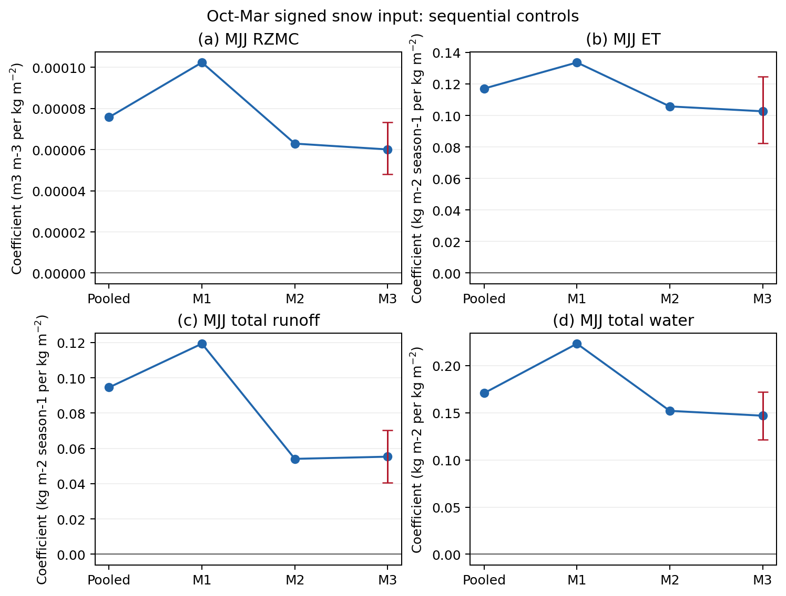

### Water-year marginal partition control sensitivity

These dimensionless regressions estimate the within-tile marginal partition of an additional unit of Oct-Sep snow-DA input. They are not an independent existence or causal test. In every control formulation, runoff + ET + storage + residual slopes sum to exactly one by construction.

| Snow control | Runoff [95% CI] | ET [95% CI] | Storage [95% CI] | Residual [95% CI] |
|---|---:|---:|---:|---:|
| water-year maximum OL snow mass | 0.751 [0.715, 0.787] | 0.181 [0.153, 0.212] | 0.084 [0.074, 0.096] | -0.016 [-0.022, -0.011] |
| March OL snow mass | 0.750 [0.716, 0.782] | 0.181 [0.151, 0.212] | 0.085 [0.074, 0.097] | -0.016 [-0.022, -0.011] |
| MAM mean OL snow mass | 0.749 [0.712, 0.781] | 0.182 [0.155, 0.214] | 0.085 [0.076, 0.095] | -0.016 [-0.022, -0.011] |

Replacing the old MAM control with the full-year peak changes the marginal runoff slope from 0.749 to 0.751 and ET from 0.182 to 0.181. For context, direct positive-input accounting describes the average fate of all added water (64.3% runoff and 35.9% ET), whereas this regression describes a marginal unit; the two are not expected to be numerically equivalent.

### Accounting-boundary and September sensitivity

Mean September signed input is 9.01 kg m-2, or 15.5% of the mean Oct-Sep annual input. In snow-addition tile-years the corresponding percentage is 14.5%. September DA-OL changes are 0.24 kg m-2 snow mass, 9.16 kg m-2 snowmelt, 4.09 kg m-2 runoff, 1.31 kg m-2 ET, and 1.70 kg m-2 August-to-September total-land-water change. The small remaining snow-mass change alongside substantial melt and runoff indicates that much of the September correction is melted and redistributed within September rather than retained as snow at the boundary. These monthly-mean quantities are a timing diagnostic, not an exact monthly closure.

> **Note.** The boundary-sensitivity numbers in this section predate the addition of the
> peatland free-standing water term and the restart-based storage endpoints to the main
> budget, and are retained as originally computed. They cannot be regenerated on the
> revised definitions: the restart endpoints exist only at 1 October, so the Sep-Aug
> boundary arm has no instantaneous storage state available. The comparison remains valid
> on its own terms, since both arms use identical definitions. Compare the Oct-Sep row
> against the revised partition above rather than treating the two as interchangeable.

The all-tile six-year mean signed input is 58.24 kg m-2 yr-1 for Oct-Sep and 57.37 kg m-2 yr-1 for Sep-Aug. The table below reports the positive-input tile-year partition; brackets are 5-degree spatial-block 95% intervals.

| Boundary | Positive input | Runoff [95% CI] | ET [95% CI] | Storage [95% CI] | Residual [95% CI] | Surface runoff | Baseflow |
|---|---:|---:|---:|---:|---:|---:|---:|
| Oct-Sep | 71.32 kg m-2 | 64.3% [61.1, 67.2] | 35.9% [32.9, 39.0] | 3.9% [3.6, 4.3] | -4.1% [-4.8, -3.5] | 43.1% | 21.2% |
| Sep-Aug | 70.65 kg m-2 | 64.5% [61.2, 67.9] | 36.0% [32.8, 39.4] | 4.2% [3.8, 4.6] | -4.7% [-5.5, -4.0] | 43.2% | 21.3% |

The boundary shift is below the pre-set 5 percentage-point runoff/ET reporting threshold for the headline partition. Storage changes by +0.3 percentage points. The residual changes by -0.6 percentage points, below the 2-point discussion threshold. Thus the boundary shift does not explain a meaningful part of the negative Oct-Sep residual under the stated reporting rule.
Annual residuals are negative in 6 of 6 Oct-Sep years and 6 of 6 Sep-Aug years.

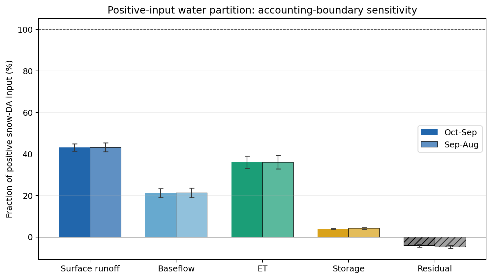

Interpretive roles remain distinct: **direct accounting** describes the average fate of snow-added water; the **water-year regression** estimates marginal partition; and the **Oct-Mar seasonal regression** tests whether prior within-location input predicts later hydrological response.
<!-- TARGETED_SNOW_HYDROLOGY_ROBUSTNESS_END -->
