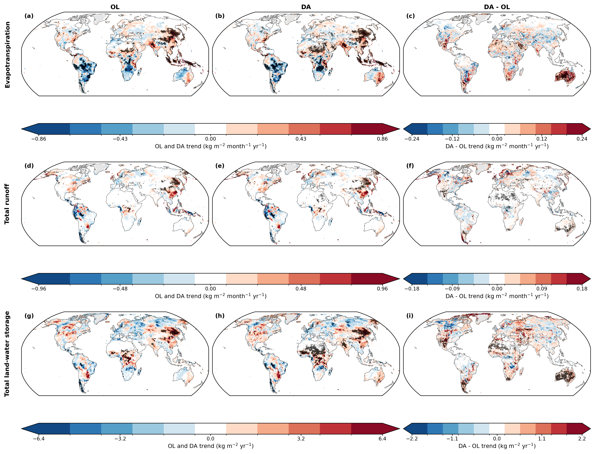
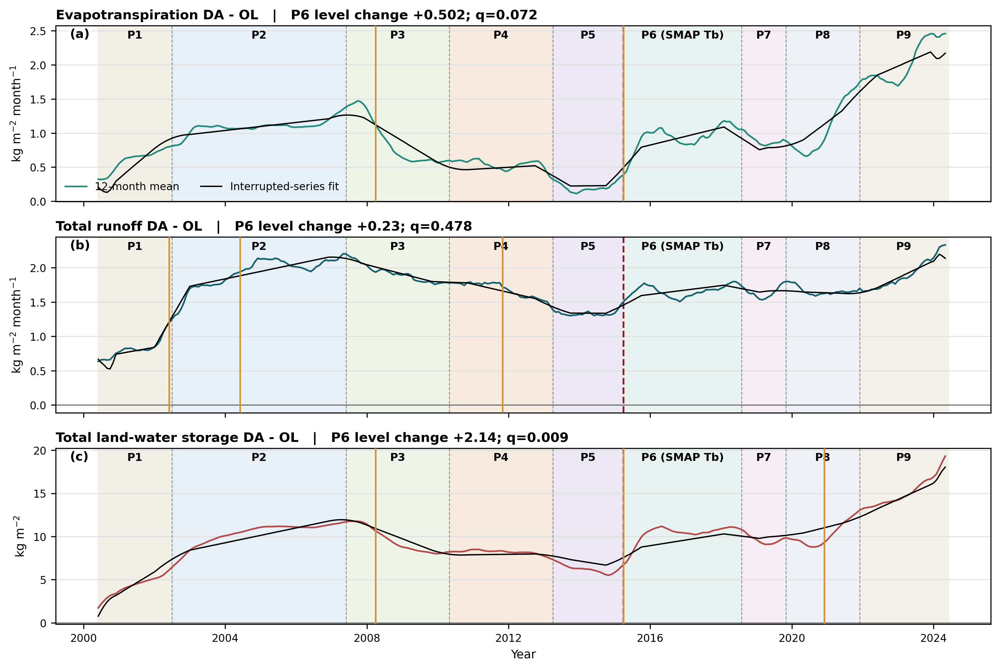

# M21C Phase 2 ET, runoff, and storage trend/breakpoint results

## Scope

This focused Phase 2 analysis extends the accepted M21C trend and breakpoint
workflow to evapotranspiration (`EVLAND`), total runoff, and total land-water
storage (`TWLAND`) over June 2000-May 2024. Total runoff is defined explicitly
as `RUNSURFLAND + BASEFLOWLAND`. ET and both runoff components are converted
from monthly mean rates to monthly water totals before the components are
summed and before strict OL/DA paired masking. `TWLAND` remains a monthly-mean
state in kg m-2.

For each variable, the workflow tests matched OL, DA, and monthly `DA - OL`
series. Tile-level trends use the same trend-preserving seasonal adjustment,
Theil-Sen slope, autocorrelation-adjusted Mann-Kendall test, and within-field
BH-FDR as Phase 1. Area-weighted domain series use the same P1-P9 interrupted
model and independent PELT changepoint workflow. P7 remains level-only and
exempt from changepoint agreement scoring.

The real-input audit passed 311/311 checks across all 12 monthly datasets. All
nine global tile fields, the nine-series interrupted model, and the
changepoint products pass their production audits. The M21C test suite passed
68 tests with one platform-dependent process-worker test skipped; the focused
post-edit tests passed 21/21.

## Whole-record trends

None of the nine area-weighted domain series has a significant whole-record
trend after autocorrelation correction and BH-FDR:

| Variable | Series | Sen slope | Adjusted 95% interval | BH q |
|---|---|---:|---:|---:|
| ET | OL | -0.0181 kg m-2 month-1 yr-1 | -0.0514 to +0.0150 | 0.841 |
| ET | DA | +0.0087 kg m-2 month-1 yr-1 | -0.0365 to +0.0567 | 0.872 |
| ET | DA - OL | +0.0226 kg m-2 month-1 yr-1 | -0.0296 to +0.0718 | 0.872 |
| Total runoff | OL | +0.0050 kg m-2 month-1 yr-1 | -0.0590 to +0.0694 | 0.872 |
| Total runoff | DA | +0.0116 kg m-2 month-1 yr-1 | -0.0589 to +0.0838 | 0.872 |
| Total runoff | DA - OL | +0.0029 kg m-2 month-1 yr-1 | -0.0272 to +0.0357 | 0.872 |
| Total storage | OL | +0.129 kg m-2 yr-1 | -0.248 to +0.491 | 0.872 |
| Total storage | DA | +0.263 kg m-2 yr-1 | -0.092 to +0.613 | 0.718 |
| Total storage | DA - OL | +0.220 kg m-2 yr-1 | -0.053 to +0.471 | 0.718 |

Thus, neither the complete runs nor the assimilation impact support a resolved
global land-mean secular trend in ET, runoff, or total storage. This does not
mean the fields are spatially invariant: regional effects cancel in the domain
mean and a sequence of level changes is not equivalent to a monotonic trend.

## Spatial trend fields

| Variable | OL significant | DA significant | DA - OL significant | DA - OL area | Positive / negative DA - OL |
|---|---:|---:|---:|---:|---:|
| ET | 12,065 (10.72%) | 15,822 (14.05%) | 4,121 (3.66%) | 3.75% | 3,598 / 523 |
| Total runoff | 3,826 (3.40%) | 4,496 (3.99%) | 5,434 (4.83%) | 5.00% | 4,443 / 991 |
| Total storage | 4,537 (4.03%) | 10,270 (9.12%) | 8,590 (7.63%) | 8.15% | 8,030 / 560 |

OL and DA tile slopes remain strongly correlated: 0.948 for ET, 0.968 for
runoff, and 0.932 for storage. Among tiles significant in both complete runs,
only two ET tiles and no runoff or storage tiles have opposing trend
directions. The dominant background spatial pattern is therefore retained.
DA superimposes smaller, predominantly positive regional trend differences,
most clearly in total storage.

Black stippling in the map marks tile trends that survive within-field FDR.
Maps use Robinson projection, stop at 60 degrees south, and use discrete
diverging scales with white around zero.

## Known observing-system transitions

At P6, when SMAP brightness-temperature assimilation begins in April 2015:

| DA - OL variable | P6 level change | Bootstrap 95% interval | BH q | Reading |
|---|---:|---:|---:|---|
| ET | +0.502 kg m-2 month-1 | +0.094 to +0.883 | 0.072 | Positive, but does not survive boundary-family FDR |
| Total runoff | +0.230 kg m-2 month-1 | -0.170 to +0.623 | 0.478 | No resolved P6 level change |
| Total storage | +2.144 kg m-2 | +0.932 to +3.266 | 0.009 | Significant positive storage shift |

The storage result is the clearest Phase 2 transition signal. ET is suggestive:
its individual bootstrap interval excludes zero and PELT independently places
a break exactly at April 2015, but the known-date coefficient does not survive
the nine-series boundary-family correction. It should therefore be described
as convergent but not formally FDR-significant. Runoff provides no comparable
P6 evidence.

The other FDR-significant assimilation-impact transition is at P2, when MODIS
Aqua snow-cover assimilation begins. Total runoff `DA - OL` increases by
0.790 kg m-2 month-1 (95% interval 0.379 to 1.176; q=0.0045), followed by a P2
period slope of +0.108 kg m-2 month-1 yr-1 (0.021 to 0.194; q=0.0349). PELT
places an accepted runoff break in June 2002, one month before the registered
July boundary. This agreement supports an observing-system association but
does not by itself establish causality.

Orange lines show accepted independent changepoints. The time series are
12-month rolling means for display; inference uses the complete monthly data.

## Independent changepoints

For the primary `DA - OL` series, accepted PELT breaks are:

| Variable | Accepted break dates | Known-boundary agreement |
|---|---|---|
| ET | April 2008; April 2015 | April 2015 matches P6 exactly |
| Total runoff | June 2002; June 2004; November 2011 | June 2002 is one month from P2 |
| Total storage | April 2008; April 2015; December 2020 | April 2015 matches P6 exactly |

The April 2008 ET and storage breaks occur ten months after the P3 boundary;
the later runoff and storage breaks do not fall within the primary or
sensitivity tolerances of a scored observing-system boundary. They should be
treated as unmatched changes rather than retroactively assigned to a sensor.

Across all nine OL/DA/DA-minus-OL domain series, PELT accepts 12 breaks. Three
known boundaries are matched within three months and four within six months.
This limited agreement reinforces the Phase 1 conclusion that not every change
in a modeled domain series should be attributed to the observing-system table.

## Main reading

1. There is no significant global secular trend in OL, DA, or `DA - OL` ET,
   total runoff, or total land-water storage over the full 24-year record.
2. Assimilation modifies regional trends over approximately 4-8% of global
   land area, predominantly toward increasing ET, runoff, and storage relative
   to OL; storage has the broadest effect.
3. April 2015 produces a robust positive `DA - OL` storage level shift and an
   independently detected but FDR-borderline ET shift. It does not produce a
   resolved global runoff level change.
4. The runoff response is more clearly associated with the July 2002 addition
   of MODIS Aqua SCF than with SMAP. This links the long-record analysis to the
   separate MODIS-only snow-water-budget result while remaining an
   observing-system association rather than causal proof.
5. The Phase 2 result adds useful nuance to the state analysis: DA does not
   create a global long-term state or flux trend, but observing-system changes
   can produce discrete storage and ET effects and geographically organized
   flux trends that disappear in a global mean.

Derived NetCDFs and CSVs are under
`output/trends_breakpoints/phase2_flux_storage/` and are intentionally not
versioned. The two PNGs under `docs/trends_breakpoints_report_figures/` are
review assets, not assigned manuscript figures.
