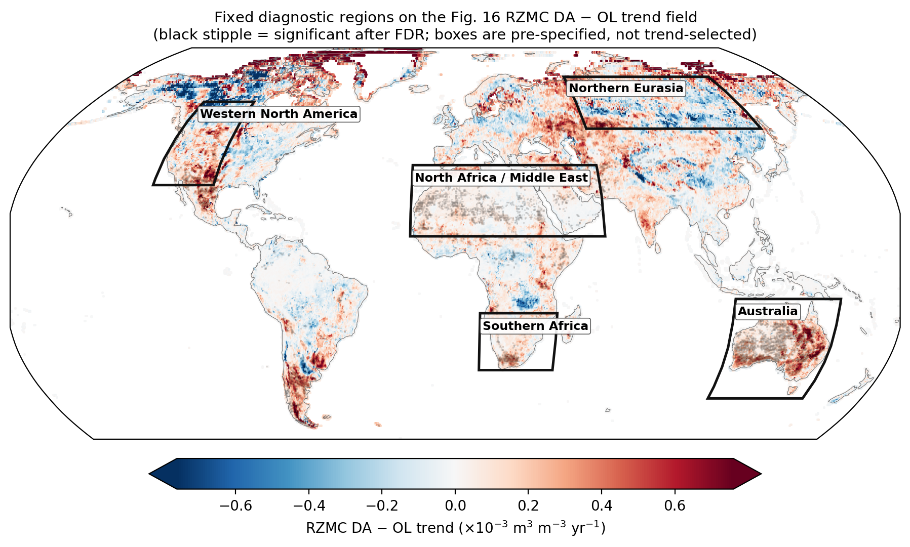
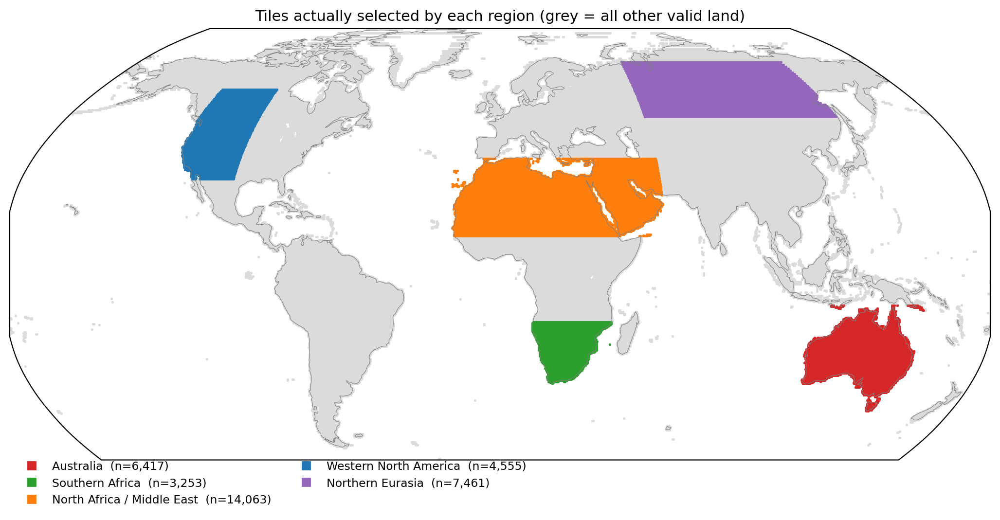
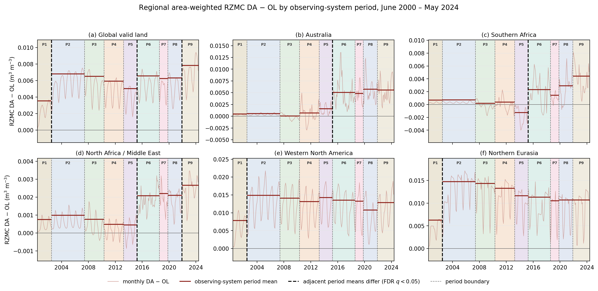

# Diagnostic: regional RZMC DA−OL by observing-system period

Exploratory diagnostic for the Figure 17 redesign. **Not yet a manuscript
figure.** Produced 2026-08-18 from the audited monthly OL v2 / DA v3 products.

Figure 16 establishes **where** assimilation changes root-zone soil moisture
over the long term. This analysis asks **when** those changes happened.

Scientific question: *are the regional RZMC DA−OL differences shown in Fig. 16
distributed uniformly through the record, or concentrated in particular
observing-system periods — and are the same periods responsible everywhere?*

The dates are not unknown regime shifts; they are documented observing-system
changes. The analysis therefore uses the P1–P9 boundaries directly rather than
searching for breakpoints.

---

## 1. Design

**Variable.** Area-weighted RZMC `DA − OL` in native m³ m⁻³. Nothing else: no
increment or correction-activity diagnostics, no z-scores.

**Regions.** Six fixed regions with explicit bounds in
`config/regional_rzmc_regions.json` — global valid land plus five lat/lon boxes.

Boxes span the broad areas where Fig. 16 shows coherent DA−OL trend structure,
and are **not** defined from significant-trend tiles. They were drawn by eye
from the Fig. 16 DA−OL panel and rounded to whole degrees; there is no
algorithm or external source behind the exact bounds.

That provenance is appropriate here because the analysis is a **timing
decomposition of a result Fig. 16 has already established**, not an independent
test that these regions are special. Fig. 16 shows where the DA effect on RZMC
is regionally concentrated; the question here is when that effect appeared. A
24-year trend of a given magnitude is consistent with many temporal
distributions of the underlying change, so where in the record that change is
concentrated is additional information not contained in the trend estimate.

The consequence for wording is specific: results below must not be stated as
"these regions show significant transitions," which the region selection cannot
support. They should be stated as the Fig. 16 differences being concentrated in
particular observing-system periods, with the periods responsible differing by
region. That is what the tests actually address.

Note also that the estimand is a difference of period means, which a gradual
ramp through one period can produce as readily as an abrupt change at its
boundary. Nothing here distinguishes those two, so the results must not be
described as steps, jumps, or discontinuities at boundaries.

The map above is the complete definition: each region is the set of `valid_land`
tiles inside its lat/lon box. The five regions together cover 31.8% of valid
land and do not tile the globe, so "Global valid land" is all 112,573 tiles
rather than the sum of the five.

**Static support.** Each region is a lat/lon box intersected with `valid_land`
and with the tiles finite in both OL and DA in every month. All 112,573
valid-land tiles are finite in all 288 months, so contributing tile count and
represented area are constant throughout the record
(`regional_support_audit.csv`). No apparent change can arise from changing
spatial support. The month-varying `warm_snowfree_monthly` mask was not used.

**Estimand.** For each region and each boundary,

    Δ_P6 = mean(DA − OL)_P6 − mean(DA − OL)_P5

and likewise for the other seven adjacent pairs. This is a change in
period-mean level, **not** an instantaneous discontinuity at the boundary — it
includes any within-period trend. That is intended: Australia's progressive
divergence appears naturally rather than requiring a hinge term.

Period means are computed on the seasonally adjusted series (calendar-month
effects removed, long-term trend retained) so that unequal seasonal composition
across periods of unequal length cannot bias the comparison.

**Uncertainty.** 95% intervals from an AR(1) effective sample size,
n_eff = n(1−ρ)/(1+ρ), with ρ and σ estimated from residuals about the period
means. **Multiplicity.** Benjamini–Hochberg at 0.05, one family per transition
across the six regions — matching the boundary-family convention already used
in the project.

## 2. Uncertainty-method sensitivity

The effective-*n* interval was compared against a moving-block bootstrap
(24-month blocks) and a fitted-AR(1) parametric bootstrap, both with 2,000
replicates (`regional_uncertainty_sensitivity.csv`).

| Method | FDR-significant of 48 | Median SE vs effective-*n* |
|---|---:|---:|
| Effective-*n* AR(1) | 9 | 1.00 |
| Fitted-AR(1) bootstrap | 9 | 0.90 |
| Moving-block bootstrap | 12 | 0.70 |

Effective-*n* and the parametric bootstrap give the **identical** significance
pattern. The block bootstrap gives smaller standard errors and adds three marginal cases
(global P5−P4; southern Africa and western North America P9−P8).

Every headline result is significant under all three methods. Effective-*n* is
retained: it is the most conservative, the simplest to state, and it agrees
exactly with the more rigorous parametric bootstrap.

## 3. Figure

Two elements only: faint monthly series and the bold period mean. The changes
in level between successive period means *are* the estimated differences, so
nothing further is marked. Dashed black boundaries mark adjacent period means
that differ under FDR; this indicates where the difference is resolved, not
that the change occurred abruptly at that date.

## 4. Adjacent-period differences

×10⁻³ m³ m⁻³. **Bold** = survives boundary-wise FDR at 0.05.

| Region | P2−P1 | P3−P2 | P4−P3 | P5−P4 | P6−P5 | P7−P6 | P8−P7 | P9−P8 |
|---|---:|---:|---:|---:|---:|---:|---:|---:|
| Global valid land | **+3.26** | -0.28 | -0.59 | -0.90 | **+1.52** | -0.31 | +0.06 | **+1.53** |
| Australia | +0.09 | -0.52 | +0.65 | +0.90 | **+3.46** | -0.20 | +0.91 | -0.16 |
| Southern Africa | +0.06 | -0.54 | +0.19 | -1.64 | **+3.57** | -0.86 | +1.48 | +1.50 |
| North Africa / Middle East | +0.24 | -0.22 | -0.28 | -0.03 | **+1.62** | +0.13 | -0.11 | **+0.56** |
| Western North America | **+7.05** | -0.78 | -0.97 | +1.15 | -0.78 | -0.27 | -2.46 | +2.07 |
| Northern Eurasia | **+8.46** | -0.37 | -1.07 | -1.65 | -0.31 | -0.81 | +0.18 | +0.02 |

With 95% intervals and q-values:

| Transition | Region | Δ ×10⁻³ | 95% interval | q |
|---|---|---:|---|---:|
| P2−P1 | Global valid land | +3.26 | +2.55 to +3.97 | <0.0001 |
| P2−P1 | Western North America | +7.05 | +4.86 to +9.25 | <0.0001 |
| P2−P1 | Northern Eurasia | +8.46 | +6.23 to +10.68 | <0.0001 |
| P6−P5 | Global valid land | +1.52 | +0.75 to +2.29 | 0.0003 |
| P6−P5 | Australia | +3.46 | +1.51 to +5.41 | 0.0008 |
| P6−P5 | Southern Africa | +3.57 | +1.59 to +5.55 | 0.0008 |
| P6−P5 | North Africa / Middle East | +1.62 | +1.25 to +2.00 | <0.0001 |
| P9−P8 | Global valid land | +1.53 | +0.72 to +2.33 | 0.0012 |
| P9−P8 | North Africa / Middle East | +0.56 | +0.17 to +0.96 | 0.0151 |

## 5. Findings

**The long-term regional RZMC differences seen in Fig. 16 are concentrated in
particular observing-system periods rather than being distributed uniformly
through the record.** In every region with a resolved comparison, one or two
adjacent-period differences account for most of the change across the record.

**The periods associated with the largest changes differ regionally**, which is
the substantive result.

**P6 is the only transition producing a coherent multi-region RZMC change.**
Four of six regions, strongest in Australia (+3.46) and southern Africa (+3.57),
present in North Africa / Middle East (+1.62). Absent in western North America
and northern Eurasia.

**P2 has a completely different spatial signature.** The P2−P1 increase is
concentrated in the snow-affected northern regions, consistent with a
soil-moisture response to the expansion from Terra-only to Terra+Aqua
snow-cover assimilation. It is absent in all three dry/warm regions.

**Australia diverges progressively through P3–P5 before the large P6
increase** (+0.03, +0.68, +1.58, then +5.04 ×10⁻³). The period representation
shows this directly, without needing to argue about the localization of a
gradual change.

**Northern Eurasia is a useful counterexample**, not a problem: a large P2
response, no P6 response, and a slow decline thereafter.

Together these dovetail with Fig. 16 — the observing-system influence on
root-zone soil moisture is regionally structured, not a uniform global drift.
Panel (a), global valid land, mixes the two opposing regional behaviours and is
the least interpretable of the six.

## 6. Caveats

- Region bounds were drawn by eye from Fig. 16. The analysis is a timing
  decomposition of that figure, not an independent test of regional
  significance, and must be described that way. In particular the P6 magnitudes
  are not an unbiased regional estimate: the regions were chosen for having
  coherent DA−OL trend structure, and any persistent shift — whenever it occurs
  — itself contributes to a positive 24-year trend. Selection on the trend can
  therefore enrich for changes at any boundary, so the P2 comparisons carry the
  same caveat as the P6 ones. The snow-region P2 versus dry-region P6 contrast
  is exploratory.
- The estimand is a period-mean difference, not a boundary discontinuity.
- Serial correlation is high (ρ = 0.63–0.80), so effective sample sizes are
  roughly a tenth of the month counts. P7 (15 months) resolves nothing and
  should not be expected to.
- P9−P8 is significant in two regions. P9 begins when ASCAT-A *ends* — a sensor
  leaving rather than arriving — and it is the last period in the record. Not
  interpreted here.

## 7. Status

This design would replace both the PELT changepoint analysis and the
interrupted-series model in the main text. The earlier PELT work is retained as
an internal robustness check and could be reported in the Supplement in one
sentence: an independent changepoint analysis identified April 2015 as the
dominant global transition.

Derived outputs under `output/regional_rzmc_transitions/` (not versioned):
`regional_rzmc_monthly.nc`, `regional_support_audit.csv`,
`regional_period_means.csv`, `regional_period_diffs_fdr.csv`,
`regional_uncertainty_sensitivity.csv`, `adjacent_period_table.md`, plus the
superseded PELT tables.
