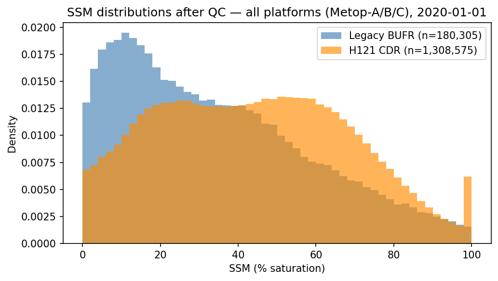
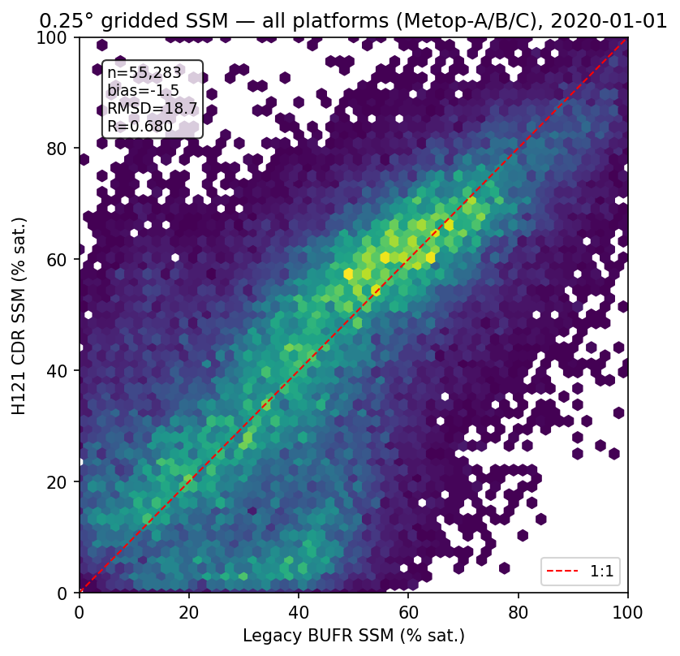
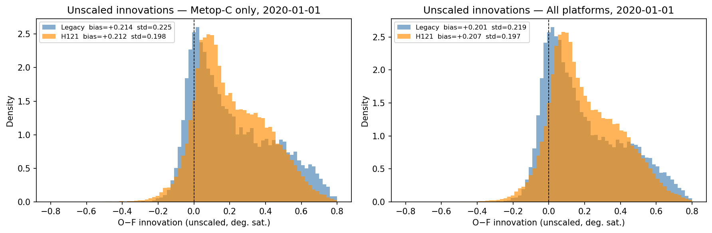
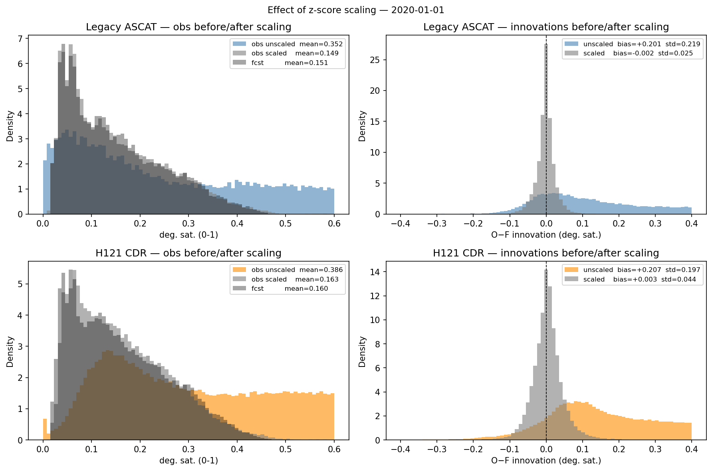
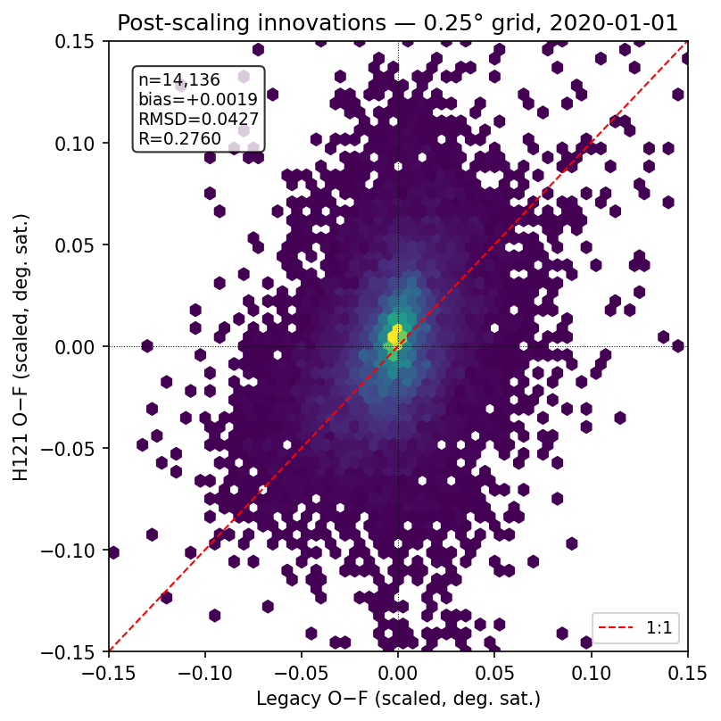
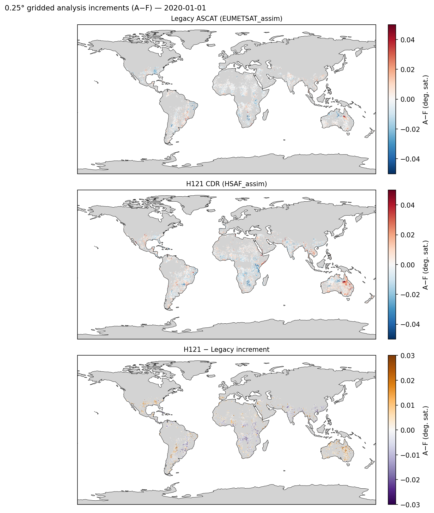
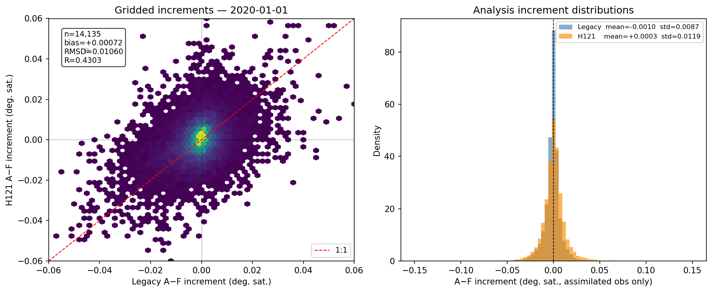

# ASCAT H121 CDR Integration Test — GEOSldas Diagnostic Summary

**Date of test**: 2020-01-01  
**Prepared by**: Andrew Fox  

---

## Background

The ASCAT soil moisture product currently assimilated in the GEOS Land Data Assimilation System (GEOSldas) uses the legacy EUMETSAT BUFR format (product ASCSMO02, ~25 km swath, Metop-A/B/C). This report documents a diagnostic test of the infrastructure required to replace this with the H SAF Climate Data Record (H121), a 12.5 km Fibonacci DGG product in NetCDF format.

Four GEOSldas runs were performed for a single day (2020-01-01) using an M36 EASE2 grid ensemble DA configuration:

| Experiment | Scaling | Assimilated |
|---|---|---|
| `monitor` | None | Neither |
| `scale` | z-score (Legacy factors) | Neither |
| `EUMETSAT_assim` | z-score (Legacy factors) | Legacy only |
| `HSAF_assim` | z-score (Legacy factors) | H121 only |

Note: all experiments use the existing Legacy z-score scaling factors as a temporary approximation. H121-specific scaling factors will need to be derived from a longer monitor-mode run.

---

## 1. Raw observation comparison

### 1.1 SSM distributions (Metop-C, point obs)

Both products show broadly similar SSM distributions after QC. The notable difference is the H121 spike near 0% in Legacy BUFR, which reflects frozen soil observations that pass BUFR QC flags but are removed by the H121 processing flag. H121 has approximately 7× more observations than Legacy BUFR at the point level, consistent with the 12.5 km vs ~25 km resolution and fixed Discrete Global Grid structure.

**Obs counts after QC (Metop-C, 2020-01-01):**
- Legacy BUFR: ~59,000
- H121 CDR: ~435,000

### 1.2 Gridded comparison (0.25° means, Metop-C)

On a 0.25° grid the two products correlate at R ≈ 0.71 with near-zero bias. The scatter (RMSD ~18 %sat) reflects genuine differences between the two products: different native footprint sizes (12.5 km vs ~25 km) produce different cell means when averaged to 0.25°, and the retrieval algorithms differ between H121 and the Legacy BUFR product.

---

## 2. GEOSldas observation space — monitor run (no scaling)

### 2.1 Innovation distributions

In the unscaled monitor run, both Legacy and H121 innovations (O−F) are large and positive (~+0.19–0.22 deg. sat.). This is expected: without scaling, the ASCAT degree-of-saturation observations (0–1) are being compared directly to model surface volumetric soil moisture (m³/m³, ~0.15). The systematic offset reflects both the unit difference and climatological biases between the ASCAT retrievals and GEOSldas — the z-score scaling corrects for both. This is not a problem with the reader. Crucially, the innovation distributions for Legacy and H121 have similar shape and spread, indicating the new H121 reader is producing physically consistent observations.

**Per-platform summary (unscaled monitor run):**

| Product | Platform | N | O−F bias | O−F std |
|---|---|---|---|---|
| Legacy | Metop-A | 12,386 | +0.190 | 0.220 |
| Legacy | Metop-B | 11,927 | +0.197 | 0.209 |
| Legacy | Metop-C | 13,372 | +0.214 | 0.225 |
| H121 | Metop-A | 39,487 | +0.185 | 0.196 |
| H121 | Metop-B | 41,489 | +0.222 | 0.194 |
| H121 | Metop-C | 42,214 | +0.212 | 0.198 |

The H121 obs count (~3× Legacy per platform on the M36 tile grid) is consistent with the resolution ratio.

---

## 3. Effect of z-score scaling

After applying the Legacy z-score scaling factors to both products, observations are brought into model space: obs means shift from ~0.35–0.40 to ~0.15, closely matching the model forecast (~0.15 m³/m³). Innovation means collapse to near-zero for both products, confirming that the scaling infrastructure is functioning correctly for H121.

H121 loses approximately 25% of observations during scaling (from ~40k to ~31k per platform), likely reflecting observations that fall outside the valid range of the Legacy scaling parameters. This will be resolved once H121-specific scaling factors are derived.

### 3.1 Post-scaling gridded innovation comparison

After scaling, the gridded Legacy and H121 innovations show improved agreement (R ≈ 0.77 on the 0.25° scaling grid) with near-zero bias. The remaining scatter reflects genuine differences between the two products (resolution, retrieval algorithm, QC) and the approximation involved in applying Legacy scaling factors to H121. This scatter will reduce once product-specific scaling parameters are in place.

---

## 4. Assimilation experiments

### 4.1 Analysis increment maps

The analysis increment (A−F) maps for the two assimilation experiments show spatially coherent patterns that are physically reasonable: positive increments (model too dry, obs push model wetter) and negative increments (model too wet) both occur in regions consistent with January conditions. The H121 and Legacy increment patterns are broadly similar, with the H121 increments covering more grid cells due to the higher observation density.

### 4.2 Analysis increment comparison

The gridded increment scatter between the two experiments is well-correlated (R ≈ 0.76) with very small bias (~0.00). The increment distributions are similar in width and shape. This is the most direct test of whether the two products will produce similar DA corrections to the model, and the results are encouraging.

---

## 5. Summary and conclusions

| Check | Result |
|---|---|
| H121 reader functioning | ✅ Obs ingested for all 3 Metop platforms |
| Obs counts consistent | ✅ ~3× Legacy per platform (matches resolution ratio) |
| Innovation statistics plausible | ✅ Similar bias/std to Legacy in monitor run |
| assim_flag correctly set | ✅ Correct species assimilated in each experiment |
| Scaling infrastructure working | ✅ Both products brought into model space |
| Analysis increments physically reasonable | ✅ Spatially coherent, similar to Legacy |

The GEOSldas infrastructure for the H121 CDR is working correctly. The system is reading, scaling, and assimilating H121 observations as intended, and the resulting analysis increments are consistent with those produced by the Legacy BUFR product.

**Next step**: Run an extended monitor-mode period (minimum ~1 year, ideally multi-year) with H121 to accumulate per-cell innovation statistics, then derive H121-specific z-score scaling factors to replace the Legacy approximation used here.

---

*Analysis performed using `projects/ascat_da/notebooks/compare_legacy_bufr_vs_H121.ipynb`*
