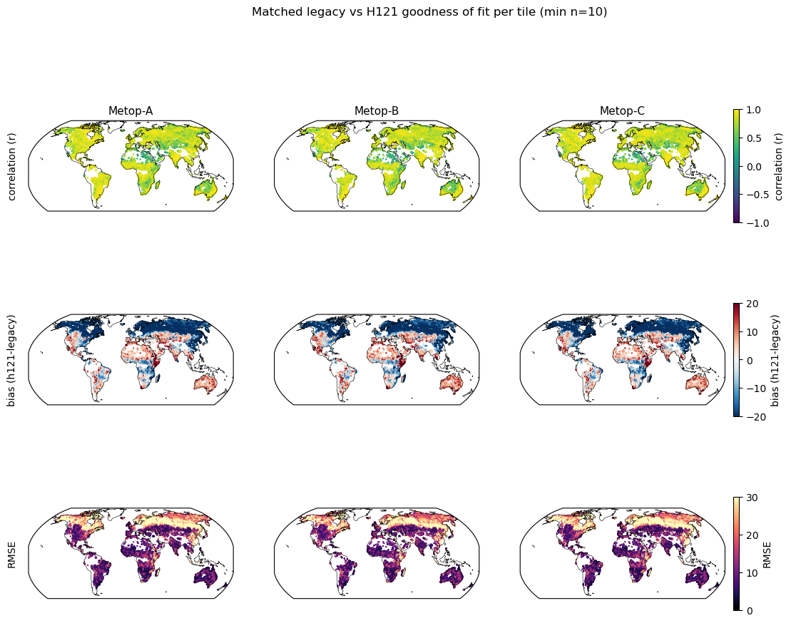
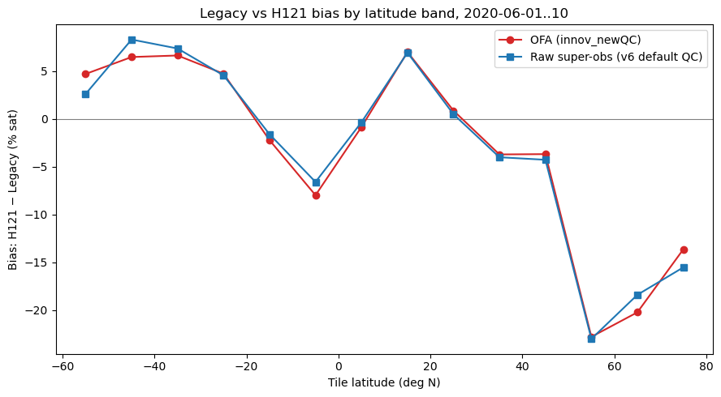
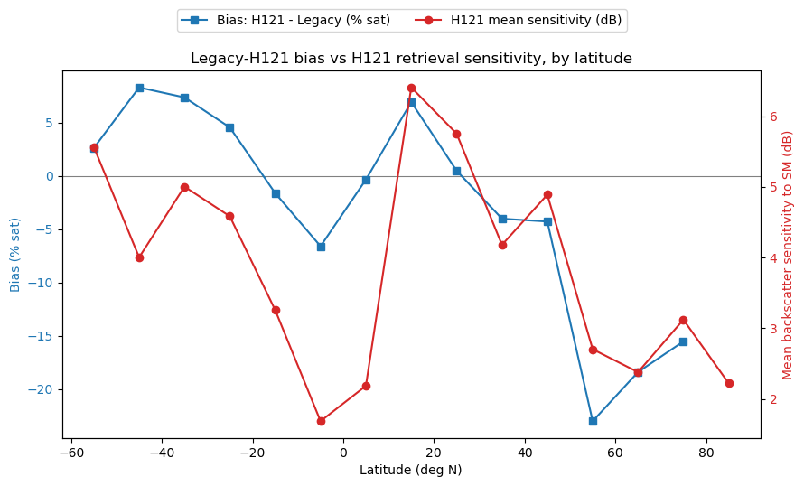
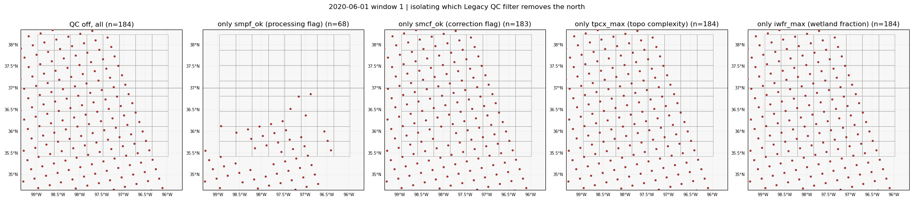
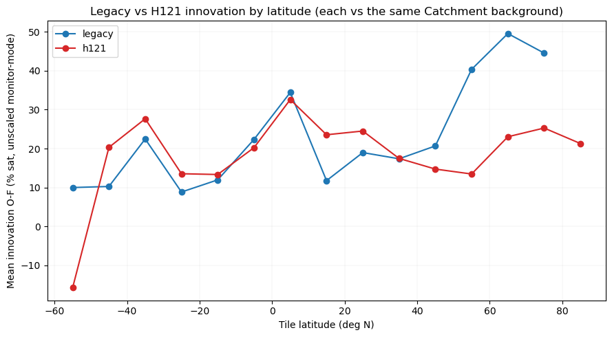

# Legacy vs H121 ASCAT: week summary (week of 2026-06-16)

## TL;DR

- Derived and ran new H121 QC defaults in a real GEOSldas experiment (`innov_newQC`):
  `sens_min=1.0`, `subsfc_max=5`, `bsflag` noise-bit screen, on top of the GEOS-mirrored
  defaults — validated against Legacy and raw obs at 10-day and full-June scale.
- Found H121 reads up to ~20% sat drier than Legacy above 50N, and spent most of the week
  ruling out artifacts: confirmed it's not tile/super-ob binning, not the new QC thresholds, and
  not snow/frozen-ground screening — it correlates with degraded backscatter sensitivity over
  boreal vegetation.
- Identified a concrete, structural QC mechanism (`smpf`/`soilMoistureProcessingFlag`) that
  explains why Legacy obs are sparser than H121 everywhere: Legacy
  rejects ~60% of obs on per-pass slope-estimate noise that H121's climatology-based retrieval
  doesn't have.

Full writeup: [`legacy_vs_h121_highlat_bias.md`](legacy_vs_h121_highlat_bias.md). QC bit-level
detail: [`legacy_vs_h121_qc_flags.md`](legacy_vs_h121_qc_flags.md).

## QC mapping: Legacy BUFR vs H121 CDR

Both readers live in `projects/ascat_da/lib/qc.py` (`QC_DEFAULT_BUFR`, `QC_DEFAULT_H121`).

| Concept | Legacy field (BUFR) | Legacy rule | H121 field (NetCDF) | H121 rule | Comparable? |
|---|---|---|---|---|---|
| Valid SM range | `surfaceSoilMoisture` | 0-100% | `surface_soil_moisture` | 0-100% | Yes, same |
| Open water | external static mask + `ALFR >= 0.9` (land fraction) in the Fortran reader | reject below 90% land fraction | `surface_flag` | reject if open-water bit set | Conceptually yes, both screen it — but Legacy's check is Fortran-only and **not yet mirrored in our Python QC**, so any Python-side comparison undercounts Legacy's real-world rejection rate |
| Per-pass retrieval-quality flag | `soilMoistureProcessingFlag` (SMPF, 16-bit `PROCESSING_FLAGS`) | reject unless **all 16 bits** clear (`smpf == 0`) | `processing_flag` (8-bit) | reject only if bit 0x01 or 0x02 set (`model_parameter_not_usable`, `backscatter40_not_usable`) | **No — structurally different.** Legacy's all-bits-clear rule is dominated by bits 16/32 ("slope Mid-Fore/Mid-Aft beam out of range", ~40% each), because Legacy estimates beam slope locally per swath pass (noisy). H121 derives slope/curvature from an offline kernel-smoothed climatology and has no equivalent per-pass failure mode — there's nothing analogous to screen. ~40% of valid-range Legacy obs pass `smpf`; this is intentional, not over-screening (see QC flags report). |
| Correction/bookkeeping flag | `soilMoistureCorrectionFlag` (SMCF, 8-bit `CORRECTION_FLAGS`) | accept `{0, 4}` (passes 92% of obs; explicitly allows the "wet correction applied" bit through) | `correction_flag` | **not screened at all** | **Confirmed not an asymmetry, empirically.** The only SMCF bits that `{0,4}` would actually *reject* (dry backscatter correction, volume-scattering-in-sand correction) fire on **0.0%** of obs in the validation sample — so Legacy's correction-type screening is a near no-op in practice. H121's `correction_flag` doesn't even have dry/vol-scatter-equivalent bits to begin with (only a wet-correction-equivalent bit exists), so there's no missing check to add on the H121 side either. |
| Topographic complexity | `topographicComplexity` | reject if **>** 10% | `topographic_complexity` | reject if **>=** 10% | Same concept and threshold value; minor boundary asymmetry exactly at 10% (Legacy's accept condition is closed, H121's is open) — immaterial in practice for a continuous field |
| Wetland / inundation | `inundationAndWetlandFraction` | reject if **>** 10% | `wetland_fraction` | reject if **>=** 10% | Same concept/threshold; same minor boundary asymmetry as topographic complexity |
| Subsurface scattering | *(not present in BUFR)* | n/a | `subsurface_scattering_probability` | reject if >= 5% | H121-only; threshold from Hahn et al. (2026) Sect. 3.5 |
| Backscatter sensitivity to SM | *(folded into SMPF bit 2, "sensitivity <= 2 dB")* | implicit, bundled into the all-bits-clear `smpf` rule | `surface_soil_moisture_sensitivity` | reject if <= 1.0 dB | Conceptually similar, but Legacy's version is one bit inside a 16-bit all-or-nothing flag, not an independent threshold; H121's is explicit and tunable. Threshold from Hahn et al. (2026) Sect. 4.1.1 |
| Azimuthal noise | `SMPF` bit 3 ("azimuthal noise >= 1 dB"), bundled into `smpf` | implicit | *(no flag — handled structurally)* | H121 applies a 12-direction empirical azimuth correction during retrieval (Hahn et al. 2026 Sect. 3.3.1) | Not a flag-vs-flag comparison — H121's algorithm change removed the need for this check entirely, rather than replacing it with an equivalent flag |
| Backscatter out-of-range (Fore-Aft) | `SMPF` bit 8 ("backscatter Fore-Aft out of range"; only 0.9% of obs — minor) | implicit, bundled into `smpf` | `backscatter40_flag` bit 4 (`noise_out_of_limits`) | reject if set (`bsflag_bad_bits=4`) | Closest real analogue to Legacy's bit 8. H121's reader assigns the same fixed `errstd` to every accepted obs regardless of flag, so this hard QC rejection is the only available lever against noisy backscatter — added to `QC_DEFAULT_H121` on assimilation-design grounds, not because a Legacy cross-check showed a clear benefit (it didn't, but didn't show harm either) |
| Frozen soil / snow | not in the legacy BUFR fields used here | n/a | `snow_cover_probability`/`frozen_soil_probability` exist in the H121 product but **neither product's GEOSldas reader uses them** | GEOSldas screens both via its own land-model state (`qc_model_based_for_sat_sfmc`) instead | Same mechanism for both products, deliberately bypassing H121's own (ERA5-climatology-based, not real-time) probability fields. Confirmed this week: layering an *extra* screen on those H121 fields doesn't reduce the high-latitude bias — if anything it makes it slightly worse while cutting the sample — consistent with the model-state approach already being the right call |
| Land fraction | `ALFR >= 0.9` (Fortran reader only) | not mirrored in our Python QC | n/a | n/a | Documented gap, not yet replicated |
| External static obs mask | netCDF land mask (Fortran reader only) | not mirrored | n/a | n/a | Documented gap, not yet replicated |

**Net read:** Legacy's QC is built around one big bundled per-pass-quality flag (`smpf`) plus a
loose correction-bookkeeping flag (`smcf`); H121's QC is built from several independent,
explicit, tunable thresholds (`sens_min`, `subsfc_max`, `bsflag`, `tc_max`, `wf_max`) because its
retrieval doesn't have the per-pass noise problem Legacy's bundled flag exists to catch. Neither
approach is "wrong" — they're QC strategies suited to two different retrieval algorithms.

## Key figures

**1. Per-tile goodness of fit, Legacy vs H121, full June (`innov_newQC` run)** — the headline
spatial pattern: correlation, bias, and RMSE per platform, per tile. The blue band across
boreal Russia/Canada in the middle row is the high-latitude bias.

**2. High-latitude bias is real, not an OFA artifact** — the same Legacy-vs-H121 bias curve by
latitude band, computed two independent ways: from GEOSldas's own ObsFcstAna output (`OFA`) and
from raw BUFR/H121 files reproduced independently in Python (`Raw super-obs`). They agree
closely at every latitude.

**3. The bias correlates with H121's own retrieval sensitivity** — mean backscatter sensitivity
to soil moisture (red) drops sharply over the same boreal latitudes where the bias (blue) turns
negative. Suggestive of vegetation-driven retrieval degradation, though not a complete
explanation on its own (see report caveats).

**4. Isolating the QC mechanism behind Legacy's sparser coverage** — single overpass, Oklahoma
box: re-enabling each Legacy QC filter one at a time shows `smpf_ok` alone reproduces the full
QC-on coverage gap (n=68 vs n=67); the other three filters remove almost nothing on their own.

**5. Which product actually diverges from the model** — mean innovation (O-F) by latitude,
computed separately for each product against the same Catchment background. Legacy's
innovation roughly doubles above 50N; H121's barely moves. This is the finding that revised the
"H121 is biased" framing.

